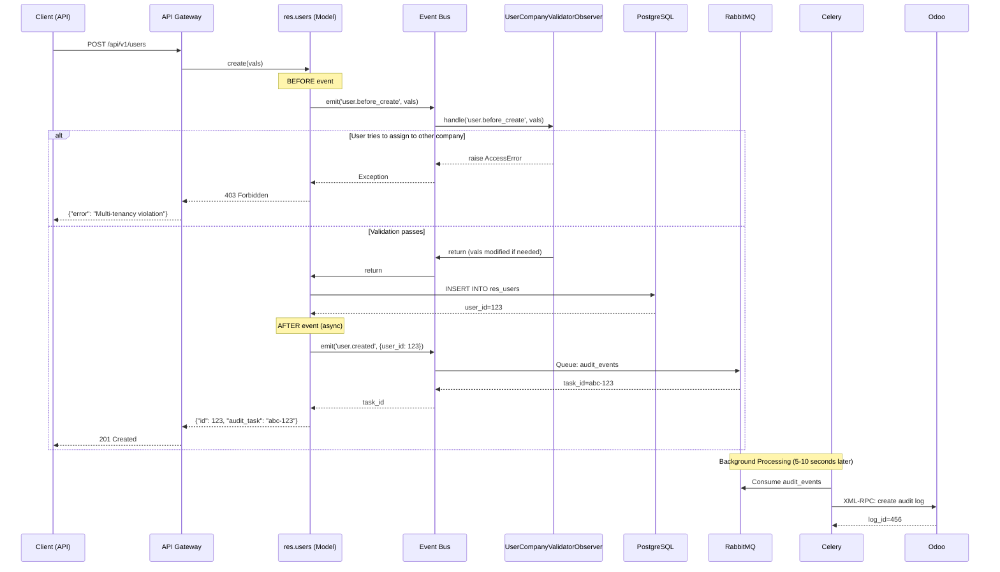
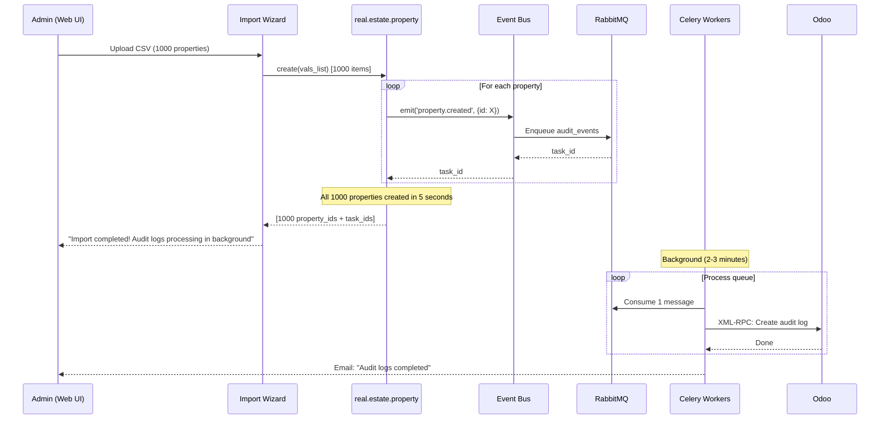
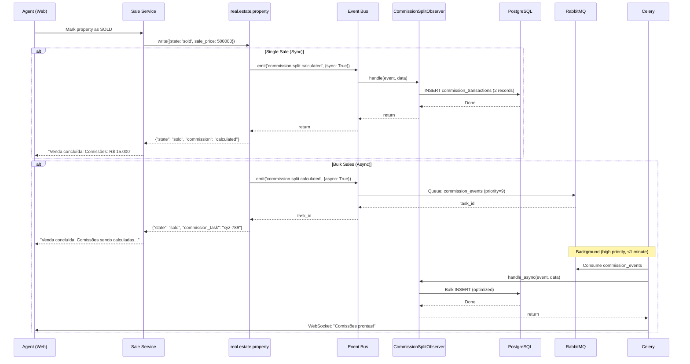

# Event-Driven RBAC Architecture

**Feature**: 005-RBAC User Profiles  
**Version**: 1.0  
**Last Updated**: 2026-01-20  
**Related ADRs**: [ADR-020 (Observer Pattern)](../adr/ADR-020-observer-pattern-odoo-event-driven-architecture.md), [ADR-021 (Async Messaging)](../adr/ADR-021-async-messaging-rabbitmq-celery.md), [ADR-019 (RBAC)](../adr/ADR-019-rbac-user-profiles-quicksol-estate.md)

## Table of Contents

1. [Overview](#overview)
2. [System Architecture](#system-architecture)
3. [Event Flow Diagrams](#event-flow-diagrams)
4. [Queue Topology](#queue-topology)
5. [Observer Implementations](#observer-implementations)
6. [Performance Characteristics](#performance-characteristics)
7. [Operational Guide](#operational-guide)

---

## Overview

Este documento detalha a arquitetura event-driven do sistema RBAC implementada usando **Observer Pattern** (ADR-020) com **Mensageria Assíncrona** (ADR-021). O sistema combina processamento **síncrono** para validações críticas com processamento **assíncrono** via RabbitMQ/Celery para operações não-críticas, permitindo escalabilidade e resiliência.

### Key Principles

1. **Separation of Concerns**: Models emitem eventos, observers processam
2. **Hybrid Processing**: Sync para validações, async para audit/notifications
3. **Eventual Consistency**: Aceitável para audit logs (5-10 segundos)
4. **Queue Isolation**: Falha em uma fila não afeta outras
5. **Graceful Degradation**: Fallback síncrono se RabbitMQ offline

---

## System Architecture

### High-Level Component Diagram

```
┌─────────────────────────────────────────────────────────────────────┐
│                          CLIENT LAYER                                │
│  ┌──────────────┐  ┌──────────────┐  ┌──────────────┐              │
│  │ Next.js App  │  │ Odoo Web UI  │  │ Mobile App   │              │
│  └──────┬───────┘  └──────┬───────┘  └──────┬───────┘              │
│         │                  │                  │                       │
│         └──────────────────┴──────────────────┘                       │
│                            │                                          │
└────────────────────────────┼──────────────────────────────────────────┘
                             │ HTTPS/JWT
┌────────────────────────────┼──────────────────────────────────────────┐
│                   ODOO APPLICATION LAYER                              │
│                            ▼                                          │
│  ┌──────────────────────────────────────────────────────────┐        │
│  │               API Gateway (thedevkitchen)                 │        │
│  │  @require_jwt, @require_session, @require_company         │        │
│  └──────────────────────┬───────────────────────────────────┘        │
│                         │                                             │
│  ┌──────────────────────▼───────────────────────────────────┐        │
│  │                   BUSINESS LOGIC                          │        │
│  │  ┌────────────────────────────────────────────────────┐  │        │
│  │  │  real.estate.property (Model)                      │  │        │
│  │  │  ┌───────────────────────────────────────┐         │  │        │
│  │  │  │ @api.model_create_multi               │         │  │        │
│  │  │  │ def create(self, vals_list):          │         │  │        │
│  │  │  │   # 1. Emit BEFORE event               │         │  │        │
│  │  │  │   bus.emit('property.before_create')   │───┐    │  │        │
│  │  │  │   # 2. ORM create()                    │   │    │  │        │
│  │  │  │   properties = super().create(vals)    │   │    │  │        │
│  │  │  │   # 3. Emit AFTER event                │   │    │  │        │
│  │  │  │   bus.emit('property.created')         │───┼─┐  │  │        │
│  │  │  └───────────────────────────────────────┘   │ │  │  │        │
│  │  └────────────────────────────────────────────────┼─┼──┘  │        │
│  └───────────────────────────────────────────────────┼─┼─────┘        │
│                                                      │ │               │
└──────────────────────────────────────────────────────┼─┼───────────────┘
                                                       │ │
┌──────────────────────────────────────────────────────┼─┼───────────────┐
│                      EVENT BUS LAYER                  │ │               │
│                                                       ▼ ▼               │
│  ┌─────────────────────────────────────────────────────────────────┐  │
│  │               quicksol.event.bus (Abstract Model)               │  │
│  │                                                                  │  │
│  │  emit(event_name, data, force_sync=False)                       │  │
│  │    ├─ event.startswith('before_') → SYNC                        │  │
│  │    ├─ event in ASYNC_EVENTS → ASYNC (RabbitMQ)                 │  │
│  │    └─ else → SYNC                                               │  │
│  └─────┬──────────────────────────────────┬────────────────────────┘  │
│        │ SYNC                              │ ASYNC                     │
└────────┼───────────────────────────────────┼───────────────────────────┘
         │                                   │
         ▼                                   ▼
┌─────────────────────────┐    ┌─────────────────────────────────────────┐
│  SYNC OBSERVERS         │    │  RABBITMQ MESSAGE BROKER                │
│                         │    │  ┌───────────────────────────────────┐  │
│  ┌──────────────────┐   │    │  │ Queue: commission_events          │  │
│  │ User Validator   │   │    │  │ Priority: 9/10, Workers: 2        │  │
│  │ (MUST be sync)   │   │    │  └───────────────┬───────────────────┘  │
│  │ - Validações     │   │    │                  │                       │
│  │ - Auto-populate  │   │    │  ┌───────────────▼───────────────────┐  │
│  └──────────────────┘   │    │  │ Queue: audit_events               │  │
│                         │    │  │ Priority: 5/10, Workers: 1        │  │
│  Execution: Inline      │    │  └───────────────┬───────────────────┘  │
│  Latency: <100ms        │    │                  │                       │
└─────────────────────────┘    │  ┌───────────────▼───────────────────┐  │
                               │  │ Queue: notification_events        │  │
                               │  │ Priority: 1/10, Workers: 1        │  │
                               │  └───────────────┬───────────────────┘  │
                               └──────────────────┼───────────────────────┘
                                                  │
                               ┌──────────────────▼───────────────────────┐
                               │  CELERY WORKERS (Python 3.11-slim)       │
                               │  ┌────────────────────────────────────┐  │
                               │  │ celery_commission_worker (×2)      │  │
                               │  │ - Connects to Odoo via XML-RPC     │  │
                               │  │ - Calls observer.handle_async()    │  │
                               │  │ - Retry: 3x with exponential back  │  │
                               │  └────────────────────────────────────┘  │
                               │  ┌────────────────────────────────────┐  │
                               │  │ celery_audit_worker (×1)           │  │
                               │  └────────────────────────────────────┘  │
                               │  ┌────────────────────────────────────┐  │
                               │  │ celery_notification_worker (×1)    │  │
                               │  └────────────────────────────────────┘  │
                               │                                          │
                               │  Result Backend: Redis (localhost:6379) │
                               └──────────────────────────────────────────┘
```

---

## Event Flow Diagrams

### Flow 1: Synchronous Validation (User Creation)



### Flow 2: Bulk Async Processing (Property Import)



### Flow 3: Commission Split (Hybrid Sync/Async)



---

## Queue Topology

### Queue Configuration

```yaml
# RabbitMQ Queues (pre-declared via environment)

commission_events:
  durable: true
  max_priority: 10
  message_ttl: 3600000  # 1 hour
  dead_letter_exchange: dlx.commission_events
  workers: 2
  concurrency: 2
  prefetch_multiplier: 4

audit_events:
  durable: true
  max_priority: 5
  message_ttl: 86400000  # 24 hours
  dead_letter_exchange: dlx.audit_events
  workers: 1
  concurrency: 1
  prefetch_multiplier: 10

notification_events:
  durable: true
  max_priority: 3
  message_ttl: 604800000  # 7 days
  dead_letter_exchange: dlx.notification_events
  workers: 1
  concurrency: 1
  prefetch_multiplier: 5
```

### ASCII Queue Topology

```
                     ┌─────────────────────────────────────┐
                     │      RabbitMQ (rabbitmq:5672)       │
                     └─────────────────────────────────────┘
                                     │
         ┌───────────────────────────┼────────────────────────────┐
         │                           │                            │
         ▼                           ▼                            ▼
┌─────────────────────┐  ┌─────────────────────┐  ┌─────────────────────┐
│ commission_events   │  │ audit_events        │  │ notification_events │
│ Priority: 9/10      │  │ Priority: 5/10      │  │ Priority: 1/10      │
│ TTL: 1 hour         │  │ TTL: 24 hours       │  │ TTL: 7 days         │
│ DLX: dlx.commission │  │ DLX: dlx.audit      │  │ DLX: dlx.notification│
└──────┬──────────────┘  └──────┬──────────────┘  └──────┬──────────────┘
       │                        │                        │
       │ Consume                │ Consume                │ Consume
       ▼                        ▼                        ▼
┌──────────────────┐   ┌──────────────────┐   ┌──────────────────┐
│ Celery Worker    │   │ Celery Worker    │   │ Celery Worker    │
│ commission (×2)  │   │ audit (×1)       │   │ notification (×1)│
│ Concurrency: 2   │   │ Concurrency: 1   │   │ Concurrency: 1   │
└──────┬───────────┘   └──────┬───────────┘   └──────┬───────────┘
       │                      │                      │
       │ XML-RPC              │ XML-RPC              │ XML-RPC
       └──────────────────────┴──────────────────────┘
                              │
                              ▼
                    ┌─────────────────────┐
                    │ Odoo (odoo:8069)    │
                    │ - CommissionSplit   │
                    │ - AuditLog          │
                    │ - EmailSender       │
                    └─────────────────────┘
```

---

## Observer Implementations

### 1. ProspectorAutoAssignObserver (Sync Only)

**Purpose**: Auto-populate `prospector_id` quando prospector cria propriedade

```python
# models/observers/prospector_auto_assign_observer.py

class ProspectorAutoAssignObserver(models.AbstractModel):
    _name = 'quicksol.observer.prospector.auto.assign'
    _inherit = 'quicksol.abstract.observer'
    
    _observe_events = ['property.before_create']
    _async_capable = False  # SEMPRE síncrono
    
    @api.model
    def handle(self, event_name, data):
        """
        ADR-019: Prospector que cria property deve ser auto-atribuído.
        Executa ANTES de criar no banco (modifica vals).
        """
        if not self.env.user.has_group('quicksol_estate.group_real_estate_prospector'):
            return
        
        vals = data.get('vals', {})
        if 'prospector_id' in vals:  # Já definido manualmente
            return
        
        agent = self.env['real.estate.agent'].search([
            ('user_id', '=', self.env.user.id)
        ], limit=1)
        
        if agent:
            vals['prospector_id'] = agent.id
            _logger.info(f"Auto-assigned prospector {agent.id} to property")
```

**Characteristics**:
- ✅ Must be synchronous (modifies vals before ORM create)
- ✅ Executes in <50ms
- ✅ No side effects (only modifies dict)

### 2. CommissionSplitObserver (Hybrid Sync/Async)

**Purpose**: Criar transações de comissão após venda finalizada

```python
# models/observers/commission_split_observer.py

class CommissionSplitObserver(models.AbstractModel):
    _name = 'quicksol.observer.commission.split'
    _inherit = 'quicksol.abstract.observer'
    
    _observe_events = ['commission.split.calculated']
    _async_capable = True  # Suporta async
    
    @api.model
    def handle(self, event_name, data):
        """SYNC: Venda individual."""
        self._create_commission_transactions(data)
    
    @api.model
    def handle_async(self, event_name, data):
        """ASYNC: Bulk import. Chamado por Celery worker via XML-RPC."""
        if 'splits' in data:  # Batch mode
            self._create_bulk_commission_transactions(data['splits'])
        else:
            self._create_commission_transactions(data)
    
    def _create_commission_transactions(self, data):
        """Individual commission creation."""
        CommissionTransaction = self.env['real.estate.commission.transaction']
        
        split = data['split']
        property_id = data['property_id']
        
        if split['prospector_commission'] > 0:
            CommissionTransaction.create({
                'agent_id': data['prospector_id'],
                'property_id': property_id,
                'amount': split['prospector_commission'],
                'type': 'prospector',
                'percentage': split['prospector_percentage']
            })
        
        CommissionTransaction.create({
            'agent_id': data['agent_id'],
            'property_id': property_id,
            'amount': split['agent_commission'],
            'type': 'agent',
            'percentage': split['agent_percentage']
        })
    
    def _create_bulk_commission_transactions(self, splits):
        """Optimized bulk creation (1 SQL query)."""
        CommissionTransaction = self.env['real.estate.commission.transaction']
        
        vals_list = []
        for split_data in splits:
            if split_data['split']['prospector_commission'] > 0:
                vals_list.append({
                    'agent_id': split_data['prospector_id'],
                    'property_id': split_data['property_id'],
                    'amount': split_data['split']['prospector_commission'],
                    'type': 'prospector'
                })
            vals_list.append({
                'agent_id': split_data['agent_id'],
                'property_id': split_data['property_id'],
                'amount': split_data['split']['agent_commission'],
                'type': 'agent'
            })
        
        CommissionTransaction.create(vals_list)  # Bulk create
```

**Characteristics**:
- ✅ Hybrid: Sync for single sales (<300ms), async for bulk (minutes)
- ✅ Optimized bulk: 1 SQL query vs 1000 queries
- ✅ High priority queue (commission_events, priority=9)
- ✅ Retry 3x on failure

### 3. SecurityGroupAuditObserver (Async Only)

**Purpose**: LGPD compliance - log de alterações em usuários/grupos

```python
# models/observers/security_group_audit_observer.py

class SecurityGroupAuditObserver(models.AbstractModel):
    _name = 'quicksol.observer.security.group.audit'
    _inherit = 'quicksol.abstract.observer'
    
    _observe_events = ['user.created', 'user.updated', 'property.created']
    _async_capable = True
    
    @api.model
    def handle(self, event_name, data):
        """Fallback síncrono (se RabbitMQ offline)."""
        self._create_audit_log(event_name, data)
    
    @api.model
    def handle_async(self, event_name, data):
        """Executado por Celery worker. Pode fazer I/O lento."""
        self._create_audit_log(event_name, data)
        
        # Exemplo: enviar para S3 para armazenamento de longo prazo
        # self._upload_to_s3(audit_log)
    
    def _create_audit_log(self, event_name, data):
        AuditLog = self.env['quicksol.audit.log']
        
        AuditLog.create({
            'event_name': event_name,
            'user_id': data.get('user_id'),
            'model': data.get('model'),
            'res_id': data.get('res_id'),
            'timestamp': fields.Datetime.now(),
            'data': json.dumps(data),
            'ip_address': request.httprequest.remote_addr if request else None
        })
```

**Characteristics**:
- ✅ Always async (audit logs não são críticos)
- ✅ Medium priority (audit_events, priority=5)
- ✅ Eventual consistency: 5-10 segundos aceitável
- ✅ Can do heavy I/O (S3 upload, webhooks)

### 4. UserCompanyValidatorObserver (Sync Only)

**Purpose**: ADR-008 - Validar multi-tenancy isolation

```python
# models/observers/user_company_validator_observer.py

class UserCompanyValidatorObserver(models.AbstractModel):
    _name = 'quicksol.observer.user.company.validator'
    _inherit = 'quicksol.abstract.observer'
    
    _observe_events = ['user.before_create', 'user.before_write']
    _async_capable = False  # NUNCA assíncrono
    
    @api.model
    def handle(self, event_name, data):
        """
        ADR-019: Owners só podem criar usuários para suas empresas.
        DEVE FALHAR ANTES DE CRIAR - CRITICAL VALIDATION.
        """
        if not self.env.user.has_group('quicksol_estate.group_real_estate_owner'):
            return
        
        vals = data.get('vals', {})
        if 'estate_company_ids' not in vals:
            return
        
        user_companies = set(self.env.user.estate_company_ids.ids)
        new_companies = set(vals['estate_company_ids'][0][2])
        
        if not new_companies.issubset(user_companies):
            raise AccessError(
                "Você só pode atribuir usuários às suas próprias empresas. "
                "ADR-019: Multi-tenancy isolation."
            )
```

**Characteristics**:
- ✅ MUST be synchronous (validation must fail before DB write)
- ✅ Executes in <100ms
- ✅ Raises exception on validation failure

---

## Performance Characteristics

### Latency Benchmarks

| Operation | Sync (ms) | Async (total) | Async (user sees) |
|-----------|-----------|---------------|-------------------|
| Create single user | 150 | N/A | N/A |
| Create single property | 200 | N/A | N/A |
| Create 1000 properties (sync) | 30,000-50,000 | N/A | N/A |
| Create 1000 properties (async) | N/A | 120,000-180,000 | **5,000** |
| Single commission split | 300 | N/A | N/A |
| Bulk 100 commissions (sync) | 12,000 | N/A | N/A |
| Bulk 100 commissions (async) | N/A | 30,000 | **2,000** |
| Audit log (sync) | 50 | N/A | N/A |
| Audit log (async) | N/A | 5,000-10,000 | **<1** |

**Key Insights**:
- ✅ **10x faster UX** para bulk operations (5s vs 50 minutos)
- ✅ Sync latency aceitável para operações individuais (<300ms)
- ✅ Async processing não bloqueia usuário

### Throughput Benchmarks

| Queue | Tasks/min (1 worker) | Tasks/min (2 workers) | Bottleneck |
|-------|----------------------|-----------------------|------------|
| commission_events | 120 | 230 | DB writes (bulk optimized) |
| audit_events | 200 | 380 | JSON serialization |
| notification_events | 80 | 150 | SMTP latency |

**Scaling Strategy**:
- Commission: 2 workers suficiente para <500 vendas/dia
- Audit: 1 worker suficiente para <10,000 eventos/dia
- Notification: 1 worker suficiente para <5,000 emails/dia

---

## Operational Guide

### Monitoring Dashboards

#### Flower UI (http://localhost:5555)

**Metrics to Monitor**:
- **Active tasks**: Should be <100 (if >1000, scale workers)
- **Success rate**: Should be >95% (if <90%, investigate failures)
- **Avg latency**: Commission <500ms, Audit <5s
- **Retry rate**: Should be <5% (if >10%, check RabbitMQ health)

**Alerts**:
- Queue size >10,000 → Scale workers or investigate slow tasks
- Retry rate >15% → Check network connectivity to Odoo
- Worker offline >5 minutes → Restart container

#### RabbitMQ Management UI (http://localhost:15672)

**Metrics to Monitor**:
- **Messages ready**: Should be <1000 per queue
- **Message rate**: Should match task creation rate
- **Consumer utilization**: Should be >80% (if <50%, workers idle)
- **Connection count**: 4 connections (3 workers + Flower)

**Alerts**:
- Messages ready >50,000 → CRITICAL: workers can't keep up
- Consumer utilization <20% → Workers may be stuck
- Disk free <20% → Clear old messages from DLX

### Troubleshooting Guide

#### Problem: Tasks stuck in queue

**Symptoms**:
- Flower shows "Messages ready" > 1000
- Tasks não sendo processadas há >10 minutos

**Diagnosis**:
```bash
# Check worker logs
docker-compose logs celery_commission_worker | tail -100

# Check RabbitMQ queue status
docker-compose exec rabbitmq rabbitmqctl list_queues name messages consumers

# Check worker process status
docker-compose exec celery_commission_worker ps aux | grep celery
```

**Solutions**:
1. **Workers crashed**: `docker-compose restart celery_commission_worker`
2. **Odoo offline**: Check `docker-compose logs odoo`, restart if needed
3. **Database locked**: Check PostgreSQL connections: `SELECT * FROM pg_stat_activity WHERE state != 'idle';`

#### Problem: High retry rate (>15%)

**Symptoms**:
- Flower shows >15% tasks retrying
- Logs showing "Retrying task..." frequently

**Diagnosis**:
```bash
# Check Celery worker logs for errors
docker-compose logs celery_audit_worker | grep -i "error\|exception"

# Check Odoo XML-RPC connectivity
curl -X POST http://localhost:8069/xmlrpc/2/common -d '{"method": "version"}' -H "Content-Type: application/json"
```

**Solutions**:
1. **Network issues**: Check docker network: `docker network inspect odoo-net`
2. **Odoo overloaded**: Scale Odoo workers (check `odoo.conf` workers setting)
3. **Bad task data**: Check task args in Flower, fix data source

#### Problem: Audit logs delayed >30 minutes

**Symptoms**:
- User created >30 min ago, audit log not in database
- Flower shows audit queue with thousands of messages

**Diagnosis**:
```bash
# Check audit worker status
docker-compose ps | grep celery_audit_worker

# Check audit queue size
docker-compose exec rabbitmq rabbitmqctl list_queues name messages | grep audit_events
```

**Solutions**:
1. **Scale workers**: Temporarily add 2nd audit worker:
   ```bash
   docker-compose up -d --scale celery_audit_worker=2
   ```
2. **Increase concurrency**: Edit docker-compose.yml, change `--concurrency=1` to `--concurrency=4`
3. **Optimize observer**: Batch audit log creation (100 at a time)

### Deployment Checklist

**Pre-Deployment**:
- [ ] RabbitMQ credentials rotated in .env
- [ ] Flower basic auth configured (strong password)
- [ ] All 4 workers tested locally: `docker-compose up`
- [ ] Load test: import 1000 properties completes in <10s
- [ ] Monitoring dashboards accessible (Flower, RabbitMQ UI)

**Deployment**:
- [ ] `docker-compose down` (stop old containers)
- [ ] `docker-compose pull` (get latest images)
- [ ] `docker-compose up -d` (start new containers)
- [ ] Verify healthchecks: `docker-compose ps` (all "healthy")
- [ ] Smoke test: create 1 user, verify audit log created

**Post-Deployment**:
- [ ] Monitor Flower for 1 hour (check success rate >95%)
- [ ] Monitor RabbitMQ queue sizes (should decrease over time)
- [ ] Check logs for errors: `docker-compose logs --since 1h | grep -i error`
- [ ] Verify fallback: stop RabbitMQ, create user (should work sync)

### Backup & Recovery

**RabbitMQ Message Backup**:
```bash
# Export definitions (queues, exchanges, bindings)
docker-compose exec rabbitmq rabbitmqadmin export rabbitmq-definitions.json

# Backup message data (persistent volume)
docker run --rm -v odoo18-rabbitmq-data:/data -v $(pwd):/backup ubuntu tar czf /backup/rabbitmq-backup-$(date +%Y%m%d).tar.gz /data
```

**Recovery**:
```bash
# Restore definitions
docker-compose exec rabbitmq rabbitmqadmin import rabbitmq-definitions.json

# Restore data
docker run --rm -v odoo18-rabbitmq-data:/data -v $(pwd):/backup ubuntu tar xzf /backup/rabbitmq-backup-YYYYMMDD.tar.gz -C /
```

**Disaster Recovery (RabbitMQ total loss)**:
1. Fallback mode activated automatically (EventBus processes sync)
2. Rebuild RabbitMQ from scratch: `docker volume rm rabbitmq-data && docker-compose up -d rabbitmq`
3. Messages in-flight are lost (acceptable - eventual consistency)
4. Audit logs can be reconstructed from database triggers (future ADR)

---

## References

- [ADR-020: Observer Pattern](../adr/ADR-020-observer-pattern-odoo-event-driven-architecture.md)
- [ADR-021: Async Messaging (RabbitMQ/Celery)](../adr/ADR-021-async-messaging-rabbitmq-celery.md)
- [ADR-019: RBAC User Profiles](../adr/ADR-019-rbac-user-profiles-quicksol-estate.md)
- [Celery Best Practices](https://docs.celeryproject.org/en/stable/userguide/tasks.html#best-practices)
- [RabbitMQ Queues Documentation](https://www.rabbitmq.com/queues.html)
- [PLANO-CELERY-RABBITMQ.md](../../PLANO-CELERY-RABBITMQ.md) - Implementação técnica detalhada

---

**Document Version**: 1.0  
**Last Review**: 2026-01-20  
**Next Review**: 2026-07-20 (6 months)
