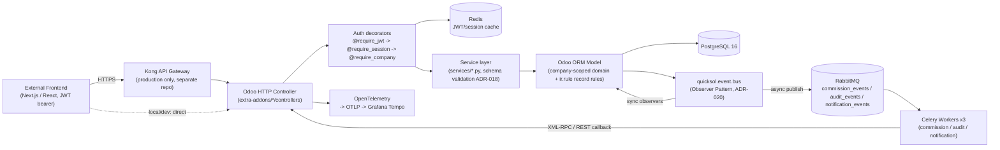

# Architecture

> Sources: `18.0/Dockerfile` (root `Dockerfile`), `18.0/docker-compose.yml`, `18.0/odoo.conf`, `docs/adr/ADR-020` (Observer Pattern), `ADR-021` (Async Messaging), `ADR-025`/`ADR-026` (Observability), `docs/architecture/DATABASE_ARCHITECTURE_USERS.md`, `docs/architecture/event-driven-rbac.md`, `docs/guide/02-docker-components.md`.

## Technology Stack

| Layer | Technology | Version |
|---|---|---|
| Application framework | Odoo (Community, self-built image) | 18.0 |
| Language runtime | Python (Ubuntu Noble base image) | 3.12 (Odoo container) / 3.13 (local `.venv` for tooling) |
| Primary database | PostgreSQL | 16 (alpine) |
| Cache / session store | Redis | 7 (alpine) |
| Message broker | RabbitMQ | 3 (management-alpine) |
| Async workers | Celery | 5.3.4 (3 specialized worker processes) |
| Frontend (consumer of the API) | Not in this repository — headless REST API consumed by an external Next.js/React application (see `docs/guide/02-docker-components.md` diagram and `thedevkitchen_cms` public SSR route) | N/A |
| API documentation | OpenAPI 3.0 (Swagger UI at `/api/docs`, spec generated dynamically from `thedevkitchen.api.endpoint` records) | — |
| Distributed tracing | OpenTelemetry SDK + OTLP/gRPC exporter → Grafana Tempo | >=1.22.0 |
| Observability stack | Prometheus + Loki + Tempo + Grafana (`18.0/observability/`) | — |
| Email (dev) | MailHog + MongoDB persistence | latest / 4.4 |
| Task monitoring | Flower | 2.0 |
| E2E testing | Cypress | ^15.10.0 |

## Architecture Type

**Modular Monolith with an asynchronous worker fleet and an external API gateway layer** — Hybrid:
- The core business logic lives in a single Odoo instance (`odoo` service), organized as independently versioned addons (modular monolith), each owning its own models/controllers/security/views.
- Non-critical, high-latency, or bulk-triggered work (audit logging, notifications, commission-split calculation) is offloaded to 3 dedicated Celery worker processes via RabbitMQ (Event-Driven extension, ADR-021), decoupled from the request/response cycle.
- In production, a **Kong API Gateway** (maintained in a separate `apigateway` repository, referenced in ADR-026) sits in front of Odoo, adding a second layer of routing, rate limiting and observability (Prometheus scrape + OTLP traces to the same Tempo backend) outside of this repo's direct control — see [integrations.md](integrations.md).
- The system is explicitly **headless**: there is no server-rendered customer-facing frontend in this repository; Odoo's own web client is used only for back-office/admin operations, while the REST API (JWT/OAuth2) is the contract for the external frontend application(s).

## Primary Request Flow (synchronous path)

## Notable Architectural Customizations / Deviations from Framework Defaults

1. **Redis-backed HTTP session and JWT cache** (native Odoo 18.0 Redis support enabled in `odoo.conf`: `enable_redis = True`, plus a custom `RedisClient` cache-aside layer in `thedevkitchen_apigateway/middleware.py` for JWT validation) — reduces DB round-trips on every authenticated request. This was added recently (see git history: PR #25 "023-redis-session-cache"); `TECHNICAL_DEBIT.md` still lists related Redis/session work as partially open, which should be re-verified against the current code (discrepancy noted in [performance.md](performance.md)).
2. **Custom triple-decorator authentication chain** (`@require_jwt` → `@require_session` → `@require_company`) applied to nearly all REST controllers instead of Odoo's default session-cookie `auth='user'`; all custom REST routes use `auth='none'` and implement their own auth stack (ADR-011).
2. **Observer Pattern / Event Bus** (`quicksol.event.bus`, ADR-020) decouples cross-cutting concerns (auto-populate fields, company validation, commission calculation, audit trail) from model `create`/`write` methods, replacing the "fat model" anti-pattern that was causing SRP violations.
3. **Hybrid sync/async event processing** (ADR-021): critical validations stay synchronous; audit/notification/commission-split events are published to RabbitMQ and processed by dedicated Celery queues, with a documented graceful-degradation fallback to synchronous processing if RabbitMQ is unavailable.
4. **Pessimistic row locking** (`SELECT ... FOR UPDATE NOWAIT`) plus a partial unique index as defense-in-depth for single-active-slot queue invariants (property proposals, credit checks) — ADR-027, chosen over optimistic retry or Postgres advisory locks.
5. **Multi-tenancy modeled at the ORM/record-rule level**, not via separate databases or schemas — see [multi-tenancy.md](multi-tenancy.md).
6. **OpenAPI spec generated dynamically at runtime** from a database table (`thedevkitchen.api.endpoint`) rather than from static YAML/annotations, so the Swagger UI always reflects currently-registered endpoints (ADR-005); a companion script (`scripts/validate_openapi_sync.sh`) checks controller/YAML drift specifically for the proposals module.

## Discrepancies Found

- `docs/guide/02-docker-components.md` describes 3 Celery workers with generic queue names (`commission_queue`, `notification_queue`, `audit_queue`) and different concurrency values (2/4/2) than what is actually configured in `18.0/docker-compose.yml` and used in code (`commission_events`, `audit_events`, `notification_events`; concurrency 2/1/1 respectively, per `event_bus.py` and `docker-compose.yml`). The documentation guide appears stale relative to the code — see [crons-queues.md](crons-queues.md) for the verified values.
