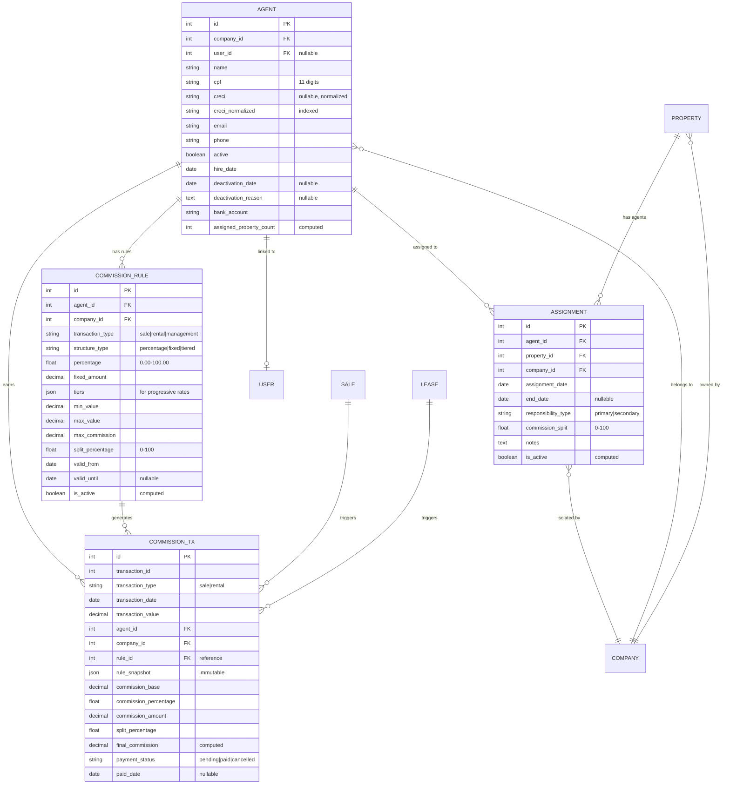

# Data Model Design - Agent Management

**Feature**: 004-agent-management  
**Date**: 2026-01-12  
**Phase**: Design (Phase 1)  
**Input**: [research.md](research.md), [spec.md](spec.md)

## Overview

This document defines the complete data model for agent/employee management in the real estate platform. The design follows Odoo 18.0 ORM patterns, multi-tenant isolation principles, and Brazilian real estate business requirements.

---

## Entity Relationship Diagram



---

## 1. Agent Model (`real.estate.agent`)

### Purpose
Represents real estate agents/brokers/employees linked to a real estate company. Central entity for commission tracking, property assignment, and performance metrics.

### Model Definition

```python
# File: 18.0/extra-addons/quicksol_estate/models/agent.py

from odoo import models, fields, api, _
from odoo.exceptions import ValidationError, UserError
from ..services.creci_validator import CreciValidator

class RealEstateAgent(models.Model):
    _name = 'real.estate.agent'
    _description = 'Real Estate Agent/Broker'
    _inherit = ['mail.thread', 'mail.activity.mixin']
    _order = 'name asc'
    
    # ==================== CORE FIELDS ====================
    
    # Identification
    name = fields.Char(
        'Full Name',
        required=True,
        tracking=True,
        help='Agent full legal name'
    )
    
    cpf = fields.Char(
        'CPF',
        size=14,  # Format: 123.456.789-01
        required=True,
        tracking=True,
        help='Brazilian individual taxpayer registry (CPF)'
    )
    
    creci = fields.Char(
        'CRECI',
        size=50,
        tracking=True,
        help='Real estate broker license (optional for trainees/assistants). Accepts flexible formats: CRECI/SP 12345, CRECI-RJ-67890, 12345-MG'
    )
    
    creci_normalized = fields.Char(
        'CRECI Normalized',
        size=20,
        compute='_compute_creci_normalized',
        store=True,
        index=True,
        help='Normalized CRECI in format: CRECI/UF NNNNN'
    )
    
    # Contact
    email = fields.Char(
        'Email',
        tracking=True
    )
    
    phone = fields.Char(
        'Phone',
        size=20,
        tracking=True,
        help='Brazilian format: +55 (11) 99999-9999'
    )
    
    mobile = fields.Char(
        'Mobile',
        size=20,
        tracking=True
    )
    
    # Multi-tenancy
    company_id = fields.Many2one(
        'thedevkitchen.estate.company',
        'Real Estate Company',
        required=True,
        default=lambda self: self.env.user.estate_default_company_id,
        ondelete='restrict',
        help='Real estate company this agent belongs to'
    )
    
    # User account link (optional)
    user_id = fields.Many2one(
        'res.users',
        'Related User',
        ondelete='restrict',
        help='Link to user account if agent has system access'
    )
    
    # ==================== STATUS & LIFECYCLE ====================
    
    active = fields.Boolean(
        'Active',
        default=True,
        tracking=True,
        help='Uncheck to deactivate agent. Inactive agents are hidden but preserve historical data.'
    )
    
    hire_date = fields.Date(
        'Hire Date',
        default=fields.Date.today,
        required=True,
        tracking=True
    )
    
    deactivation_date = fields.Date(
        'Deactivation Date',
        readonly=True,
        tracking=True
    )
    
    deactivation_reason = fields.Text(
        'Deactivation Reason',
        readonly=True
    )
    
    # ==================== FINANCIAL ====================
    
    bank_name = fields.Char('Bank Name')
    bank_branch = fields.Char('Branch', size=10)
    bank_account = fields.Char('Account Number', size=20)
    bank_account_type = fields.Selection([
        ('checking', 'Checking Account'),
        ('savings', 'Savings Account')
    ], string='Account Type')
    pix_key = fields.Char('PIX Key', help='Brazilian instant payment key')
    
    # ==================== RELATIONSHIPS ====================
    
    # Commission rules (One2many)
    commission_rule_ids = fields.One2many(
        'real.estate.commission.rule',
        'agent_id',
        string='Commission Rules'
    )
    
    # Active commission rules (computed)
    active_commission_rule_count = fields.Integer(
        'Active Rules',
        compute='_compute_commission_counts',
        store=True
    )
    
    # Property assignments (One2many)
    property_assignment_ids = fields.One2many(
        'real.estate.agent.property.assignment',
        'agent_id',
        string='Property Assignments'
    )
    
    # Assigned properties (computed Many2many)
    assigned_property_ids = fields.Many2many(
        'real.estate.property',
        compute='_compute_assigned_properties',
        string='Assigned Properties'
    )
    
    assigned_property_count = fields.Integer(
        'Active Properties',
        compute='_compute_property_count',
        store=True,
        help='Number of properties currently assigned to this agent'
    )
    
    # Commission transactions
    commission_transaction_ids = fields.One2many(
        'real.estate.commission.transaction',
        'agent_id',
        string='Commission Transactions'
    )
    
    # ==================== PERFORMANCE METRICS (COMPUTED) ====================
    
    total_sales_count = fields.Integer(
        'Total Sales',
        compute='_compute_performance_metrics',
        help='Total number of closed sales'
    )
    
    total_rentals_count = fields.Integer(
        'Total Rentals',
        compute='_compute_performance_metrics',
        help='Total number of active rental contracts'
    )
    
    total_commissions_earned = fields.Monetary(
        'Total Commissions',
        compute='_compute_performance_metrics',
        currency_field='currency_id',
        help='Total commissions earned (all time)'
    )
    
    currency_id = fields.Many2one(
        'res.currency',
        default=lambda self: self.env.company.currency_id
    )
    
    # ==================== CONSTRAINTS ====================
    
    _sql_constraints = [
        ('cpf_company_unique',
         'UNIQUE(cpf, company_id)',
         'CPF já cadastrado para esta imobiliária'),
        
        ('creci_company_unique',
         'UNIQUE(creci_normalized, company_id) WHERE creci_normalized IS NOT NULL',
         'CRECI já cadastrado para esta imobiliária'),
        
        ('user_unique',
         'UNIQUE(user_id) WHERE user_id IS NOT NULL',
         'Este usuário já está vinculado a outro agente')
    ]
    
    # ==================== COMPUTED FIELDS ====================
    
    @api.depends('creci')
    def _compute_creci_normalized(self):
        """Normalize CRECI to standard format"""
        for agent in self:
            if agent.creci:
                try:
                    agent.creci_normalized = CreciValidator.normalize(agent.creci)
                except ValidationError:
                    agent.creci_normalized = False
            else:
                agent.creci_normalized = False
    
    @api.depends('property_assignment_ids', 'property_assignment_ids.is_active')
    def _compute_property_count(self):
        """Count active property assignments"""
        for agent in self:
            agent.assigned_property_count = len(
                agent.property_assignment_ids.filtered(lambda a: a.is_active)
            )
    
    @api.depends('property_assignment_ids', 'property_assignment_ids.is_active')
    def _compute_assigned_properties(self):
        """Get list of assigned properties"""
        for agent in self:
            active_assignments = agent.property_assignment_ids.filtered(lambda a: a.is_active)
            agent.assigned_property_ids = active_assignments.mapped('property_id')
    
    @api.depends('commission_rule_ids', 'commission_rule_ids.is_active')
    def _compute_commission_counts(self):
        """Count active commission rules"""
        for agent in self:
            agent.active_commission_rule_count = len(
                agent.commission_rule_ids.filtered(lambda r: r.is_active)
            )
    
    def _compute_performance_metrics(self):
        """Calculate performance metrics (placeholder - implement with sales/rental models)"""
        for agent in self:
            # TODO: Implement when sale/rental models exist
            agent.total_sales_count = 0
            agent.total_rentals_count = 0
            agent.total_commissions_earned = sum(
                agent.commission_transaction_ids.filtered(
                    lambda t: t.payment_status == 'paid'
                ).mapped('final_commission')
            )
    
    # ==================== VALIDATION ====================
    
    @api.constrains('cpf')
    def _check_cpf_format(self):
        """Validate CPF format and checksum"""
        from validate_docbr import CPF
        cpf_validator = CPF()
        
        for agent in self:
            if agent.cpf:
                # Remove formatting
                cpf_clean = ''.join(filter(str.isdigit, agent.cpf))
                
                if not cpf_validator.validate(cpf_clean):
                    raise ValidationError(_('CPF inválido: %s') % agent.cpf)
    
    @api.constrains('creci', 'creci_normalized')
    def _check_creci_format(self):
        """Validate CRECI format"""
        for agent in self:
            if agent.creci:
                # Normalize will raise ValidationError if invalid
                normalized = CreciValidator.normalize(agent.creci)
                CreciValidator.validate(normalized)
    
    @api.constrains('email')
    def _check_email_format(self):
        """Validate email format"""
        import re
        email_pattern = re.compile(r'^[a-zA-Z0-9._%+-]+@[a-zA-Z0-9.-]+\.[a-zA-Z]{2,}$')
        
        for agent in self:
            if agent.email and not email_pattern.match(agent.email):
                raise ValidationError(_('Email inválido: %s') % agent.email)
    
    @api.constrains('phone', 'mobile')
    def _check_phone_format(self):
        """Validate Brazilian phone format"""
        import re
        # Pattern: +55 (11) 99999-9999 or variants
        phone_pattern = re.compile(r'^\+?55\s?\(?\d{2}\)?\s?\d{4,5}-?\d{4}$')
        
        for agent in self:
            if agent.phone and not phone_pattern.match(agent.phone.replace(' ', '')):
                raise ValidationError(_('Telefone inválido: %s. Formato: +55 (11) 99999-9999') % agent.phone)
            
            if agent.mobile and not phone_pattern.match(agent.mobile.replace(' ', '')):
                raise ValidationError(_('Celular inválido: %s. Formato: +55 (11) 99999-9999') % agent.mobile)
    
    # ==================== BUSINESS METHODS ====================
    
    def action_deactivate(self, reason=None):
        """Deactivate agent (soft-delete)"""
        self.ensure_one()
        
        if not self.active:
            raise UserError(_('Agent is already inactive'))
        
        self.write({
            'active': False,
            'deactivation_date': fields.Date.today(),
            'deactivation_reason': reason
        })
        
        # End all active property assignments
        active_assignments = self.property_assignment_ids.filtered(lambda a: a.is_active)
        active_assignments.write({'end_date': fields.Date.today()})
        
        # Log activity
        self.message_post(
            body=_('Agent deactivated. Reason: %s') % (reason or 'Not specified'),
            message_type='notification'
        )
        
        return True
    
    def action_reactivate(self):
        """Reactivate agent"""
        self.ensure_one()
        
        if self.active:
            raise UserError(_('Agent is already active'))
        
        self.write({
            'active': True,
            'deactivation_date': False,
            'deactivation_reason': False
        })
        
        self.message_post(
            body=_('Agent reactivated'),
            message_type='notification'
        )
        
        return True
    
    def get_active_commission_rule(self, transaction_type):
        """
        Get active commission rule for transaction type
        
        Args:
            transaction_type: 'sale', 'rental', 'rental_management'
            
        Returns:
            real.estate.commission.rule record or False
        """
        self.ensure_one()
        
        return self.commission_rule_ids.filtered(
            lambda r: r.is_active and r.transaction_type == transaction_type
        )[:1]
```

### Fields Summary

| Field | Type | Required | Indexed | Description |
|-------|------|----------|---------|-------------|
| `id` | Integer | Auto | PK | Primary key |
| `name` | Char | Yes | No | Full name |
| `cpf` | Char(14) | Yes | Yes (via unique) | Brazilian taxpayer ID |
| `creci` | Char(50) | No | No | Broker license (flexible input) |
| `creci_normalized` | Char(20) | No | Yes | Normalized CRECI format |
| `email` | Char | No | No | Email address |
| `phone` | Char(20) | No | No | Phone number |
| `mobile` | Char(20) | No | No | Mobile number |
| `company_id` | Many2one | Yes | Yes | Real estate company |
| `user_id` | Many2one | No | Yes (via unique) | Linked user account |
| `active` | Boolean | Yes | Yes | Active status |
| `hire_date` | Date | Yes | No | Hire date |
| `deactivation_date` | Date | No | No | Deactivation date |
| `bank_account` | Char(20) | No | No | Bank account |
| `pix_key` | Char | No | No | PIX payment key |
| `assigned_property_count` | Integer | No | No | Computed: active properties |
| `total_commissions_earned` | Monetary | No | No | Computed: total commissions |

### State Transitions

```
[Created] → (hire_date set) → [Active]
           ↓
[Active] → (action_deactivate) → [Inactive]
           ↓
[Inactive] → (action_reactivate) → [Active]
```

### Access Rules

```xml
<!-- File: 18.0/extra-addons/quicksol_estate/security/record_rules.xml -->

<odoo>
    <data noupdate="1">
        <!-- Multi-tenant isolation -->
        <record id="agent_company_rule" model="ir.rule">
            <field name="name">Agent: Multi-company isolation</field>
            <field name="model_id" ref="model_real_estate_agent"/>
            <field name="domain_force">[('company_id', 'in', user.estate_company_ids.ids)]</field>
            <field name="groups" eval="[(4, ref('base.group_user'))]"/>
        </record>
    </data>
</odoo>
```

---

## 2. Commission Rule Model (`real.estate.commission.rule`)

### Purpose
Versioned template for commission calculations. Supports percentage, fixed, and tiered structures. Multiple rules can exist per agent (for different transaction types or time periods).

### Model Definition

```python
# File: 18.0/extra-addons/quicksol_estate/models/commission_rule.py

from odoo import models, fields, api, _
from odoo.exceptions import ValidationError

class RealEstateCommissionRule(models.Model):
    _name = 'real.estate.commission.rule'
    _description = 'Commission Rule Template (Versioned)'
    _order = 'agent_id, transaction_type, valid_from desc'
    
    # ==================== CORE FIELDS ====================
    
    agent_id = fields.Many2one(
        'real.estate.agent',
        'Agent',
        required=True,
        ondelete='cascade'
    )
    
    company_id = fields.Many2one(
        'thedevkitchen.estate.company',
        'Company',
        required=True,
        default=lambda self: self.env.user.estate_default_company_id,
        ondelete='restrict'
    )
    
    transaction_type = fields.Selection([
        ('sale', 'Sale'),
        ('rental', 'Rental'),
        ('rental_management', 'Rental Management')
    ], string='Transaction Type', required=True)
    
    # ==================== COMMISSION STRUCTURE ====================
    
    structure_type = fields.Selection([
        ('percentage', 'Percentage'),
        ('fixed', 'Fixed Amount'),
        ('tiered', 'Tiered/Progressive')
    ], string='Structure Type', required=True, default='percentage')
    
    percentage = fields.Float(
        'Percentage',
        digits=(5, 2),
        help='Commission percentage (e.g., 6.00 for 6%)'
    )
    
    fixed_amount = fields.Monetary(
        'Fixed Amount',
        currency_field='currency_id'
    )
    
    currency_id = fields.Many2one(
        'res.currency',
        default=lambda self: self.env.company.currency_id
    )
    
    tiers = fields.Json(
        'Tiers',
        help='Progressive rate structure: [{"min": 0, "max": 500000, "rate": 0.06}, ...]'
    )
    
    # ==================== CONSTRAINTS ====================
    
    min_value = fields.Monetary(
        'Minimum Transaction Value',
        currency_field='currency_id',
        help='Minimum value to apply commission'
    )
    
    max_value = fields.Monetary(
        'Maximum Transaction Value',
        currency_field='currency_id',
        help='Maximum value for percentage calculation'
    )
    
    max_commission = fields.Monetary(
        'Commission Cap',
        currency_field='currency_id',
        help='Maximum commission amount (cap)'
    )
    
    # ==================== VERSIONING ====================
    
    valid_from = fields.Date(
        'Valid From',
        required=True,
        default=fields.Date.today
    )
    
    valid_until = fields.Date(
        'Valid Until',
        help='Leave empty for currently active rule'
    )
    
    is_active = fields.Boolean(
        'Active',
        compute='_compute_is_active',
        store=True,
        help='Automatically computed based on date range'
    )
    
    # ==================== MULTI-AGENT SPLIT ====================
    
    split_percentage = fields.Float(
        'Commission Split %',
        default=100.0,
        digits=(5, 2),
        help='Percentage of commission for this agent (for co-brokers)'
    )
    
    # ==================== CONSTRAINTS ====================
    
    _sql_constraints = [
        ('percentage_range',
         'CHECK(percentage >= 0 AND percentage <= 100)',
         'Percentage must be between 0% and 100%'),
        
        ('split_range',
         'CHECK(split_percentage > 0 AND split_percentage <= 100)',
         'Split percentage must be between 0% and 100%'),
        
        ('valid_dates',
         'CHECK(valid_until IS NULL OR valid_until >= valid_from)',
         'Valid until must be >= valid from')
    ]
    
    # ==================== COMPUTED FIELDS ====================
    
    @api.depends('valid_from', 'valid_until')
    def _compute_is_active(self):
        """Compute if rule is active based on date range"""
        today = fields.Date.today()
        for rule in self:
            rule.is_active = (
                rule.valid_from <= today and
                (not rule.valid_until or rule.valid_until >= today)
            )
    
    # ==================== VALIDATION ====================
    
    @api.constrains('structure_type', 'percentage', 'fixed_amount', 'tiers')
    def _check_structure_fields(self):
        """Validate structure-specific fields are populated"""
        for rule in self:
            if rule.structure_type == 'percentage' and not rule.percentage:
                raise ValidationError(_('Percentage required for percentage-based commission'))
            
            if rule.structure_type == 'fixed' and not rule.fixed_amount:
                raise ValidationError(_('Fixed amount required for fixed commission'))
            
            if rule.structure_type == 'tiered' and not rule.tiers:
                raise ValidationError(_('Tiers required for tiered commission'))
    
    @api.constrains('tiers')
    def _check_tiers_format(self):
        """Validate tiers JSON structure"""
        for rule in self:
            if rule.structure_type == 'tiered' and rule.tiers:
                if not isinstance(rule.tiers, list):
                    raise ValidationError(_('Tiers must be a JSON array'))
                
                for tier in rule.tiers:
                    if not all(k in tier for k in ['min', 'max', 'rate']):
                        raise ValidationError(_('Each tier must have min, max, and rate'))
                    
                    if tier['rate'] < 0 or tier['rate'] > 1:
                        raise ValidationError(_('Tier rate must be between 0 and 1 (e.g., 0.06 for 6%)'))
    
    # ==================== BUSINESS METHODS ====================
    
    def deactivate_rule(self, end_date=None):
        """Deactivate rule by setting valid_until"""
        self.ensure_one()
        
        if not self.is_active:
            raise ValidationError(_('Rule is already inactive'))
        
        self.write({
            'valid_until': end_date or fields.Date.today()
        })
        
        return True
```

### Example Data

```python
# Percentage commission: 6% on sales
{
    'agent_id': 1,
    'company_id': 1,
    'transaction_type': 'sale',
    'structure_type': 'percentage',
    'percentage': 6.0,
    'valid_from': '2026-01-01',
    'split_percentage': 100.0
}

# Tiered commission: 6% up to R$500k, 5% above
{
    'agent_id': 1,
    'company_id': 1,
    'transaction_type': 'sale',
    'structure_type': 'tiered',
    'tiers': [
        {'min': 0, 'max': 500000, 'rate': 0.06},
        {'min': 500000, 'max': 999999999, 'rate': 0.05}
    ],
    'valid_from': '2026-01-01',
    'split_percentage': 100.0
}

# Fixed commission: R$200 per rental
{
    'agent_id': 1,
    'company_id': 1,
    'transaction_type': 'rental',
    'structure_type': 'fixed',
    'fixed_amount': 200.0,
    'valid_from': '2026-01-01',
    'split_percentage': 100.0
}
```

---

## 3. Agent-Property Assignment Model (`real.estate.agent.property.assignment`)

### Purpose
Junction table linking agents to properties with metadata. Supports multiple agents per property, assignment history, and commission split tracking.

### Model Definition

```python
# File: 18.0/extra-addons/quicksol_estate/models/agent_property_assignment.py

from odoo import models, fields, api, _
from odoo.exceptions import ValidationError

class RealEstateAgentPropertyAssignment(models.Model):
    _name = 'real.estate.agent.property.assignment'
    _description = 'Agent-Property Assignment (Junction with Metadata)'
    _order = 'assignment_date desc'
    
    # ==================== CORE RELATIONSHIP ====================
    
    agent_id = fields.Many2one(
        'real.estate.agent',
        'Agent',
        required=True,
        ondelete='cascade'
    )
    
    property_id = fields.Many2one(
        'real.estate.property',
        'Property',
        required=True,
        ondelete='cascade'
    )
    
    company_id = fields.Many2one(
        'thedevkitchen.estate.company',
        'Company',
        required=True,
        default=lambda self: self.env.user.estate_default_company_id,
        ondelete='restrict'
    )
    
    # ==================== METADATA ====================
    
    assignment_date = fields.Date(
        'Assignment Date',
        required=True,
        default=fields.Date.today
    )
    
    end_date = fields.Date(
        'End Date',
        help='Leave empty for currently assigned. Set to end assignment.'
    )
    
    responsibility_type = fields.Selection([
        ('primary', 'Primary Responsible'),
        ('secondary', 'Co-broker/Assistant')
    ], string='Responsibility', default='primary', required=True)
    
    commission_split = fields.Float(
        'Commission Split %',
        default=100.0,
        digits=(5, 2),
        help='Percentage of commission for this agent'
    )
    
    notes = fields.Text('Assignment Notes')
    
    # ==================== COMPUTED ====================
    
    is_active = fields.Boolean(
        'Active',
        compute='_compute_is_active',
        store=True
    )
    
    display_name = fields.Char(
        compute='_compute_display_name'
    )
    
    # ==================== CONSTRAINTS ====================
    
    _sql_constraints = [
        ('unique_active_assignment',
         'UNIQUE(agent_id, property_id, company_id) WHERE end_date IS NULL',
         'Agent already assigned to this property'),
        
        ('check_commission_split',
         'CHECK(commission_split > 0 AND commission_split <= 100)',
         'Commission split must be between 0% and 100%'),
        
        ('check_dates',
         'CHECK(end_date IS NULL OR end_date >= assignment_date)',
         'End date cannot be before assignment date')
    ]
    
    # ==================== COMPUTED FIELDS ====================
    
    @api.depends('assignment_date', 'end_date')
    def _compute_is_active(self):
        """Compute active status based on dates"""
        today = fields.Date.today()
        for rec in self:
            rec.is_active = (
                rec.assignment_date <= today and
                (not rec.end_date or rec.end_date >= today)
            )
    
    @api.depends('agent_id', 'property_id', 'responsibility_type')
    def _compute_display_name(self):
        """Generate display name"""
        for rec in self:
            rec.display_name = f"{rec.agent_id.name} → {rec.property_id.name} ({rec.responsibility_type})"
    
    # ==================== VALIDATION ====================
    
    @api.constrains('agent_id', 'property_id', 'company_id')
    def _check_company_consistency(self):
        """Ensure agent and property belong to same company"""
        for rec in self:
            if rec.agent_id.company_id != rec.company_id:
                raise ValidationError(_('Agent must belong to the same company'))
            
            if rec.property_id.company_id != rec.company_id:
                raise ValidationError(_('Property must belong to the same company'))
    
    @api.constrains('agent_id')
    def _check_agent_active(self):
        """Prevent assigning inactive agents"""
        for rec in self:
            if rec.is_active and not rec.agent_id.active:
                raise ValidationError(_('Cannot assign inactive agent to property'))
    
    # ==================== BUSINESS METHODS ====================
    
    def end_assignment(self, end_date=None):
        """End assignment by setting end_date"""
        self.ensure_one()
        
        if not self.is_active:
            raise ValidationError(_('Assignment is already ended'))
        
        self.write({
            'end_date': end_date or fields.Date.today()
        })
        
        return True
```

---

## 4. Commission Transaction Model (`real.estate.commission.transaction`)

### Purpose
Immutable record of commission calculation for each transaction. Stores snapshot of commission rule at transaction time to ensure non-retroactive calculations.

### Model Definition

```python
# File: 18.0/extra-addons/quicksol_estate/models/commission_transaction.py

from odoo import models, fields, api, _
from odoo.exceptions import ValidationError

class RealEstateCommissionTransaction(models.Model):
    _name = 'real.estate.commission.transaction'
    _description = 'Commission Transaction (Immutable Snapshot)'
    _order = 'transaction_date desc'
    
    # ==================== TRANSACTION REFERENCE ====================
    
    transaction_id = fields.Integer(
        'Transaction ID',
        help='ID of sale or lease record'
    )
    
    transaction_type = fields.Selection([
        ('sale', 'Sale'),
        ('rental', 'Rental')
    ], string='Type', required=True)
    
    transaction_date = fields.Date(
        'Transaction Date',
        required=True,
        help='Date when transaction was confirmed'
    )
    
    transaction_value = fields.Monetary(
        'Transaction Value',
        required=True,
        currency_field='currency_id'
    )
    
    currency_id = fields.Many2one(
        'res.currency',
        default=lambda self: self.env.company.currency_id
    )
    
    # ==================== AGENT ====================
    
    agent_id = fields.Many2one(
        'real.estate.agent',
        'Agent',
        required=True,
        ondelete='restrict'  # Never delete agent with commissions
    )
    
    company_id = fields.Many2one(
        'thedevkitchen.estate.company',
        'Company',
        required=True,
        ondelete='restrict'
    )
    
    # ==================== COMMISSION CALCULATION ====================
    
    rule_id = fields.Many2one(
        'real.estate.commission.rule',
        'Commission Rule',
        help='Reference to rule used (can be inactive)'
    )
    
    rule_snapshot = fields.Json(
        'Rule Snapshot',
        required=True,
        help='Immutable copy of commission rule at transaction time'
    )
    
    commission_base = fields.Monetary(
        'Commission Base',
        currency_field='currency_id',
        help='Base value used for percentage calculation'
    )
    
    commission_percentage = fields.Float(
        'Applied %',
        digits=(5, 2)
    )
    
    commission_amount = fields.Monetary(
        'Commission Amount',
        required=True,
        currency_field='currency_id'
    )
    
    split_percentage = fields.Float(
        'Split %',
        default=100.0,
        digits=(5, 2)
    )
    
    final_commission = fields.Monetary(
        'Final Commission',
        compute='_compute_final_commission',
        store=True,
        currency_field='currency_id'
    )
    
    # ==================== PAYMENT TRACKING ====================
    
    payment_status = fields.Selection([
        ('pending', 'Pending'),
        ('paid', 'Paid'),
        ('cancelled', 'Cancelled')
    ], string='Payment Status', default='pending', required=True)
    
    paid_date = fields.Date('Paid Date')
    
    payment_reference = fields.Char('Payment Reference')
    
    # ==================== COMPUTED ====================
    
    @api.depends('commission_amount', 'split_percentage')
    def _compute_final_commission(self):
        """Calculate final commission with split"""
        for rec in self:
            rec.final_commission = rec.commission_amount * (rec.split_percentage / 100.0)
    
    # ==================== CONSTRAINTS ====================
    
    @api.constrains('payment_status', 'paid_date')
    def _check_paid_date(self):
        """Ensure paid_date set when status is paid"""
        for rec in self:
            if rec.payment_status == 'paid' and not rec.paid_date:
                raise ValidationError(_('Paid date required when status is Paid'))
```

---

## Database Indexes

```sql
-- Agent model
CREATE INDEX idx_agent_company ON real_estate_agent(company_id);
CREATE INDEX idx_agent_active ON real_estate_agent(active) WHERE active = TRUE;
CREATE INDEX idx_agent_creci_normalized ON real_estate_agent(creci_normalized) WHERE creci_normalized IS NOT NULL;
CREATE INDEX idx_agent_user ON real_estate_agent(user_id) WHERE user_id IS NOT NULL;

-- Commission Rule model
CREATE INDEX idx_commission_rule_agent ON real_estate_commission_rule(agent_id);
CREATE INDEX idx_commission_rule_company ON real_estate_commission_rule(company_id);
CREATE INDEX idx_commission_rule_active ON real_estate_commission_rule(is_active) WHERE is_active = TRUE;
CREATE INDEX idx_commission_rule_dates ON real_estate_commission_rule(valid_from, valid_until);
CREATE INDEX idx_commission_rule_type ON real_estate_commission_rule(agent_id, transaction_type, valid_from);

-- Assignment model
CREATE INDEX idx_assignment_agent ON real_estate_agent_property_assignment(agent_id);
CREATE INDEX idx_assignment_property ON real_estate_agent_property_assignment(property_id);
CREATE INDEX idx_assignment_company ON real_estate_agent_property_assignment(company_id);
CREATE INDEX idx_assignment_active ON real_estate_agent_property_assignment(is_active) WHERE is_active = TRUE;
CREATE INDEX idx_assignment_dates ON real_estate_agent_property_assignment(assignment_date, end_date);

-- Commission Transaction model
CREATE INDEX idx_commission_tx_agent ON real_estate_commission_transaction(agent_id);
CREATE INDEX idx_commission_tx_company ON real_estate_commission_transaction(company_id);
CREATE INDEX idx_commission_tx_date ON real_estate_commission_transaction(transaction_date);
CREATE INDEX idx_commission_tx_status ON real_estate_commission_transaction(payment_status);
CREATE INDEX idx_commission_tx_type ON real_estate_commission_transaction(transaction_type);
```

---

## Migration Considerations

### Phase 1: Create New Models
1. Create all 4 models (agent, commission_rule, assignment, commission_transaction)
2. Apply indexes
3. Create security access rights and record rules

### Phase 2: Data Migration (if existing agent data)
```python
# If existing real.estate.agent model has data
existing_agents = env['real.estate.agent'].search([])
for agent in existing_agents:
    # Normalize CRECI if exists
    if agent.creci:
        agent.creci_normalized = CreciValidator.normalize(agent.creci)
    
    # Migrate property assignments if agent_id exists on property
    if hasattr(env['real.estate.property'], 'agent_id'):
        properties = env['real.estate.property'].search([('agent_id', '=', agent.id)])
        for prop in properties:
            env['real.estate.agent.property.assignment'].create({
                'agent_id': agent.id,
                'property_id': prop.id,
                'company_id': prop.company_id.id,
                'responsibility_type': 'primary'
            })
```

### Phase 3: Remove Deprecated Fields
```python
# After migration validation
# ALTER TABLE real_estate_property DROP COLUMN agent_id;
```

---

## Testing Data Fixtures

```python
# tests/fixtures/agent_fixtures.py

def create_test_agent(env, company_id, **kwargs):
    """Create test agent with defaults"""
    defaults = {
        'name': 'Test Agent',
        'cpf': '123.456.789-01',
        'email': 'agent@test.com',
        'phone': '+55 (11) 99999-9999',
        'company_id': company_id,
        'hire_date': fields.Date.today()
    }
    defaults.update(kwargs)
    return env['real.estate.agent'].create(defaults)

def create_test_commission_rule(env, agent_id, **kwargs):
    """Create test commission rule"""
    defaults = {
        'agent_id': agent_id,
        'company_id': agent.company_id.id,
        'transaction_type': 'sale',
        'structure_type': 'percentage',
        'percentage': 6.0,
        'valid_from': fields.Date.today(),
        'split_percentage': 100.0
    }
    defaults.update(kwargs)
    return env['real.estate.commission.rule'].create(defaults)

def create_test_assignment(env, agent_id, property_id, **kwargs):
    """Create test assignment"""
    defaults = {
        'agent_id': agent_id,
        'property_id': property_id,
        'company_id': agent.company_id.id,
        'responsibility_type': 'primary',
        'commission_split': 100.0
    }
    defaults.update(kwargs)
    return env['real.estate.agent.property.assignment'].create(defaults)
```

---

## Summary

### Models Created: 4

1. **real.estate.agent**: 25 fields, 3 computed, 3 unique constraints
2. **real.estate.commission.rule**: 14 fields, 1 computed, 3 constraints
3. **real.estate.agent.property.assignment**: 11 fields, 2 computed, 3 constraints
4. **real.estate.commission.transaction**: 16 fields, 1 computed, 1 constraint

### Total Fields: 66
### Total Indexes: 23
### Total Constraints: 10

### Odoo Patterns Used
- `_inherit = ['mail.thread', 'mail.activity.mixin']` (chatter)
- Computed fields with `@api.depends`
- SQL constraints via `_sql_constraints`
- Python constraints via `@api.constrains`
- Multi-tenant isolation via `company_id`
- Soft-delete via `active` field
- Record rules for security

### Next Steps
→ Phase 1 continues with API contracts (OpenAPI schema)
