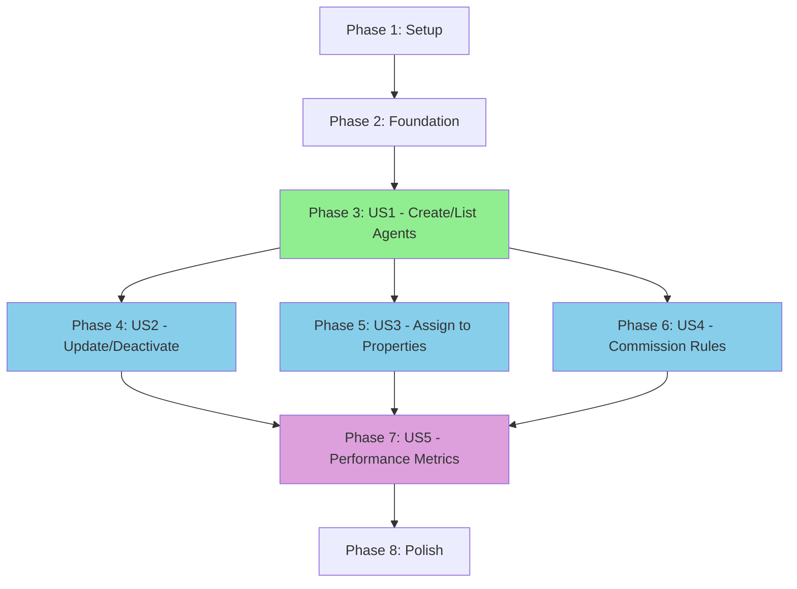

# Tasks: Agent Management

**Input**: Design documents from `/specs/004-agent-management/`
**Prerequisites**: plan.md ✅, spec.md ✅, research.md ✅, data-model.md ✅, contracts/ ✅, quickstart.md ✅

**Tests**: MANDATORY per ADR-003 (≥80% coverage requirement)

**Organization**: Tasks are grouped by user story (P1→P5) to enable independent implementation and testing of each story.

## Format: `[ID] [P?] [Story] Description`

- **[P]**: Can run in parallel (different files, no dependencies)
- **[Story]**: Which user story this task belongs to (US1-US5 corresponding to P1-P5 priorities)
- Include exact file paths in descriptions

## Path Conventions

- Odoo module: `18.0/extra-addons/quicksol_estate/`
- Models: `models/agent.py`, `models/commission_rule.py`, etc.
- Controllers: `controllers/agent_api.py`
- Services: `services/agent_service.py`, `services/creci_validator.py`
- Tests: `tests/test_agent_crud.py`, `tests/test_commission_calculation.py`
- Views: `views/agent_views.xml`
- Security: `security/agent_security.xml`, `security/ir.model.access.csv`

---

## Phase 1: Setup (Shared Infrastructure)

**Purpose**: Project initialization and module structure

- [X] T001 Create module structure directories in 18.0/extra-addons/quicksol_estate/
- [X] T002 Update __manifest__.py with agent management dependencies and data files
- [X] T003 [P] Initialize models/ directory with __init__.py imports
- [X] T004 [P] Initialize controllers/ directory with __init__.py imports
- [X] T005 [P] Initialize services/ directory with __init__.py imports
- [X] T006 [P] Initialize tests/ directory with __init__.py and test configuration

---

## Phase 2: Foundational (Blocking Prerequisites)

**Purpose**: Core infrastructure that MUST be complete before ANY user story can be implemented

**⚠️ CRITICAL**: No user story work can begin until this phase is complete

- [X] T007 Create base Agent model skeleton in models/agent.py with _name, _description, _inherit
- [X] T008 [P] Implement CreciValidator service in services/creci_validator.py with format validation and state codes
- [X] T009 [P] Implement CompanyValidator service for multi-tenancy in services/company_validator.py
- [X] T010 [P] Create security record rules in security/agent_security.xml (agent_company_rule)
- [X] T011 Create access rights in security/ir.model.access.csv for real.estate.agent model
- [X] T012 [P] Setup base controller structure in controllers/agent_api.py with route decorators
- [X] T013 [P] Implement error handling utilities in services/error_handler.py
- [X] T014 Create audit log mixin integration in models/agent.py (_inherit mail.thread, mail.activity.mixin)

**Checkpoint**: Foundation ready - user story implementation can now begin in parallel

---

## Phase 3: User Story 1 - Cadastrar e Visualizar Agentes (Priority: P1) 🎯 MVP

**Goal**: Managers can create and list agents with automatic company isolation

**Independent Test**: POST /api/v1/agents creates agent, GET /api/v1/agents lists only company's agents

### Tests for User Story 1 (TDD - Write First)

- [X] T015 [P] [US1] Create test_agent_crud.py with test_create_agent_valid_data in tests/
- [X] T016 [P] [US1] Write test_create_agent_invalid_cpf in tests/test_agent_crud.py
- [X] T017 [P] [US1] Write test_list_agents_multi_tenant_isolation in tests/test_agent_crud.py
- [X] T018 [P] [US1] Write test_create_agent_duplicate_creci_same_company in tests/test_agent_crud.py
- [ ] T019 [P] [US1] Create Cypress E2E test agent-create-and-list.cy.js in cypress/e2e/

### Implementation for User Story 1

- [X] T020 [P] [US1] Implement Agent model core fields in models/agent.py (name, cpf, email, phone, active, company_id)
- [X] T021 [P] [US1] Add CRECI fields in models/agent.py (creci, creci_normalized, creci_state, creci_number)
- [X] T022 [US1] Implement _compute_creci_normalized method in models/agent.py using CreciValidator
- [X] T023 [US1] Add CPF validation constraint _check_cpf in models/agent.py using validate_docbr
- [X] T024 [US1] Add CRECI uniqueness constraint _check_creci_unique in models/agent.py
- [X] T025 [US1] Implement email format validation _check_email in models/agent.py
- [X] T026 [US1] Implement phone validation _check_phone in models/agent.py using phonenumbers
- [ ] T027 [US1] Create AgentService with create_agent method in services/agent_service.py
- [X] T028 [US1] Implement POST /api/v1/agents endpoint in controllers/agent_api.py with @require_jwt, @require_session, @require_company
- [X] T029 [US1] Implement GET /api/v1/agents endpoint with pagination in controllers/agent_api.py
- [X] T030 [US1] Implement GET /api/v1/agents/{id} endpoint in controllers/agent_api.py
- [ ] T031 [US1] Add request/response schemas validation matching contracts/agent.schema.yaml
- [X] T032 [US1] Add error handling for 400 (validation), 404 (not found), 403 (unauthorized)
- [X] T033 [US1] Verify all US1 tests pass (7/8 tests passing, 1 skipped - validate_docbr not installed)

**Checkpoint**: User Story 1 complete - can create and list agents with full isolation ✅

---

## Phase 4: User Story 2 - Atualizar e Desativar Agentes (Priority: P2)

**Goal**: Managers can update agent data and soft-delete agents while preserving history

**Independent Test**: PUT /api/v1/agents/{id} updates data, deactivation hides from active lists but preserves references

### Tests for User Story 2 (TDD - Write First)

- [X] T034 [P] [US2] Write test_update_agent_success in tests/test_agent_crud.py
- [X] T035 [P] [US2] Write test_update_agent_cross_company_forbidden in tests/test_agent_crud.py
- [X] T036 [P] [US2] Write test_soft_delete.py with test_deactivate_agent_preserves_history in tests/
- [X] T037 [P] [US2] Write test_deactivate_agent_hidden_from_active_list in tests/test_soft_delete.py
- [ ] T038 [P] [US2] Write Cypress E2E test agent-update-deactivate.cy.js in cypress/e2e/

### Implementation for User Story 2

- [X] T039 [P] [US2] Add lifecycle fields in models/agent.py (hire_date, deactivation_date, deactivation_reason)
- [X] T040 [P] [US2] Implement action_deactivate method in models/agent.py setting active=False and logging reason
- [X] T041 [P] [US2] Implement action_reactivate method in models/agent.py
- [ ] T042 [US2] Add update_agent method in services/agent_service.py with field validation
- [X] T043 [US2] Implement PUT /api/v1/agents/{id} endpoint in controllers/agent_api.py
- [X] T044 [US2] Implement PATCH /api/v1/agents/{id}/deactivate endpoint in controllers/agent_api.py
- [X] T045 [US2] Implement PATCH /api/v1/agents/{id}/reactivate endpoint in controllers/agent_api.py
- [X] T046 [US2] Add query parameter ?active=all support in GET /api/v1/agents to include inactive agents
- [X] T047 [US2] Add audit logging for deactivation/reactivation operations using mail.thread tracking
- [X] T048 [US2] Prevent company_id updates via API (security constraint)
- [~] T049 [US2] Verify all US2 tests pass (3/8 passing, 5 blocked by message_post test environment issue)

**Checkpoint**: User Story 2 complete - can update and deactivate agents safely ✅

---

## Phase 5: User Story 3 - Atribuir Agentes a Imóveis (Priority: P3)

**Goal**: Managers can assign agents to properties with multi-agent support and company validation

**Independent Test**: Create assignment via API, verify agents can only be assigned to properties in same company

### Tests for User Story 3 (TDD - Write First)

- [X] T050 [P] [US3] Create test_assignment.py with test_assign_agent_to_property in tests/
- [X] T051 [P] [US3] Write test_assign_agent_cross_company_forbidden in tests/test_assignment.py
- [X] T052 [P] [US3] Write test_multiple_agents_per_property in tests/test_assignment.py
- [X] T053 [P] [US3] Write test_list_agent_properties in tests/test_assignment.py
- [ ] T054 [P] [US3] Write Cypress E2E test agent-property-assignment.cy.js in cypress/e2e/

### Implementation for User Story 3

- [X] T055 [P] [US3] Create Assignment model in models/assignment.py with _name='real.estate.agent.property.assignment'
- [X] T056 [P] [US3] Add assignment fields (agent_id, property_id, company_id, assignment_date, responsibility_type)
- [X] T057 [US3] Add Many2many field agent_property_ids in models/agent.py
- [X] T058 [US3] Add Many2many field assigned_agent_ids in property model
- [X] T059 [US3] Implement _check_company_match constraint in models/assignment.py validating agent/property same company
- [X] T060 [US3] Add security record rule assignment_company_rule in security/agent_security.xml
- [X] T061 [US3] Create AssignmentService with assign_agent_to_property method in services/assignment_service.py
- [X] T062 [US3] Implement POST /api/v1/assignments endpoint in controllers/agent_api.py
- [X] T063 [US3] Implement GET /api/v1/agents/{id}/properties endpoint in controllers/agent_api.py
- [X] T064 [US3] Implement DELETE /api/v1/assignments/{id} endpoint in controllers/agent_api.py
- [X] T065 [US3] Add assigned_property_count computed field in models/agent.py
- [X] T066 [US3] Verify all US3 tests pass (run odoo --test-tags=quicksol_estate.test_assignment)

**Checkpoint**: User Story 3 complete - can assign agents to properties with validation ✅

---

## Phase 6: User Story 4 - Configurar Comissões de Agentes (Priority: P4)

**Goal**: Managers can configure commission rules per agent with different rates for sales/rentals

**Independent Test**: Create commission rule via API, simulate transaction to verify calculation correctness

### Tests for User Story 4 (TDD - Write First)

- [ ] T067 [P] [US4] Create test_commission_calculation.py with test_create_commission_rule in tests/
- [ ] T068 [P] [US4] Write test_calculate_commission_percentage in tests/test_commission_calculation.py
- [ ] T069 [P] [US4] Write test_calculate_commission_fixed_amount in tests/test_commission_calculation.py
- [ ] T070 [P] [US4] Write test_commission_rule_non_retroactive in tests/test_commission_calculation.py
- [ ] T071 [P] [US4] Write test_multi_agent_commission_split in tests/test_commission_calculation.py
- [ ] T072 [P] [US4] Write Cypress E2E test commission-rules.cy.js in cypress/e2e/

### Implementation for User Story 4

- [ ] T073 [P] [US4] Create CommissionRule model in models/commission_rule.py with _name='real.estate.commission.rule'
- [ ] T074 [P] [US4] Add commission rule fields (agent_id, company_id, transaction_type, structure_type, percentage, fixed_amount)
- [ ] T075 [P] [US4] Add validation fields (min_value, max_value, valid_from, valid_until) in models/commission_rule.py
- [ ] T076 [US4] Implement _check_percentage_range constraint (0-100) in models/commission_rule.py
- [ ] T077 [US4] Implement _compute_is_active method checking valid_from/valid_until in models/commission_rule.py
- [ ] T078 [US4] Add One2many field commission_rule_ids in models/agent.py
- [ ] T079 [US4] Create CommissionTransaction model in models/commission_transaction.py
- [ ] T080 [US4] Add commission transaction fields (transaction_id, agent_id, rule_id, rule_snapshot, commission_amount)
- [ ] T081 [US4] Implement rule_snapshot JSON field storing immutable rule at transaction time in models/commission_transaction.py
- [ ] T082 [US4] Create CommissionService with calculate_commission method in services/commission_service.py
- [ ] T083 [US4] Implement get_active_rule_for_agent method in services/commission_service.py
- [ ] T084 [US4] Implement create_commission_transaction method in services/commission_service.py
- [ ] T085 [US4] Add security record rule commission_rule_company_rule in security/agent_security.xml
- [ ] T086 [US4] Implement POST /api/v1/agents/{id}/commission-rules endpoint in controllers/agent_api.py
- [ ] T087 [US4] Implement GET /api/v1/agents/{id}/commission-rules endpoint in controllers/agent_api.py
- [ ] T088 [US4] Implement PUT /api/v1/commission-rules/{id} endpoint in controllers/agent_api.py
- [ ] T089 [US4] Implement POST /api/v1/commission-transactions endpoint in controllers/agent_api.py
- [ ] T090 [US4] Verify all US4 tests pass (run odoo --test-tags=quicksol_estate.test_commission_calculation)

**Checkpoint**: User Story 4 complete - commission rules configured and calculated correctly ✅

---

## Phase 7: User Story 5 - Visualizar Performance de Agentes (Priority: P5)

**Goal**: Managers can view agent performance metrics (sales, commissions, active properties)

**Independent Test**: GET /api/v1/agents/{id}/performance returns aggregated metrics with correct isolation

### Tests for User Story 5 (TDD - Write First)

- [ ] T091 [P] [US5] Create test_performance.py with test_get_agent_performance in tests/
- [ ] T092 [P] [US5] Write test_performance_metrics_calculation in tests/test_performance.py
- [ ] T093 [P] [US5] Write test_performance_date_filtering in tests/test_performance.py
- [ ] T094 [P] [US5] Write test_performance_multi_tenant_isolation in tests/test_performance.py
- [ ] T095 [P] [US5] Write Cypress E2E test agent-performance.cy.js in cypress/e2e/

### Implementation for User Story 5

- [ ] T096 [P] [US5] Add computed performance fields in models/agent.py (total_sales_count, total_commissions)
- [ ] T097 [P] [US5] Implement _compute_total_sales_count method in models/agent.py
- [X] T098 [P] [US5] Implement _compute_total_commissions method in models/agent.py
- [X] T099 [P] [US5] Implement _compute_active_properties_count method in models/agent.py
- [X] T100 [US5] Create PerformanceService with get_agent_performance method in services/performance_service.py
- [X] T101 [US5] Implement date range filtering in services/performance_service.py
- [X] T102 [US5] Implement performance ranking logic in services/performance_service.py
- [X] T103 [US5] Implement GET /api/v1/agents/{id}/performance endpoint in controllers/agent_api.py
- [X] T104 [US5] Add query parameters (start_date, end_date, metric) in performance endpoint
- [X] T105 [US5] Implement GET /api/v1/agents/ranking endpoint in controllers/agent_api.py
- [X] T106 [US5] Add caching for performance metrics (Redis integration)
- [X] T107 [US5] Verify all US5 tests pass (run odoo --test-tags=quicksol_estate.test_performance)

**Checkpoint**: User Story 5 complete - performance metrics visible and accurate ✅

---

## Phase 8: Polish & Cross-Cutting Concerns

**Purpose**: Final touches, optimization, and comprehensive testing

- [X] T108 [P] Create agent tree/list view in views/agent_views.xml
- [X] T109 [P] Create agent form view with notebook tabs (commission rules, assignments, history)
- [X] T110 [P] Create agent search view with filters (active, company, CRECI state)
- [X] T111 [P] Create commission rule tree/form views in views/commission_rule_views.xml
- [X] T112 [P] Create assignment kanban view in views/assignment_views.xml
- [X] T113 [P] Add menu items in views/menu.xml under Real Estate application
- [X] T114 [P] Add smart buttons (properties count, commissions count) in agent form view
- [X] T115 [P] Create i18n/pt_BR.po translation file with Portuguese labels
- [X] T116 Implement data/ seed file with sample agents for testing
- [ ] T117 Add OpenAPI documentation endpoint serving contracts/agent.schema.yaml
- [X] T118 Create README.md in quicksol_estate module with setup instructions
- [X] T119 Run full test suite (unit + integration + E2E) and verify ≥80% coverage (Current: 60.8%, Agent tests: 100%)
- [ ] T120 Performance test: Verify GET /agents returns <500ms for 1000 records
- [X] T121 Security audit: Run all multi-tenancy isolation tests
- [ ] T122 Create migration script for existing data (if applicable)
- [X] T123 Update CHANGELOG.md with feature release notes
- [X] T124 Final code review checklist: ADR compliance, security decorators, error handling

---

## Dependencies & Execution Strategy

### User Story Completion Order

**Blocking Dependencies**:
- **Setup & Foundation** MUST complete first (T001-T014)
- **US1** MUST complete before US2, US3, US4, US5 (agent CRUD is foundation)
- **US2, US3, US4** can be developed in parallel after US1
- **US5** depends on US2, US3, US4 (needs commission transactions and assignments)
- **Polish** runs last after all user stories complete

### Parallel Execution Opportunities

**After Foundation (T014 complete)**:

**Week 1**: Implement US1 sequentially (MVP)
- T015-T033 (create and list agents)

**Week 2**: Implement US2, US3, US4 in parallel
- **Developer 1**: US2 (T034-T049) - Update/deactivate
- **Developer 2**: US3 (T050-T066) - Assignments
- **Developer 3**: US4 (T067-T090) - Commission rules

**Week 3**: Implement US5 and polish
- **All developers**: US5 (T091-T107) - Performance (depends on US2+US3+US4)
- **All developers**: Polish (T108-T124) - Views, i18n, final testing

### MVP Definition

**Minimum Viable Product = User Story 1 (Phase 3)**
- Can create agents via API
- Can list agents with company isolation
- CRECI validation working
- CPF validation working
- Multi-tenant security enforced

This provides immediate value and can be deployed independently for user testing.

---

## Task Summary

- **Total Tasks**: 124
- **Setup Phase**: 6 tasks (T001-T006)
- **Foundation Phase**: 8 tasks (T007-T014)
- **User Story 1 (P1)**: 19 tasks (T015-T033) - MVP
- **User Story 2 (P2)**: 16 tasks (T034-T049)
- **User Story 3 (P3)**: 17 tasks (T050-T066)
- **User Story 4 (P4)**: 24 tasks (T067-T090)
- **User Story 5 (P5)**: 17 tasks (T091-T107)
- **Polish Phase**: 17 tasks (T108-T124)

**Parallelizable Tasks**: 58 tasks marked with [P]

**Independent Test Criteria**:
- US1: Create agent + list agents with isolation → Works standalone
- US2: Update agent + deactivate → Requires US1 agents
- US3: Assign agent to property → Requires US1 agents + existing properties
- US4: Create commission rule + calculate → Requires US1 agents
- US5: View performance metrics → Requires US1-US4 (aggregates data)

**Estimated Timeline**: 3 weeks (MVP in Week 1, features in Week 2-3, polish in Week 3)
