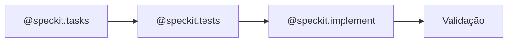
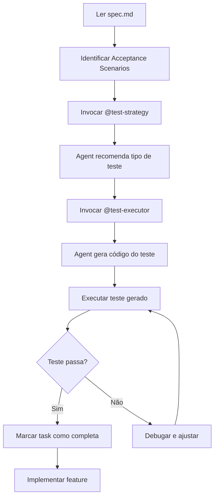

# AI-Powered Test Generation Guide

**Feature**: RBAC User Profiles System  
**Agents**: speckit.tests (integrates Test Strategy + Test Executor)  
**Updated**: 2026-01-22

## Overview

Este guia explica o **processo fluido** de geração automática de testes usando os agents do speckit.

## 🚀 Processo Fluido (Recomendado)

### Workflow Simplificado



### Comandos (3 passos)

```bash
# 1. Gerar tasks (se ainda não existir)
@speckit.tasks 005-rbac-user-profiles

# 2. Gerar TODOS os testes automaticamente
@speckit.tests 005-rbac-user-profiles

# 3. Implementar código (TDD: testes já existem)
@speckit.implement 005-rbac-user-profiles
```

**É só isso!** O `@speckit.tests` vai:
1. Ler spec.md e extrair TODOS os acceptance scenarios
2. Aplicar a "Regra de Ouro" (ADR-003) para cada um
3. Gerar código de teste (curl/bash, Cypress, ou unittest)
4. Criar arquivos nas localizações corretas
5. Marcar tasks de teste como completas em tasks.md
6. Fazer handoff para @speckit.implement

## Workflow Completo



## Passo a Passo

### 1. Preparação do Ambiente

Certifique-se que:
- Docker está rodando (`docker compose ps`)
- Odoo está acessível em `http://localhost:8069`
- Arquivo `.env` está configurado com credenciais de teste
- Agents estão disponíveis (`.github/prompts/*.prompt.md`)

```bash
cd 18.0
docker compose up -d
curl -s http://localhost:8069/web/database/selector | head -5
```

### 2. Geração de Testes para User Story 1

**Task T024.A - Owner Login e Full Access**

```bash
# Copie o Acceptance Scenario da spec.md
SCENARIO="Given a SaaS admin creates a new real estate company, \
When they create an owner user and link them via estate_company_ids, \
Then the owner can log in and sees full access to all company data"
```

**Invocar Test Strategy Agent:**

```
@test-strategy

Preciso da recomendação de teste para o seguinte cenário:

**User Story:** Owner Onboards New Real Estate Company (Priority: P1)

**Acceptance Scenario 1:**
Given a SaaS admin creates a new real estate company,  
When they create an owner user and link them via estate_company_ids,  
Then the owner can log in and sees full access to all company data

**Código envolvido:**
- Model: real.estate.company
- Model: res.users com campo estate_company_ids
- OAuth/Session authentication flow
- Record rules para filtrar dados por company
- Multi-tenancy isolation

**Operações:**
- Criar company via API
- Criar user owner via API
- Vincular user à company (estate_company_ids)
- Login do owner (OAuth flow)
- Validar acesso a dados da company
- Validar multi-tenancy (não vê outras companies)

Por favor, analise e recomende o tipo de teste adequado.
```

**Exemplo de Resposta do Test Strategy Agent:**

```markdown
## Recomendação de Teste

**Tipo de teste recomendado:** E2E (Teste de Integração) via curl/bash

**Justificativa:** 
- Precisa de banco? SIM (companies, users, OAuth tokens, sessions)
- Envolve múltiplos models persistindo dados
- Testa autenticação OAuth (incompatível com HttpCase)
- Valida record rules e multi-tenancy em cenário real

**Localização:** integration_tests/test_us1_scenario1_owner_login.sh
```

**Invocar Test Executor Agent:**

```
@test-executor

Olá Test Executor Agent! Preciso gerar o código de teste E2E usando curl/bash.

**Recomendação do Test Strategy Agent:**
- Tipo: E2E via curl/bash
- Localização: integration_tests/test_us1_scenario1_owner_login.sh

**Cenário:**
Given a SaaS admin creates a new real estate company,  
When they create an owner user and link them via estate_company_ids,  
Then the owner can log in and sees full access to all company data

**Validações esperadas:**
1. Owner consegue fazer login
2. Owner vê todos os dados da sua company
3. Multi-tenancy: owner não vê dados de outras companies

Por favor, crie o teste E2E completo usando curl/bash seguindo seu template.
```

**Resultado:** Arquivo `integration_tests/test_us1_scenario1_owner_login.sh` criado automaticamente.

### 3. Executar Teste Gerado

```bash
chmod +x integration_tests/test_us1_scenario1_owner_login.sh
bash integration_tests/test_us1_scenario1_owner_login.sh
```

**Saída esperada:**
```
✅ Admin login successful
✅ Company A created: 123
✅ Company B created: 456
✅ Owner user created and linked to Company A
✅ Owner login successful
✅ Owner sees Company A properties: 5 found
✅ Multi-tenancy: Owner cannot see Company B data
```

### 4. Marcar Task Como Completa

No arquivo `tasks.md`:
```markdown
- [X] T024.A [US1] Generate test for Scenario 1: Owner logs in and sees full access
  Expected output: integration_tests/test_us1_scenario1_owner_login.sh ✅
```

### 5. Repetir para Todos os Cenários

Repita os passos 2-4 para:
- T024.B - Owner CRUD operations
- T024.C - Multi-tenancy isolation
- T038.A até T038.D - User Story 2
- T054.A até T054.E - User Story 3
- E assim por diante...

## Automação com Script

Para acelerar o processo, você pode criar um script que itera sobre todas as tasks de teste:

```bash
#!/bin/bash
# scripts/generate_all_tests.sh

# Lista de tasks de teste da spec 005
TASKS=(
    "T024.A|US1|Owner login and full access"
    "T024.B|US1|Owner CRUD operations"
    "T024.C|US1|Multi-tenancy isolation"
    "T038.A|US2|Create user with agent profile"
    # ... adicionar todas as tasks
)

for task in "${TASKS[@]}"; do
    IFS='|' read -r task_id story description <<< "$task"
    
    echo "========================================="
    echo "Generating test: $task_id - $description"
    echo "========================================="
    
    # Aqui você pode invocar os agents programaticamente
    # ou simplesmente listar o que precisa ser feito manualmente
    
    echo "TODO: Invoke @test-strategy for: $description"
    echo "TODO: Invoke @test-executor based on strategy recommendation"
    echo ""
done
```

## Integração com Speckit Implement

Depois que todos os testes foram gerados e estão passando:

```bash
# 1. Verificar que todos os testes passam
cd integration_tests
for test in test_us*.sh; do
    echo "Running $test..."
    bash "$test" || echo "FAILED: $test"
done

# 2. Rodar speckit implement
cd /opt/homebrew/var/www/realestate/realestate_backend
speckit implement 005-rbac-user-profiles

# 3. O speckit vai:
#    - Ler tasks.md
#    - Ver que tasks de teste já estão completas (marcadas com [X])
#    - Executar apenas as tasks de implementação pendentes
#    - Rodar os testes gerados para validar cada implementação
```

## Vantagens desta Abordagem

1. **Testes antes da implementação (TDD)**: Os testes definem o comportamento esperado
2. **Documentação automática**: Cada teste documenta um acceptance scenario
3. **Velocidade**: Agents geram testes em segundos vs horas manualmente
4. **Consistência**: Todos os testes seguem os mesmos padrões (ADR-003)
5. **Cobertura completa**: Nenhum scenario fica sem teste
6. **Integração com CI/CD**: Testes prontos para rodar em pipelines

## Troubleshooting

### Teste falha com "401 Unauthorized"

**Causa:** Credenciais incorretas no `.env`

**Solução:**
```bash
cd 18.0
cat .env | grep TEST_
# Verificar: TEST_USER_ADMIN, TEST_PASSWORD_ADMIN, TEST_DATABASE
```

### Teste falha com "Connection refused"

**Causa:** Odoo não está rodando

**Solução:**
```bash
docker compose up -d
docker compose logs odoo | tail -20
```

### Agent recomenda HttpCase

**Causa:** Agent não está seguindo ADR-002

**Solução:** Reforçar no prompt que HttpCase é PROIBIDO:
```
IMPORTANTE: HttpCase é proibido por ADR-002. Use curl/bash para testes E2E de API.
```

### Teste gerado não executa

**Causa:** Falta permissão de execução

**Solução:**
```bash
chmod +x integration_tests/test_*.sh
```

## Checklist de Validação

Antes de marcar uma task de teste como completa:

- [ ] Teste foi gerado pelo Test Executor Agent
- [ ] Arquivo de teste existe no local correto
- [ ] Teste tem permissão de execução (`chmod +x`)
- [ ] Teste executa sem erros
- [ ] Teste valida todos os acceptance criteria
- [ ] Teste segue padrões do ADR-003
- [ ] Teste está documentado (comentários no código)
- [ ] Teste pode rodar em CI/CD (não depende de estado manual)

## Próximos Passos

1. Gerar todos os testes das User Stories P1 (US1, US2, US3)
2. Executar `speckit implement` para implementar as features
3. Validar que testes continuam passando após implementação
4. Gerar testes para User Stories P2 e P3
5. Documentar lições aprendidas

## Referências

- [ADR-002: Cypress End-to-End Testing](../../docs/adr/ADR-002-cypress-end-to-end-testing.md)
- [ADR-003: Mandatory Test Coverage](../../docs/adr/ADR-003-mandatory-test-coverage.md)
- [Test Strategy Agent](.github/prompts/test-strategy.prompt.md)
- [Test Executor Agent](.github/prompts/test-executor.prompt.md)
- [Spec 005: RBAC User Profiles](spec.md)
