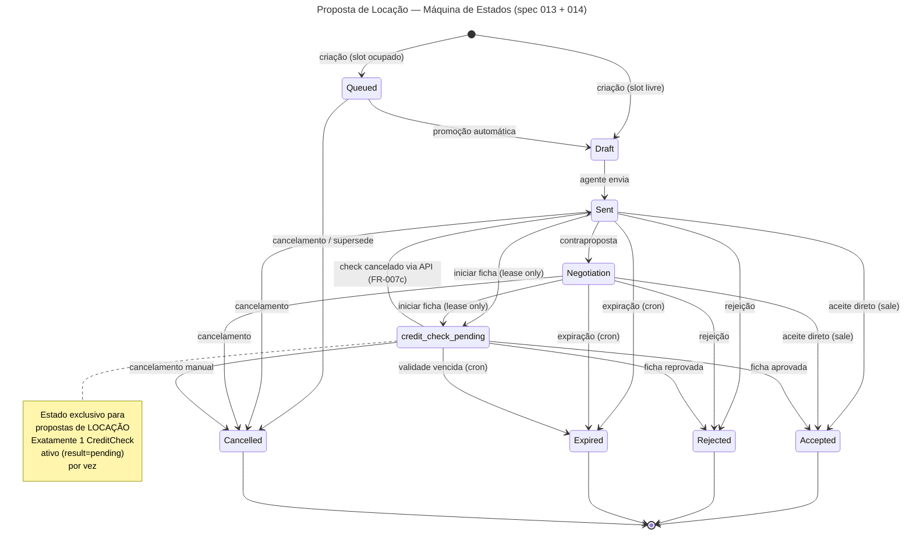
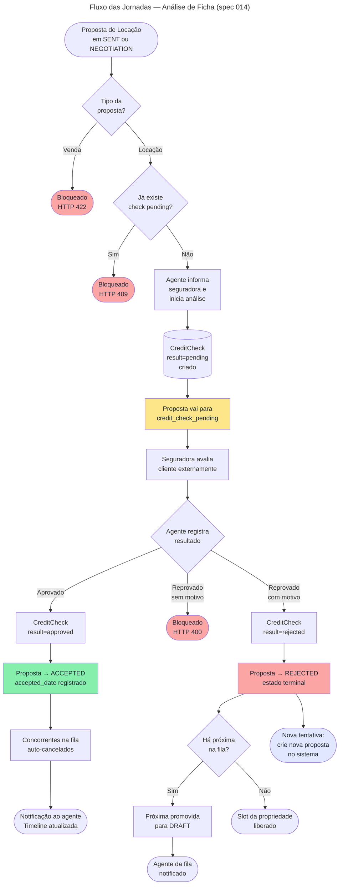

# Feature Specification: Rental Credit Check (Análise de Ficha)

**Feature Branch**: `014-rental-credit-check`
**Created**: 2026-04-28
**Status**: Draft
**Input**: User description: "Rental Credit Check - análise de ficha de crédito do locatário"
**Source Idea**: [specs/014-rental-credit-check/spec-idea.md](./spec-idea.md)

## Clarifications

### Session 2026-04-28 (áudios WhatsApp 13:32 e 13:34)

- Q: Qual é o tipo de solução desta feature? → A: Ambos — API + Odoo UI.
- Q: Esta feature cobre quais fluxos dos áudios? → A: Análise de ficha / crédito do locatário (locação) + Histórico de ficha do cliente. O fluxo de decisão do proprietário entre propostas concorrentes ficou **fora do escopo** desta spec (pode virar spec própria).
- Q: Como esta spec se relaciona com a spec 013? → A: Extensão da 013 — adiciona regras sobre ela, depende do modelo de propostas existente.
- Q: Quem são os atores da análise de ficha e como o resultado entra no sistema? → A: Agente registra o resultado manualmente (aprovado/reprovado + motivo). Sem integração automática com API de seguradora nesta versão.
- Q: A análise de ficha adiciona um novo estado à proposta? → A: Sim — novo estado explícito `credit_check_pending`; proposta fica nele até o resultado ser registrado.
- Q: Como modelar a análise de ficha? → A: Entidade `CreditCheck` separada (ligada à proposta e ao cliente), para suportar histórico completo e múltiplas tentativas.
- Q: Uma proposta pode ter mais de uma análise? → A: Uma por vez; nova análise só pode ser aberta se a anterior foi reprovada ou cancelada.
- Q: Quais perfis podem registrar e visualizar as análises? → A: Owner + Manager registram e veem tudo; Agent registra e vê apenas as suas.

### Session 2026-04-29

- Q: Quando uma ficha é reprovada, qual estado a proposta assume? → A: Proposta vai diretamente para `rejected` (terminal) — agente deve criar uma **nova proposta** para tentar com outra seguradora. Não é possível reabrir uma proposta rejeitada.
- Q: O que acontece se o agente tentar criar uma contraproposta enquanto a proposta está em `credit_check_pending`? → A: Bloqueado — a operação é rejeitada com erro. O agente deve aguardar o resultado da análise antes de qualquer negociação de termos.
- Q: Quando a data de validade de uma proposta em `credit_check_pending` passa, o que acontece? → A: O cron da spec 013 é estendido para cobrir também `credit_check_pending`: validade vencida → check ativo marcado como `cancelled` + proposta vai para `expired` (não `rejected`). Reutiliza o job existente sem criar cron separado.
- Q: Para o Agent, qual é o escopo de acesso ao histórico de fichas de um cliente? → A: Agente acessa o histórico de qualquer cliente com quem já teve proposta (qualquer estado, inclusive terminal). Acesso negado para clientes sem nenhuma proposta associada ao agente na empresa.
- Q: Volume máximo de `CreditCheck` por empresa para performance garantida (< 300ms)? → A: 1.000 checks por empresa.
- Q: Quem acessa a interface Odoo e quem acessa de forma headless? → A: **Apenas Owner, Manager e Administrador do sistema** utilizam a interface Odoo diretamente. **Agents acessam exclusivamente via aplicação headless** (Next.js/React SSR consumindo a API REST). Portanto, a aba "Análise de Ficha" no Odoo UI é destinada a Owner/Manager; o fluxo completo via API já cobre os Agents.

## Flowcharts

### Diagrama 1 — Máquina de Estados da Proposta de Locação

> Extensão da spec 013. O estado `credit_check_pending` (destacado) é exclusivo para propostas do tipo **lease**.

---

### Diagrama 2 — Fluxo das Jornadas de Análise de Ficha

> Cobre as jornadas US1 (iniciar análise), US2 (registrar resultado), US3 (nova tentativa após reprovação) e os efeitos na fila FIFO da spec 013.

---

## User Scenarios & Testing *(mandatory)*

### User Story 1 — Agente inicia análise de ficha (Priority: P1) 🎯 MVP

Para propostas de locação que já foram enviadas ou estão em negociação, o agente precisa registrar formalmente que uma análise de crédito será feita junto à seguradora antes do aceite final. Isso inicia um estado de espera onde a proposta fica pendente até o resultado da seguradora.

**Why this priority**: Sem a abertura da análise, o fluxo de locação não pode avançar — é o pré-requisito para qualquer aceite em contratos de aluguel. É a fatia mínima viável: mesmo sem registrar o resultado, já permite controlar o estado da proposta.

**Independent Test**: Pode ser testado de forma isolada criando uma proposta de locação em estado `sent`, chamando o endpoint de abertura de análise e verificando que: (1) a proposta muda para `credit_check_pending`, (2) um registro `CreditCheck` com `result=pending` é criado, (3) o timeline registra o evento.

**Acceptance Scenarios**:

1. **Given** uma proposta de locação em estado `sent` ou `negotiation`, **When** o agente submete uma solicitação de análise informando a seguradora, **Then** a proposta muda para `credit_check_pending`, um `CreditCheck` com `result=pending` é criado, e o timeline da proposta registra o evento.
2. **Given** uma proposta de **venda** em qualquer estado, **When** tentativa de abrir análise de ficha, **Then** o sistema rejeita com erro indicando que análise de ficha é exclusiva para propostas de locação.
3. **Given** uma proposta de locação já em estado `credit_check_pending` (análise ativa em andamento), **When** tentativa de abrir segunda análise, **Then** o sistema bloqueia indicando que já existe uma análise em andamento.
4. **Given** uma proposta em estado terminal (Accepted, Rejected, Expired, Cancelled), **When** qualquer operação de análise é tentada, **Then** o sistema bloqueia com erro de estado terminal.
5. **Given** um agente tentando iniciar análise em proposta de outro agente, **When** a solicitação é feita, **Then** o sistema nega a operação.

---

### User Story 2 — Agente registra resultado da análise (Priority: P1) 🎯 MVP

Após a seguradora emitir seu parecer, o agente registra o resultado manualmente (aprovado ou reprovado). Se aprovado, a proposta avança diretamente para aceite. Se reprovado, a proposta vai para rejeitado e a próxima da fila é promovida automaticamente.

**Why this priority**: Fecha o ciclo do MVP — sem o registro do resultado, a proposta fica presa em `credit_check_pending` para sempre. É o complemento direto da US1.

**Independent Test**: Com uma proposta em `credit_check_pending`, registrar `result=approved` e verificar que a proposta vai para `accepted`, `accepted_date` é registrado e os concorrentes são cancelados. Separadamente, registrar `result=rejected` com motivo e verificar que a proposta vai para `rejected` e a próxima da fila é promovida.

**Acceptance Scenarios**:

1. **Given** um `CreditCheck` em estado `pending`, **When** o agente registra `result=approved`, **Then** o check muda para `approved`, a proposta muda para `accepted`, `accepted_date` é registrado, o evento `proposal.accepted` é emitido, e o timeline registra o evento.
2. **Given** um `CreditCheck` em estado `pending`, **When** o agente registra `result=rejected` **sem** motivo de reprovação, **Then** o sistema rejeita a requisição exigindo o motivo.
3. **Given** um `CreditCheck` em estado `pending`, **When** o agente registra `result=rejected` com `rejection_reason`, **Then** o check muda para `rejected`, a proposta muda para `rejected`, e a próxima proposta na fila da propriedade é promovida automaticamente para `draft` com notificação ao agente responsável.
4. **Given** uma proposta rejeitada por ficha com próxima da fila sendo de locação, **When** promovida, **Then** a proposta promovida **não** inicia análise de ficha automaticamente — o agente decide quando iniciar.
5. **Given** um `CreditCheck` com resultado já definido (approved, rejected, ou cancelled), **When** tentativa de alterar o resultado, **Then** o sistema bloqueia — resultado é imutável.

---

### User Story 3 — Nova tentativa após reprovação: criar nova proposta (Priority: P2)

Quando uma ficha é reprovada, a proposta vai para o estado terminal `rejected` e o próximo da fila é promovido automaticamente. Se o agente quiser tentar a locação com outra seguradora para o mesmo cliente, deve criar uma **nova proposta** — que entra normalmente na fila FIFO. O histórico de fichas do cliente (US4) fica disponível para orientar a escolha da seguradora na nova tentativa.

**Why this priority**: Esclarece o comportamento esperado após reprovação e evita confusão operacional. A proposta rejeitada é imutável; a continuidade da negociação passa pela criação de nova proposta.

**Independent Test**: Rejeitar um check em uma proposta de locação → verificar que a proposta vai para `rejected` (terminal, bloqueada para qualquer atualização) → verificar que a próxima da fila é promovida → criar nova proposta para o mesmo cliente → verificar que o histórico de fichas do cliente exibe o check anterior.

**Acceptance Scenarios**:

1. **Given** um `CreditCheck` em estado `pending`, **When** o agente registra `result=rejected` com motivo, **Then** a proposta transita para `rejected` (terminal) e **nenhuma** operação adicional (novo check, edição, envio) é permitida nessa proposta.
2. **Given** uma proposta em estado `rejected` (reprovada por ficha), **When** o agente tenta abrir nova análise na mesma proposta, **Then** o sistema bloqueia — estado terminal.
3. **Given** uma proposta rejeitada por ficha, **When** o agente cria **nova proposta** para o mesmo cliente e propriedade, **Then** a nova proposta entra na fila normalmente (FIFO) e o histórico de fichas do cliente exibe o check anterior da proposta rejeitada.

---

### User Story 4 — Histórico de fichas do cliente (Priority: P2)

Quando um cliente retorna meses ou anos depois para outra proposta de locação, o agente consegue consultar todo o histórico de análises de ficha desse cliente, incluindo quais seguradoras foram utilizadas, os resultados e os motivos de eventuais reprovações.

**Why this priority**: Informação histórica valiosa para o agente avaliar a viabilidade antes mesmo de submeter uma nova análise, poupando tempo e evitando reprovações previsíveis.

**Independent Test**: Criar cliente com 3 checks históricos em propostas diferentes (1 aprovado, 2 reprovados com diferentes seguradoras), consultar o endpoint de histórico e verificar que: (1) todos os 3 registros aparecem, (2) o `summary` mostra contagem correta, (3) resultado está isolado por empresa.

**Acceptance Scenarios**:

1. **Given** um cliente com checks em múltiplas propostas, **When** consultado `GET /api/v1/clients/{partner_id}/credit-history`, **Then** retorna todos os checks paginados (máx. 100) com proposta, seguradora, resultado, data e motivo.
2. **Given** cliente de outra empresa consultado por usuário da empresa atual, **When** chamada feita, **Then** retorna HTTP 404 — sem informação de existência.
3. **Given** um agente consultando histórico de cliente com quem **nunca teve proposta** (na empresa), **When** chamada feita, **Then** retorna HTTP 404 — agente só acessa clientes de suas próprias propostas (qualquer estado).
4. **Given** cliente sem nenhum histórico de fichas, **When** consultado por Owner ou Manager, **Then** retorna array vazio com HTTP 200.
5. **Given** a consulta de detalhe de uma proposta de locação, **When** o cliente possui fichas anteriores, **Then** a resposta inclui `credit_history_summary` com contadores de aprovações e reprovações totais do cliente.

---

### User Story 5 — Visualização e operação no Odoo UI — Owner/Manager (Priority: P1)

Owners e Managers precisam realizar o fluxo de análise de ficha diretamente no formulário da proposta dentro do Odoo. Agents acessam exclusivamente via aplicação headless (API REST); a interface Odoo não é destinada a eles.

**Why this priority**: O Odoo UI é o canal operacional diário de Owners e Managers. Sem UI, esses perfis dependem exclusivamente da API para operações administrativas e de supervisão.

**Independent Test**: Abrir formulário de proposta de locação no Odoo como Manager, verificar que aba "Análise de Ficha" carrega sem erros, iniciar análise via botão, registrar resultado e verificar estado atualizado — tudo sem erros no console do browser.

**Acceptance Scenarios**:

1. **Given** uma proposta de locação aberta no Odoo por um Owner ou Manager, **When** usuário navega para a aba "Análise de Ficha", **Then** a aba carrega sem erros exibindo o histórico de checks.
2. **Given** proposta de locação em `sent` ou `negotiation`, **When** aba de ficha está aberta por Owner/Manager, **Then** o botão "Iniciar Análise" está visível e habilitado.
3. **Given** proposta em `credit_check_pending`, **When** aba de ficha aberta por Owner/Manager, **Then** formulário para registrar resultado (aprovado/reprovado + seguradora + motivo) está disponível.
4. **Given** uma proposta de **venda**, **When** aba de ficha aberta, **Then** mensagem informativa indica que análise de ficha é exclusiva para locação e controles de criação estão desabilitados.
5. **Given** qualquer interação na UI de análise de ficha, **When** ação executada, **Then** browser DevTools console registra ZERO erros JavaScript.

---

### Edge Cases

- **Proposta expirada com análise pendente**: quando o cron diário (extensão da spec 013 FR-026) expira uma proposta em `credit_check_pending`, o `CreditCheck` ativo é marcado como `cancelled` e a proposta vai para `expired` (não `rejected`). A próxima da fila é promovida normalmente.
- **Proposta cancelada com análise pendente**: se a proposta for cancelada manualmente enquanto `credit_check_pending`, o check ativo é marcado como `cancelled` automaticamente.
- **Aprovação com concorrentes na fila**: aprovação via análise de ficha executa o mesmo cancelamento de concorrentes da spec 013 (FR-014) — a propriedade fica "ocupada" pelo aceito.
- **Reprovação sem próxima na fila**: ficha reprovada move proposta para `rejected` e a propriedade fica livre normalmente, sem promoção (nada a promover).
- **Re-abertura após aprovação**: não permitida — proposta já está em estado terminal `accepted`.
- **Agente visualiza checks criados por manager**: agente pode visualizar todos os checks de suas propostas, independentemente de quem os criou.
- **Seguradora com nome livre**: `insurer_name` é texto livre sem lista predefinida, para suportar qualquer seguradora atual ou futura.
- **Proposta rejeitada por ficha reentra na fila?**: não — proposta vai para `rejected` (terminal). Nova tentativa exige nova proposta (nova entrada na fila).
- **Counter-proposal em `credit_check_pending`**: bloqueado — proposta em análise de ficha não aceita contraproposta. O agente deve aguardar o resultado da análise. Se reprovada, cria nova proposta; se aprovada, a proposta está aceita.

## Requirements *(mandatory)*

### Functional Requirements

#### Estado e Transições

- **FR-001**: O sistema DEVE adicionar o estado `credit_check_pending` ao conjunto de estados válidos de uma proposta, aplicável **exclusivamente** a propostas de tipo `lease`.
- **FR-002**: O sistema DEVE permitir as transições `sent → credit_check_pending` e `negotiation → credit_check_pending` somente para propostas do tipo `lease`.
- **FR-003**: O sistema DEVE permitir a transição `credit_check_pending → accepted` quando o resultado da análise for `approved`.
- **FR-004**: O sistema DEVE permitir a transição `credit_check_pending → rejected` quando o resultado for `rejected`, exigindo `rejection_reason` obrigatório.
- **FR-005**: O sistema DEVE bloquear quaisquer outras transições a partir de `credit_check_pending`, exceto para `accepted`, `rejected`, `cancelled`, e `expired` (somente via cron — ver FR-007).
- **FR-005a**: O sistema DEVE bloquear a criação de contraproposta (counter-proposal) quando a proposta pai está em estado `credit_check_pending`, retornando erro que explica que a proposta está em análise de ficha.
- **FR-006**: O sistema DEVE rejeitar com erro de validação a tentativa de iniciar análise de ficha em proposta do tipo `sale`.
- **FR-007**: O sistema DEVE, quando o cron diário (extensão de spec 013 FR-026) identificar uma proposta em `credit_check_pending` com `valid_until` vencido, marcar o `CreditCheck` ativo como `cancelled` e mover a proposta para `expired`. Quando a proposta for cancelada **manualmente**, o check ativo também deve ser marcado como `cancelled`.
- **FR-007c**: O sistema DEVE, quando um `CreditCheck` em estado `pending` for cancelado via `PATCH result=cancelled`, marcar o `CreditCheck` como `cancelled` e reverter o estado da proposta para `sent`, permitindo que nova análise de ficha seja iniciada para a mesma proposta.

#### Entidade CreditCheck

- **FR-008**: O sistema DEVE criar um registro `CreditCheck` a cada solicitação de análise, contendo: `proposal_id`, `partner_id` (cliente), `company_id`, `insurer_name`, `result` (pending/approved/rejected/cancelled), `requested_at`, `check_date` (data do resultado), `rejection_reason`, e campos de auditoria.
- **FR-009**: O sistema DEVE tratar o resultado de um `CreditCheck` como imutável após ser definido como `approved`, `rejected`, ou `cancelled`.
- **FR-010**: O sistema DEVE permitir no máximo **uma análise ativa** (`result=pending`) por proposta ao mesmo tempo.
- **FR-011**: O sistema NÃO DEVE permitir a abertura de nova análise de ficha em proposta já em estado terminal (`rejected`). Quando o `CreditCheck` é reprovado, a proposta transita para `rejected` (terminal); para nova tentativa com qualquer seguradora, o agente deve criar uma **nova proposta**.
- **FR-012**: O sistema DEVE preservar todo o histórico de checks da proposta mesmo após abertura de novas análises.

#### Histórico do Cliente

- **FR-013**: O sistema DEVE expor um endpoint de histórico de fichas por cliente retornando todos os `CreditCheck` associados àquele `partner_id` dentro da empresa, paginados (máx. 100).
- **FR-014**: O sistema DEVE incluir, na resposta de detalhe de uma proposta de locação, um campo `credit_history_summary` com contadores de aprovações e reprovações históricas do cliente.
- **FR-015**: O sistema DEVE isolar o histórico de fichas por `company_id` — nenhum vazamento entre empresas.

#### Integração com Fila (spec 013)

- **FR-016**: O sistema DEVE, ao registrar `result=rejected` em um `CreditCheck`, executar o mesmo mecanismo de promoção de fila da spec 013 (FR-011): a próxima proposta `queued` mais antiga é promovida para `draft`, e o agente responsável notificado.
- **FR-017**: O sistema DEVE, ao registrar `result=approved` e a proposta transitar para `accepted`, executar o mesmo mecanismo de cancelamento de concorrentes da spec 013 (FR-014): todas as propostas não-terminais na mesma propriedade são canceladas com razão "Superseded by accepted proposal *PRPxxx*".

#### Notificações

- **FR-018**: O sistema DEVE enviar notificação (email + timeline) ao agente responsável quando uma análise é aprovada ou reprovada.
- **FR-019**: O sistema DEVE desacoplar o envio de email da transição de estado, enfileirando notificações de forma assíncrona (padrão Outbox, conforme spec 013 FR-041a).

#### Autorização

- **FR-020**: O sistema DEVE aplicar a seguinte matriz de autorização:

  | Ação | Owner | Manager | Agent | Receptionist | Prospector |
  |---|---|---|---|---|---|
  | Iniciar análise | Sim | Sim | Sim (proposta própria) | Não | Não |
  | Registrar resultado | Sim | Sim | Sim (proposta própria) | Não | Não |
  | Ver checks da proposta | Sim | Sim | Sim (proposta própria) | Leitura | Não |
  | Ver histórico do cliente | Sim | Sim | Sim (clientes de qualquer proposta sua, qualquer estado) | Leitura | Não |

- **FR-021**: O sistema DEVE isolar todos os dados por `company_id`, retornando HTTP 404 para recursos de outra empresa (sem revelar existência).

#### Validação

- **FR-022**: O sistema DEVE validar `insurer_name` como campo obrigatório ao iniciar análise.
- **FR-023**: O sistema DEVE validar `rejection_reason` como obrigatório ao registrar resultado `rejected`.
- **FR-024**: O sistema DEVE validar que `check_date`, quando informado, não é uma data futura.
- **FR-025**: O sistema DEVE retornar erros de validação estruturados (ADR-018).

#### Odoo UI (Owner/Manager apenas)

- **FR-026**: O sistema DEVE exibir uma aba "Análise de Ficha" no formulário de proposta no Odoo, acessível por Owner e Manager. Agents não utilizam o Odoo diretamente — realizam todas as operações via API headless.
- **FR-027**: O sistema DEVE desabilitar controles de criação/edição de ficha para propostas de venda, exibindo mensagem informativa.
- **FR-028**: O sistema DEVE exibir o histórico de checks do cliente na aba de análise do formulário de proposta.
- **FR-029**: O sistema DEVE usar `<list>` (não `<tree>`), sem `attrs`, sem `column_invisible` com expressões Python (ADR-001).

### Key Entities *(include if feature involves data)*

- **CreditCheck**: Entidade central desta feature. Representa uma análise de crédito realizada por uma seguradora para um locatário no contexto de uma proposta de locação. Contém: código único, seguradora (texto livre), resultado (pending/approved/rejected/cancelled), data de solicitação, data do resultado, motivo de reprovação, notas e campos de auditoria. Pertence a exatamente uma proposta e um cliente. Pertence a uma empresa (multi-tenancy).
- **Proposal** (extensão da spec 013): Passa a suportar o estado `credit_check_pending` (exclusivo para `lease`) e expõe `credit_check_ids` (lista de checks) e `credit_history_summary` (campo computado).
- **Client (res.partner)**: Entidade pré-existente. O histórico de fichas é agregado por `partner_id` dentro de uma empresa.

## Success Criteria *(mandatory)*

### Measurable Outcomes

- **SC-001**: Owner ou Manager consegue iniciar e registrar resultado de análise de ficha em menos de 2 minutos via Odoo UI (do clique em "Iniciar Análise" à confirmação do resultado).
- **SC-002**: Reprovação de ficha promove o próximo da fila em ≤ 5 segundos.
- **SC-003**: Aprovação de ficha cancela todos os concorrentes atomicamente — 0 falhas verificadas em 100 execuções concorrentes.
- **SC-004**: Histórico do cliente retorna corretamente fichas de múltiplas propostas, isolado por empresa, em < 300ms para empresas com até **1.000 `CreditCheck`** registrados.
- **SC-005**: 0 erros JavaScript no console em qualquer interação na UI de análise de ficha (Odoo — Owner/Manager).
- **SC-006**: 100% das transições de estado disparadas por análise de ficha são registradas no timeline da proposta.
- **SC-007**: Tentativa de análise em proposta de venda é bloqueada em 100% dos testes.
- **SC-008**: Re-abertura de análise com check `pending` ativo é bloqueada em 100% dos testes.

## Assumptions

- A spec 013 (Property Proposals) está implementada; `thedevkitchen.estate.proposal` existe com os estados, mecanismos de fila e notificações documentados.
- O campo `proposal_type` (`sale`/`lease`) já existe na proposta (spec 013).
- `insurer_name` é texto livre — sem integração com APIs de seguradoras nesta versão.
- A transição `credit_check_pending → accepted/rejected` executa os mesmos efeitos colaterais da spec 013 (cancelamento de concorrentes / promoção de fila).
- Uma reprovação de ficha move a proposta para `rejected` (terminal). Para nova tentativa com qualquer seguradora, o agente deve criar uma **nova proposta** — não é possível reabrir uma proposta rejeitada.
- Agents acessam **exclusivamente via aplicação headless** (Next.js/React SSR consumindo a API REST). Owner, Manager e Administrador do sistema utilizam a interface Odoo diretamente.

## Dependencies

- **Spec 013** (`013-property-proposals`): modelo `thedevkitchen.estate.proposal`, estados, fila FIFO, notificações assíncronas (Outbox), cron de expiração.
- **Partner module** (`res.partner`): entidade de cliente identificada por CPF/CNPJ.
- **Notification subsystem**: Outbox assíncrono para emails (spec 013 FR-041a).
- **Activity timeline**: `mail.thread` / `mail.activity.mixin` na proposta para registro de eventos.
- **Background job scheduler**: cron diário da spec 013 (FR-026) deve ser **estendido** para incluir `credit_check_pending` como estado expirabível, marcando o check ativo como `cancelled` e movendo a proposta para `expired`.

## Out of Scope

- Integração automática via API/webhook com seguradoras (Porto Seguro, Tokio Marine etc.) — resultado é registrado manualmente.
- Análise de ficha para propostas de **venda**.
- Score de crédito calculado pelo sistema — apenas registro do resultado externo da seguradora.
- Múltiplas análises simultâneas em paralelo por proposta.
- Re-abertura de análise após aprovação (proposta já em terminal `accepted`).
- Notificações ao **cliente/locatário** sobre resultado — notificação é apenas ao agente responsável nesta versão.
- Fluxo de decisão do proprietário entre propostas concorrentes de diferente valor (mencionado nos áudios — candidato para spec 015).
- Integração com bureaus de crédito (Serasa, SPC) — fora de escopo para este ciclo.

