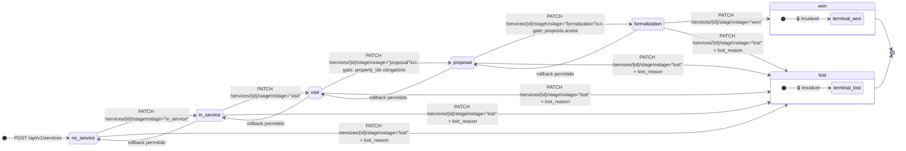
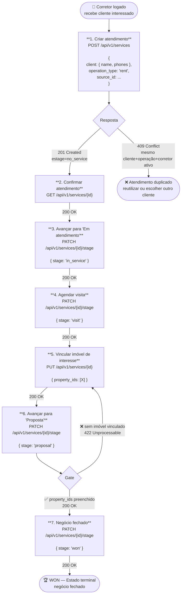
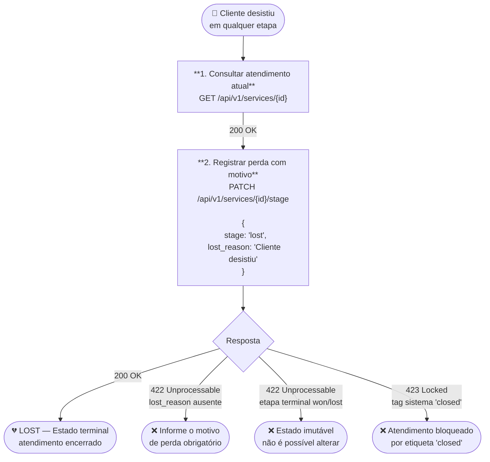
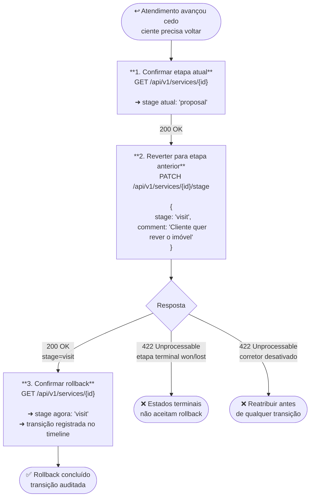
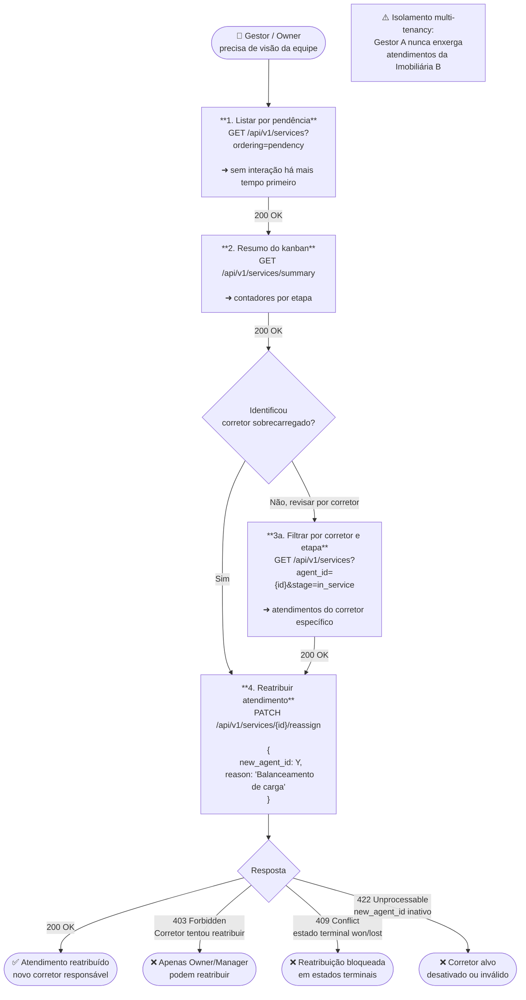
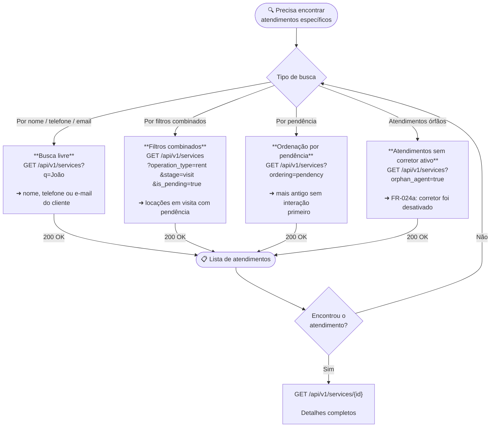
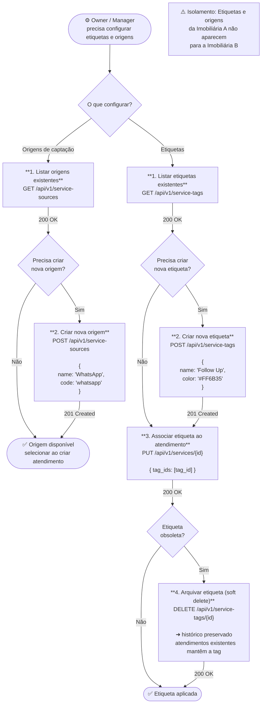
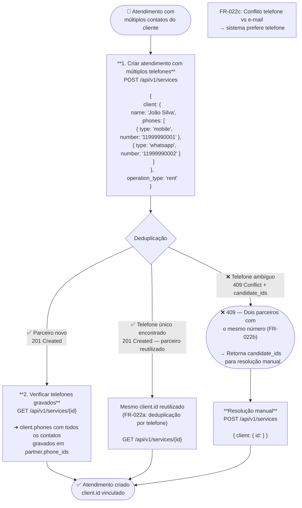
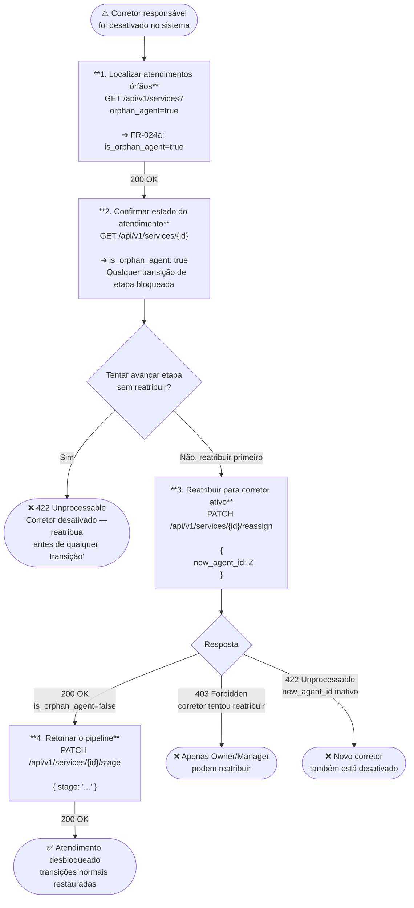

# Fluxogramas de Atendimentos — Spec 015

Este documento contém os fluxogramas visuais do ciclo de vida de um **Atendimento** (`thedevkitchen.service`), cobrindo todas as jornadas definidas em [service-flow.md](./service-flow.md). Use estes diagramas para entender quais endpoints chamar, em qual ordem e quais condições de erro tratar.

---

## Máquina de Estados do Atendimento

---

## J1 — Corretor registra e evolui atendimento pelo pipeline

---

## J2 — Atendimento marcado como perdido

---

## J3 — Rollback de etapa

---

## J4 — Gestor visualiza, filtra e reatribui atendimentos

---

## J5 — Filtros e busca no pipeline

---

## J6 — Etiquetas e origens configuráveis

---

## J7 — Múltiplos telefones e deduplicação de cliente

---

## J8 — Atendimento com corretor desativado (Orphan Agent)

---

## Resumo de Erros por Endpoint

| Endpoint | Código | Causa |
|---|---|---|
| `POST /api/v1/services` | 409 | Mesmo cliente + operação + corretor com atendimento ativo |
| `POST /api/v1/services` | 409 | Telefone ambíguo — dois parceiros com mesmo número |
| `PATCH /services/{id}/stage` | 422 | `lost_reason` ausente na transição para `lost` |
| `PATCH /services/{id}/stage` | 422 | Gate `proposal`: sem `property_ids` vinculado |
| `PATCH /services/{id}/stage` | 422 | Gate `formalization`: sem proposta aceita |
| `PATCH /services/{id}/stage` | 422 | Corretor desativado (`is_orphan_agent=true`) |
| `PATCH /services/{id}/stage` | 422 | Estado terminal (`won`/`lost`) — imutável |
| `PATCH /services/{id}/stage` | 423 | Etiqueta de sistema `closed` trava transições |
| `PATCH /services/{id}/reassign` | 403 | Corretor tentou reatribuir (precisa Owner/Manager) |
| `PATCH /services/{id}/reassign` | 409 | Atendimento em estado terminal (`won`/`lost`) |
| `DELETE /api/v1/service-tags/{id}` | 404 | Corretor fora do escopo (anti-enumeração) |
| Qualquer endpoint autenticado | 404 | Atendimento fora do escopo do corretor (anti-enumeração) |
