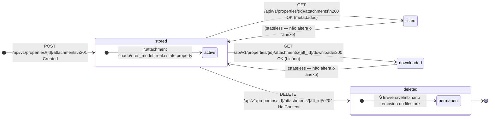
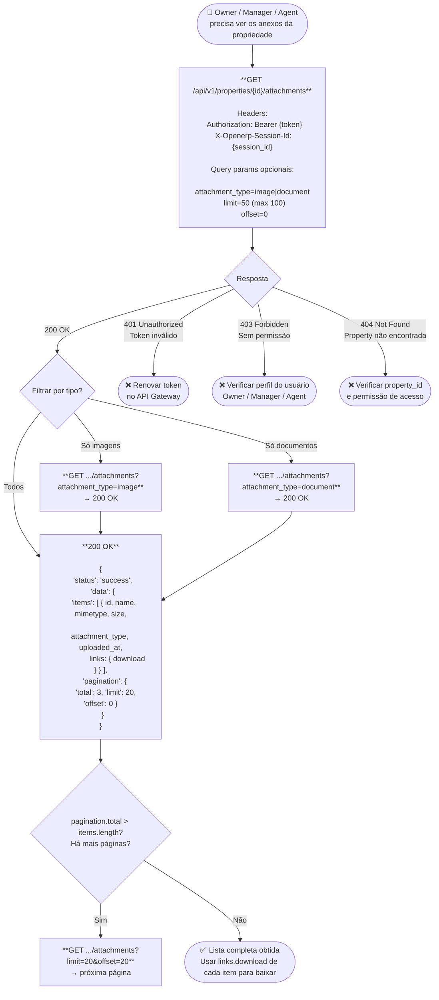
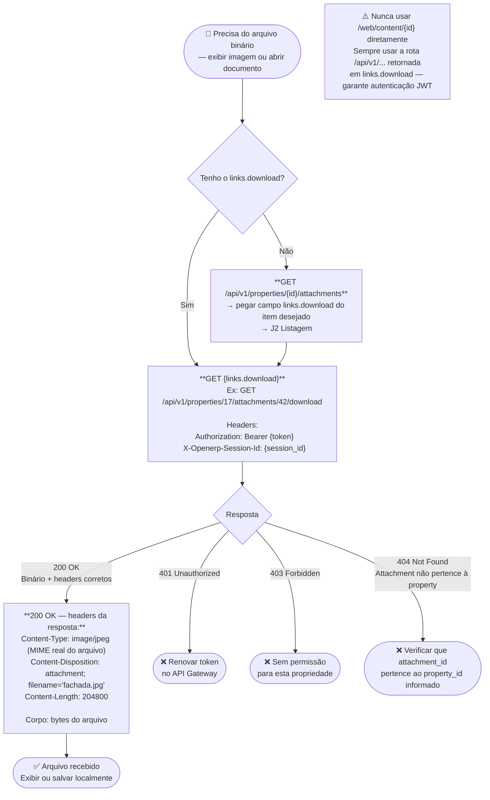
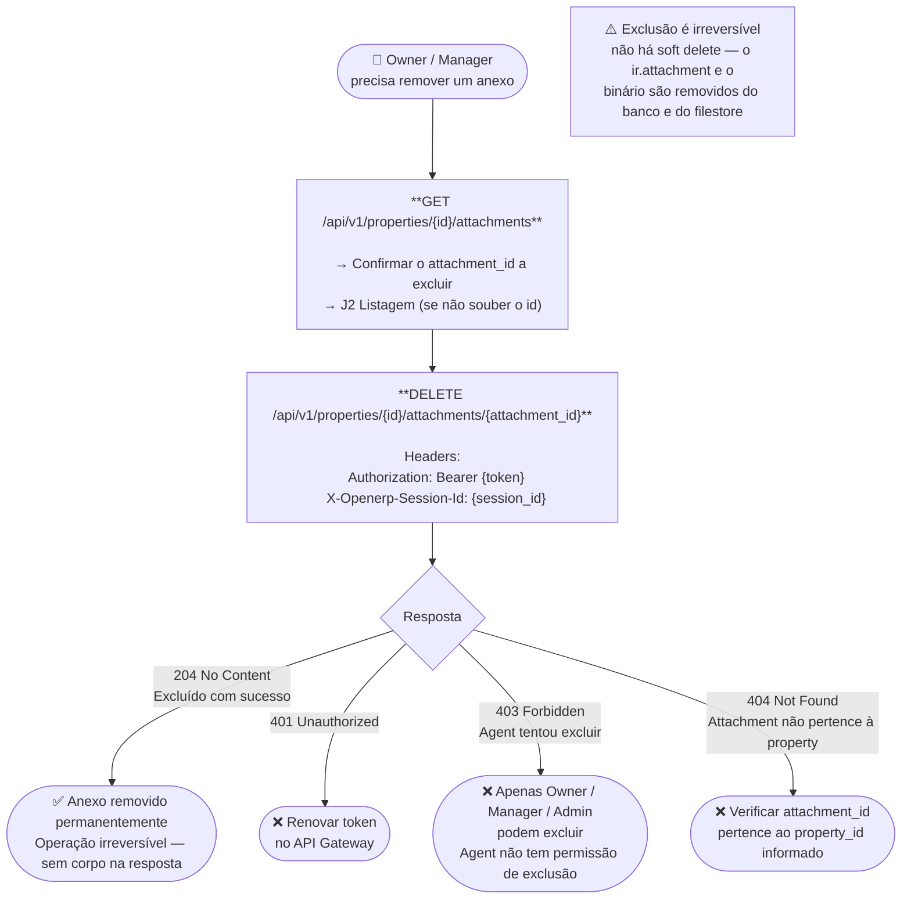
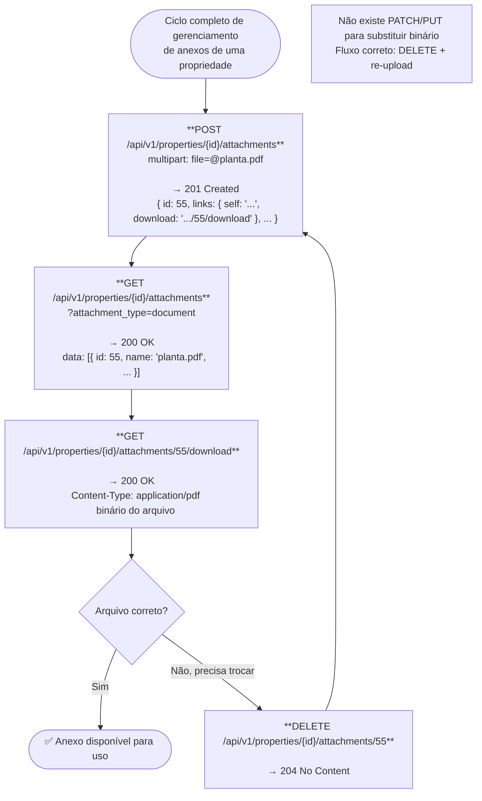

# Fluxogramas de Property Attachments — Spec 017

Este documento contém os fluxogramas visuais do ciclo de vida de **anexos de propriedades** (`ir.attachment`), cobrindo upload, listagem, download e exclusão. Use estes diagramas para entender quais endpoints chamar, em qual ordem e quais condições de erro tratar.

**Endpoints desta feature:**

| Método | Endpoint | Ação |
|--------|----------|------|
| `POST` | `/api/v1/properties/{id}/attachments` | Upload de arquivo (multipart/form-data) |
| `GET` | `/api/v1/properties/{id}/attachments` | Listar metadados dos anexos |
| `GET` | `/api/v1/properties/{id}/attachments/{attachment_id}/download` | Download do binário |
| `DELETE` | `/api/v1/properties/{id}/attachments/{attachment_id}` | Excluir anexo permanentemente |

---

## Máquina de Estados do Anexo



---

## J1 — Upload de imagem ou documento

**Endpoint:** `POST /api/v1/properties/{id}/attachments`

```mermaid
flowchart TD
    Start([👤 Owner / Manager / Agent\nprecisa anexar arquivo à propriedade]) --> U1

    U1["**POST /api/v1/properties/{id}/attachments**\n\nHeaders:\n  Authorization: Bearer {token}\n  X-Session-Id: {session_id}\n  Content-Type: multipart/form-data\n\nBody (form-data):\n  file = @fachada.jpg"] --> U1R{Validações do servidor}

    U1R -->|✅ MIME válido + tamanho OK\n+ limite de quantidade OK| U2
    U1R -->|❌ Campo 'file' ausente\n→ 400 Bad Request| ERR1([❌ Incluir campo 'file'\nno form-data])
    U1R -->|❌ MIME não permitido\n→ 415 Unsupported Media Type| ERR2([❌ Apenas imagens e PDFs/Office\nMIME validado via magic bytes\nnão pela extensão do arquivo])
    U1R -->|❌ Arquivo excede limite\n→ 413 Request Entity Too Large| ERR3([❌ Reduzir tamanho ou ajustar\nweb.max_file_upload_size no painel])
    U1R -->|❌ 50 imagens já existem\n→ 422 Unprocessable| ERR4([❌ Excluir imagens antes\nDELETE /attachments/{id}])
    U1R -->|❌ 20 documentos já existem\n→ 422 Unprocessable| ERR5([❌ Excluir documentos antes\nDELETE /attachments/{id}])
    U1R -->|❌ Property sem acesso\n→ 404 Not Found| ERR6([❌ Verificar property_id\ne permissão de acesso])

    U2["**201 Created**\n\n{\n  'status': 'success',\n  'data': {\n    'id': 42,\n    'name': 'fachada.jpg',\n    'mimetype': 'image/jpeg',\n    'size': 204800,\n    'attachment_type': 'image',\n    'uploaded_at': '2026-05-10T21:40:00Z',\n    'links': {\n      'self': '/api/v1/properties/17/attachments/42',\n      'download': '/api/v1/properties/17/attachments/42/download'\n    }\n  }\n}"] --> U3

    U3["Salvar links.download retornado\npara uso futuro"] --> Done([✅ Anexo armazenado])

    note1["⚠️ links.download SEMPRE usa /api/v1/...\nnunca /web/content/{id} — essa rota\nbypassa o API Gateway e a autenticação JWT"]
```

---

## J2 — Listagem de anexos de uma propriedade

**Endpoint:** `GET /api/v1/properties/{id}/attachments`



---

## J3 — Download do conteúdo binário

**Endpoint:** `GET /api/v1/properties/{id}/attachments/{attachment_id}/download`



---

## J4 — Exclusão de anexo

**Endpoint:** `DELETE /api/v1/properties/{id}/attachments/{attachment_id}`



---

## J5 — Ciclo completo (upload → listar → download → excluir)

**Endpoints:** `POST` → `GET` (list) → `GET` (download) → `DELETE`



---

## Resumo de Erros por Endpoint

| Endpoint | Código | Causa |
|---|---|---|
| `POST .../attachments` | 400 | Campo `file` ausente no form-data |
| `POST .../attachments` | 401 | Token JWT inválido ou ausente |
| `POST .../attachments` | 403 | Perfil sem permissão de upload (apenas Owner, Manager e Admin) |
| `POST .../attachments` | 404 | Property não encontrada (anti-enumeração) |
| `POST .../attachments` | 413 | Arquivo excede `web.max_file_upload_size` |
| `POST .../attachments` | 415 | MIME type não permitido (validado via magic bytes) |
| `POST .../attachments` | 422 | Limite de 50 imagens ou 20 documentos atingido |
| `GET .../attachments` | 401 | Token JWT inválido |
| `GET .../attachments` | 403 | Sem permissão para a propriedade |
| `GET .../attachments` | 404 | Property não encontrada (anti-enumeração) |
| `GET .../attachments/{id}/download` | 401 | Token JWT inválido |
| `GET .../attachments/{id}/download` | 403 | Sem permissão para a propriedade |
| `GET .../attachments/{id}/download` | 404 | Attachment não pertence à property informada |
| `DELETE .../attachments/{id}` | 401 | Token JWT inválido |
| `DELETE .../attachments/{id}` | 403 | Perfil sem permissão de exclusão (apenas Owner, Manager e Admin) |
| `DELETE .../attachments/{id}` | 404 | Attachment não pertence à property informada |

---

## MIME Types Aceitos

| Categoria | MIME Types |
|---|---|
| **Imagens** | `image/jpeg`, `image/png`, `image/webp` |
| **Documentos** | `application/pdf`, `application/msword`, `application/vnd.openxmlformats-officedocument.wordprocessingml.document`, `application/vnd.ms-excel`, `application/vnd.openxmlformats-officedocument.spreadsheetml.sheet` |

> **Validação:** MIME type é detectado via **magic bytes** (conteúdo binário), não pela extensão do arquivo. Um arquivo `.jpg` com conteúdo executável será rejeitado com 415.
