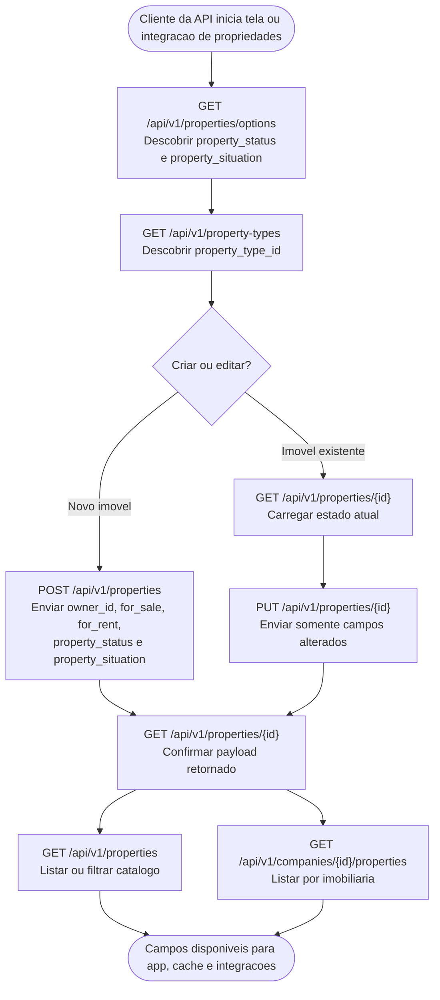
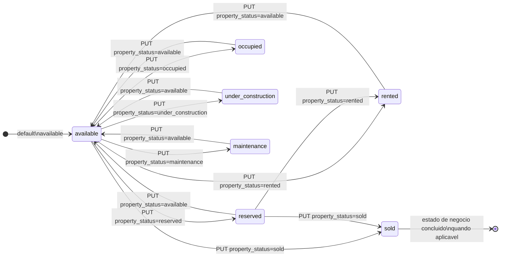
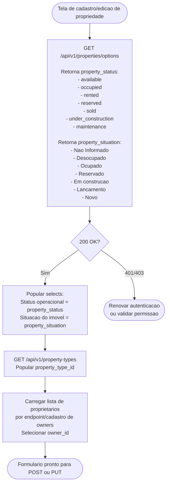
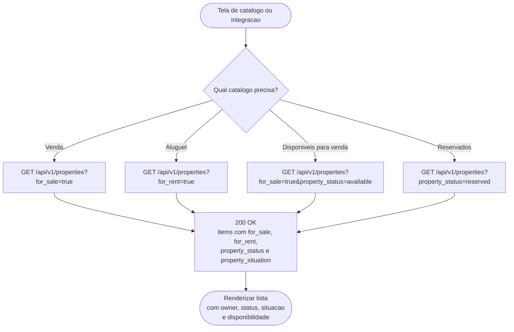
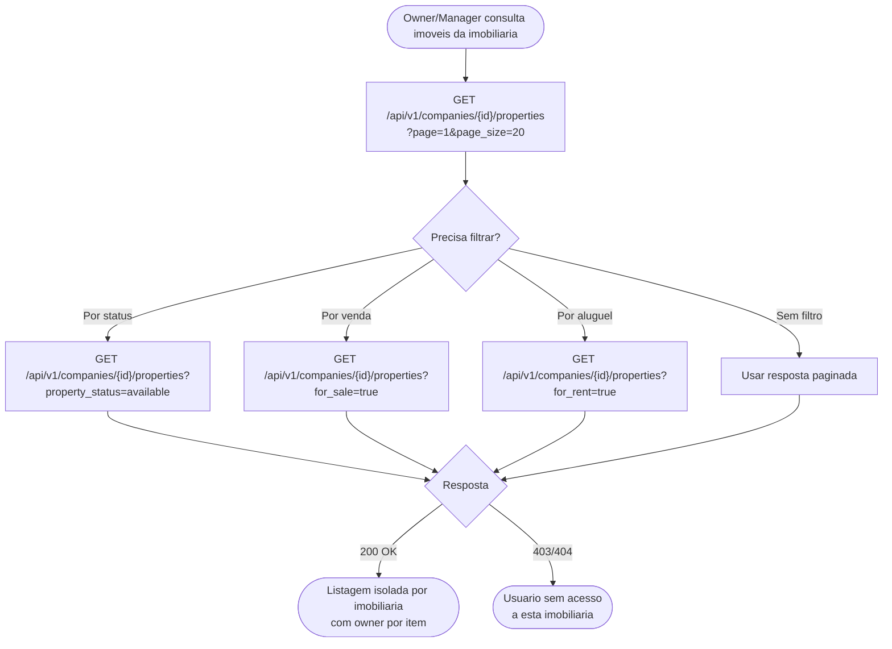
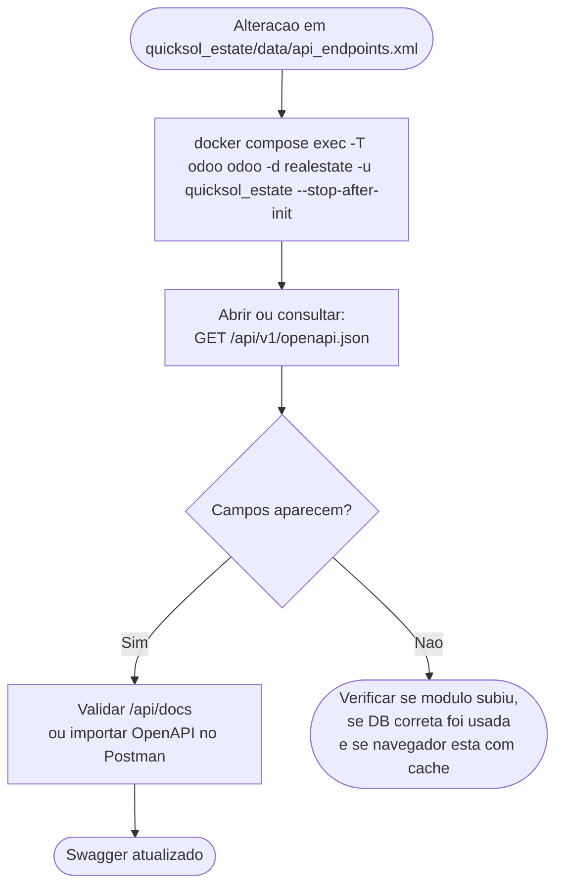

# Fluxogramas de Status e Situacao de Propriedades — Spec 018

Este documento descreve como usar os endpoints de **Propriedades** nas jornadas afetadas pela spec 018 — disponibilidade para venda/aluguel, status operacional e situacao do imovel.

O objetivo principal e deixar claro:

- quais endpoints consultar antes de montar formularios;
- quais campos enviar em `POST` e `PUT`;
- como interpretar `property_status`, `status`, `property_situation`, `for_sale` e `for_rent`;
- como consumir as opcoes documentadas pelo Swagger e por `GET /api/v1/properties/options`.

> **Escopo:** Esta spec documenta somente o dominio de propriedades. Ela nao altera anexos, leads, atendimentos, propostas, locacoes ou vendas.

---

## Endpoints Envolvidos

| Metodo | Endpoint | Uso na jornada |
|---|---|---|
| `GET` | `/api/v1/properties/options` | Descobrir valores validos para `property_status` e `property_situation`. |
| `GET` | `/api/v1/property-types` | Obter ids validos para `property_type_id` antes de criar imovel. |
| `POST` | `/api/v1/properties` | Criar imovel com `owner_id`, flags de venda/aluguel e campos de status/situacao. |
| `GET` | `/api/v1/properties/{id}` | Consultar detalhe e confirmar `owner`, status, situacao e disponibilidade serializados. |
| `PUT` | `/api/v1/properties/{id}` | Atualizar parcialmente `owner_id`, status, situacao e disponibilidade. |
| `GET` | `/api/v1/properties` | Listar e filtrar propriedades por status/disponibilidade, com `owner` por item. |
| `GET` | `/api/v1/companies/{id}/properties` | Listar propriedades de uma imobiliaria com filtros e `owner` por item. |

---

## Contrato dos Campos

| Campo | Tipo API | Origem no Odoo | Como enviar | Como ler |
|---|---|---|---|---|
| `for_sale` | boolean | `fields.Boolean` | `true` ou `false` no JSON | boolean |
| `for_rent` | boolean | `fields.Boolean` | `true` ou `false` no JSON | boolean |
| `property_status` | string selection | `fields.Selection` | string de opcao valida | string canonica |
| `status` | string alias | alias de `property_status` | nao usar para escrita nova | alias legado no retorno |
| `property_situation` | string selection | `fields.Selection` | string de opcao valida | string explicita ou fallback |
| `owner_id` | integer | `fields.Many2one` | id de `real.estate.property.owner` | nao retorna como escalar |
| `owner` | object | relacao `owner_id` | read-only | objeto do proprietario relacionado |

`property_status` e `property_situation` **nao sao relacionamentos**. Nao envie objeto, `id`, array ou comando Odoo. Envie a string selecionada.

`owner` e relacional. Para criar ou atualizar o proprietario do imovel, envie `owner_id`; nao envie `owner` aninhado nem os campos legados `owner_email`, `owner_home_phone`, `owner_business_phone` ou `owner_mobile_phone`.

Exemplo valido:

```json
{
  "for_sale": true,
  "for_rent": false,
  "owner_id": 4,
  "property_status": "available",
  "property_situation": "Desocupado"
}
```

---

## Ciclo Geral da Jornada



---

## Maquina de Estados do Status Operacional

`property_status` representa o estado operacional canonico do imovel. O endpoint nao impoe uma maquina de transicao rigida nesta spec, mas os clientes devem tratar estes valores como conjunto fechado retornado em `GET /api/v1/properties/options`.



> **Nota:** A regra de negocio final sobre transicoes permitidas pode ser endurecida em uma spec futura. Hoje o contrato importante e usar somente strings validas do selection.

---

## J1 — Montar formulario de propriedade com selects corretos

Antes de exibir um formulario de criacao ou edicao, o cliente deve consultar as opcoes validas no backend. Isso evita hardcode de listas no app e garante que Swagger, Postman e API usem os mesmos valores.



---

## J2 — Criar imovel disponivel para venda

O cliente cria um imovel novo informando que ele esta disponivel para venda. Como `for_sale` e `for_rent` sao booleanos, eles devem ser enviados como `true`/`false`, nao como `"true"`/`"false"`.

```mermaid
flowchart TD
    Start([Usuario cria imovel para venda]) --> C0

    C0["GET /api/v1/properties/options\nEscolher property_status e property_situation"] --> C1

    C1["POST /api/v1/properties\n\n{\n  \"name\": \"Apartamento Seed\",\n  \"property_type_id\": 2,\n  \"owner_id\": 4,\n  \"area\": 82,\n  \"zip_code\": \"12200-000\",\n  \"state_id\": 1,\n  \"city\": \"Sao Jose dos Campos\",\n  \"street\": \"Rua Exemplo\",\n  \"street_number\": \"100\",\n  \"location_type_id\": 1,\n  \"for_sale\": true,\n  \"for_rent\": false,\n  \"property_status\": \"available\",\n  \"property_situation\": \"Desocupado\"\n}"] --> C1R{Resposta}

    C1R -->|201 Created| C2["GET /api/v1/properties/{id}\nConfirmar retorno"]
    C1R -->|400 Validation Error| ERR1([Corrigir campos obrigatorios\nou selection invalido])
    C1R -->|401/403| ERR2([Validar token, sessao e RBAC])

    C2 --> C3["Resposta esperada contem:\nowner={...}\nfor_sale=true\nfor_rent=false\nproperty_status=available\nstatus=available\nproperty_situation=Desocupado"]
    C3 --> Done([Imovel criado e pronto para listagem])
```

---

## J3 — Criar imovel disponivel para aluguel

```mermaid
flowchart TD
    Start([Usuario cria imovel para aluguel]) --> R1

    R1["POST /api/v1/properties\n\n{\n  \"owner_id\": 4,\n  \"for_sale\": false,\n  \"for_rent\": true,\n  \"rent_price\": 4500,\n  \"property_status\": \"available\",\n  \"property_situation\": \"Desocupado\",\n  \"...\": \"demais campos obrigatorios\"\n}"] --> R1R{Resposta}

    R1R -->|201 Created| R2["GET /api/v1/properties/{id}"]
    R1R -->|400| ERR1([Verificar required fields\ne valores selection])

    R2 --> R3{Payload confere?}
    R3 -->|Sim| Done([Imovel disponivel para aluguel])
    R3 -->|Nao| ERR2([Comparar payload enviado\ncom response serializada])
```

---

## J4 — Atualizar status, situacao ou proprietario de imovel existente

`PUT /api/v1/properties/{id}` e parcial. Envie apenas os campos alterados. Campos omitidos nao devem ser limpos. Para trocar o proprietario relacionado, envie `owner_id`.

```mermaid
flowchart TD
    Start([Usuario altera estado do imovel]) --> U0

    U0["GET /api/v1/properties/{id}\nLer estado atual"] --> U1

    U1["PUT /api/v1/properties/{id}\n\n{\n  \"owner_id\": 4,\n  \"property_status\": \"reserved\",\n  \"property_situation\": \"Reservado\"\n}"] --> U1R{Resposta}

    U1R -->|200 OK| U2["GET /api/v1/properties/{id}\nConfirmar alteracao"]
    U1R -->|400 Validation Error| ERR1([Valor selection invalido\nou owner_id inexistente])
    U1R -->|403 Forbidden| ERR2([Usuario sem permissao de escrita])
    U1R -->|404 Not Found| ERR3([Property inexistente\nou fora do escopo da empresa])

    U2 --> U3["Retorno esperado:\nowner={...}\nproperty_status=reserved\nstatus=reserved\nproperty_situation=Reservado"]
    U3 --> Done([Status atualizado])
```

---

## J5 — Vincular e ler proprietario por relacionamento

`owner` e sempre derivado de `owner_id`. O cliente escreve o relacionamento usando o id do proprietario e le os dados normalizados no objeto `owner`.

```mermaid
flowchart TD
    Start([Cliente precisa associar proprietario ao imovel]) --> O0

    O0{Proprietario ja existe?}
    O0 -->|Sim| O1["Usar id existente de real.estate.property.owner\nEx: owner_id=4"]
    O0 -->|Nao| O2["Criar/cadastrar proprietario\nno fluxo de owners\nGuardar id retornado"]

    O1 --> O3
    O2 --> O3

    O3["POST ou PUT /api/v1/properties\n\n{\n  \"owner_id\": 4,\n  \"...\": \"demais campos da propriedade\"\n}"] --> O3R{Resposta}

    O3R -->|201/200| O4["GET /api/v1/properties/{id}\nConfirmar owner serializado"]
    O3R -->|400 owner_id invalido| ERR1([Verificar se o proprietario existe\nem real.estate.property.owner])

    O4 --> O5["Resposta esperada:\n{\n  \"owner\": {\n    \"id\": 4,\n    \"name\": \"Proprietario Seed\",\n    \"email\": \"propowner@seed.com.br\",\n    \"phone\": \"...\",\n    \"mobile\": \"...\",\n    \"partner_id\": 26,\n    \"state\": { \"code\": \"SP\" }\n  }\n}"]

    O5 --> Done([Relacionamento confirmado])
```

Campos que nao devem ser enviados nem esperados no retorno da propriedade:

- `owner_email`
- `owner_home_phone`
- `owner_business_phone`
- `owner_mobile_phone`

---

## J6 — Fallback de `property_situation` quando o banco esta vazio

Registros antigos podem nao ter `property_situation` preenchido. Para evitar retorno `null`, o serializer deriva uma situacao legivel a partir de `property_status`.

```mermaid
flowchart TD
    Start([GET /api/v1/properties/{id}]) --> F1

    F1{property_situation armazenado?}
    F1 -->|Sim| F2["Retornar valor armazenado\nEx: Novo"]
    F1 -->|Nao| F3{property_status}

    F3 -->|available| S1["property_situation = Desocupado"]
    F3 -->|occupied| S2["property_situation = Ocupado"]
    F3 -->|rented| S2
    F3 -->|reserved| S3["property_situation = Reservado"]
    F3 -->|sold| S2
    F3 -->|under_construction| S4["property_situation = Em construcao"]
    F3 -->|maintenance| S5["property_situation = Nao Informado"]
    F3 -->|vazio/desconhecido| S5

    F2 --> Done([Resposta serializada])
    S1 --> Done
    S2 --> Done
    S3 --> Done
    S4 --> Done
    S5 --> Done
```

> O fallback e somente de resposta. Ele nao grava automaticamente o valor no banco.

---

## J7 — Listar e filtrar propriedades por disponibilidade

Os filtros de query string sempre trafegam como texto na URL, mesmo quando representam booleanos. O backend interpreta `for_sale=true` e `for_rent=false`.



---

## J8 — Listar propriedades de uma imobiliaria

Quando a tela esta no contexto de uma imobiliaria especifica, use o endpoint de company. Ele respeita RBAC e isolamento multi-tenant.



---

## J9 — Validar contrato via Swagger/OpenAPI

Depois de alterar `api_endpoints.xml`, o Swagger so reflete os campos apos atualizar o modulo e consultar o OpenAPI gerado.



Campos esperados no OpenAPI:

- `GET /api/v1/properties/options`
- `property_status` em `/properties/options`
- `property_situation` em `/properties/options`
- `for_sale` e `for_rent` em respostas de propriedade
- `property_status` e `property_situation` em respostas de propriedade
- `owner` em respostas de propriedade
- `owner_id` em requests de `POST /api/v1/properties` e `PUT /api/v1/properties/{id}`
- ausencia de `owner_email`, `owner_home_phone`, `owner_business_phone` e `owner_mobile_phone` nos schemas de propriedade

---

## Erros Comuns

| Situacao | Causa provavel | Correcao |
|---|---|---|
| `property_situation` nao aparece no Swagger UI | Cache da UI ou modulo nao atualizado no banco | Consultar `/api/v1/openapi.json` e atualizar `quicksol_estate`. |
| `property_situation` enviado como objeto | Campo e selection, nao relacionamento | Enviar string valida retornada por `/properties/options`. |
| `property_status` enviado como label | Backend espera o value, nao label | Enviar `available`, `reserved`, etc. |
| `for_sale` enviado como `"true"` no JSON | Campo e booleano | Enviar `true` sem aspas. |
| `owner` enviado no `POST`/`PUT` | `owner` e objeto read-only da resposta | Enviar `owner_id`. |
| Campos `owner_email`/telefones enviados | Campos legados removidos do contrato | Criar/atualizar o proprietario no dominio de owners e vincular por `owner_id`. |
| `PUT` remove campo nao enviado | Nao deve ocorrer no contrato atual | Enviar somente campo alterado e validar detalhe apos update. |
| Retorno tem `status` e `property_status` | Compatibilidade legada | Usar `property_status` em clientes novos. |
