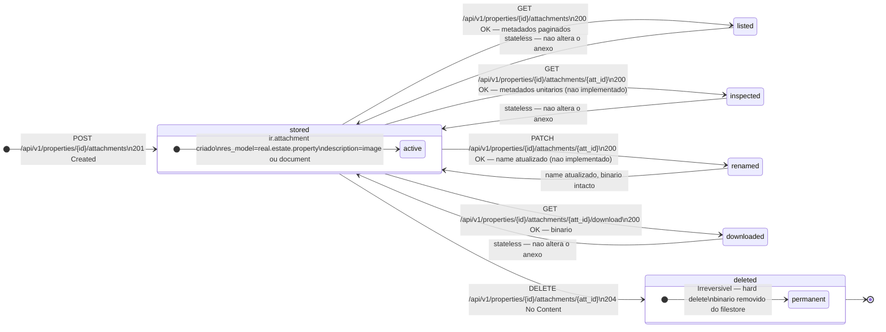
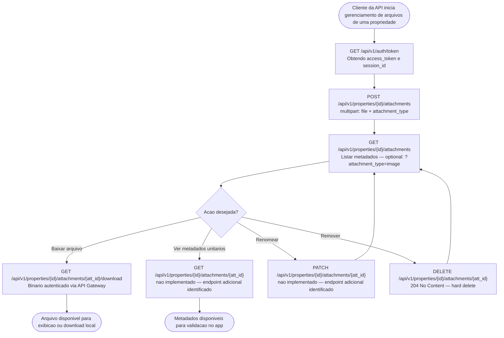
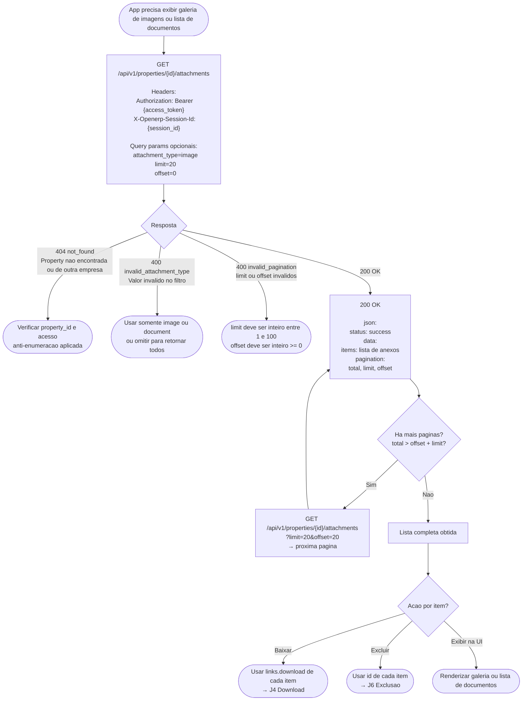
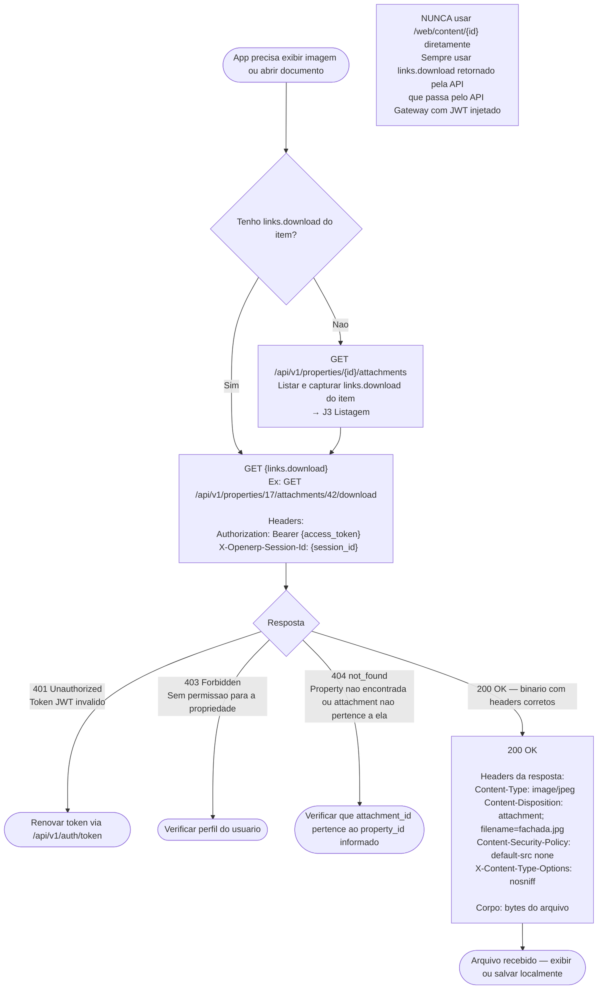
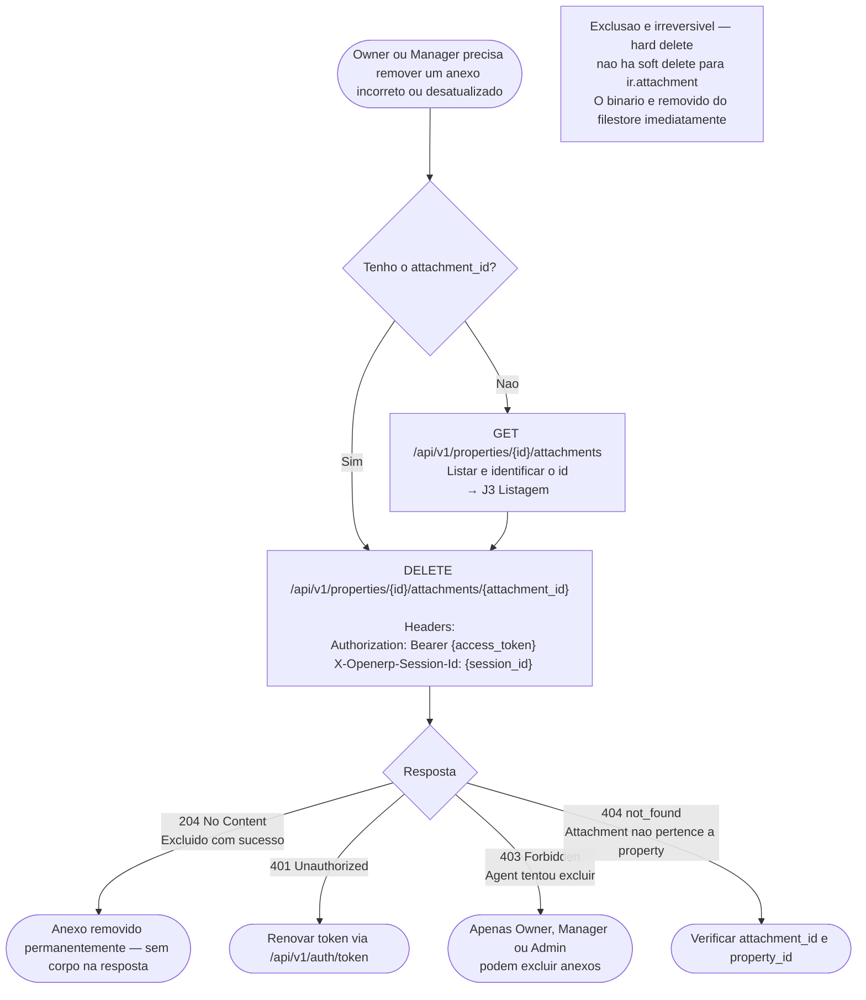
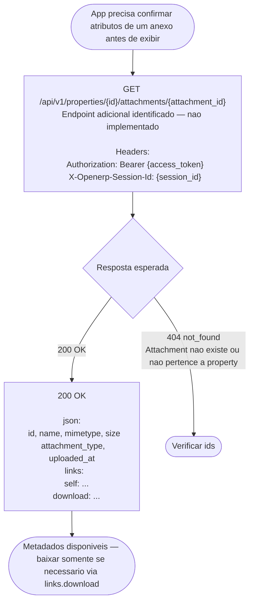
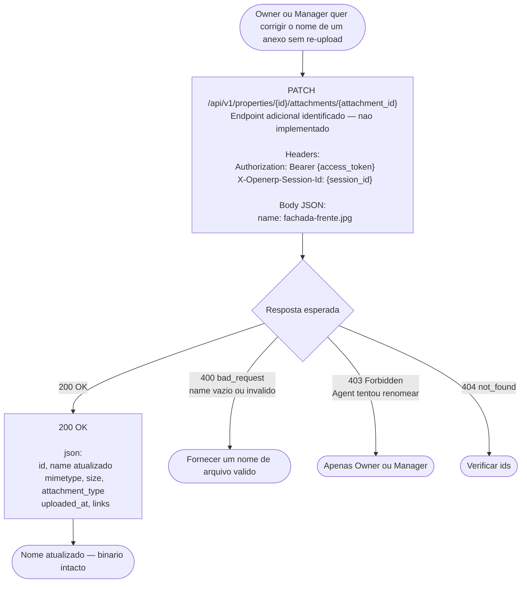
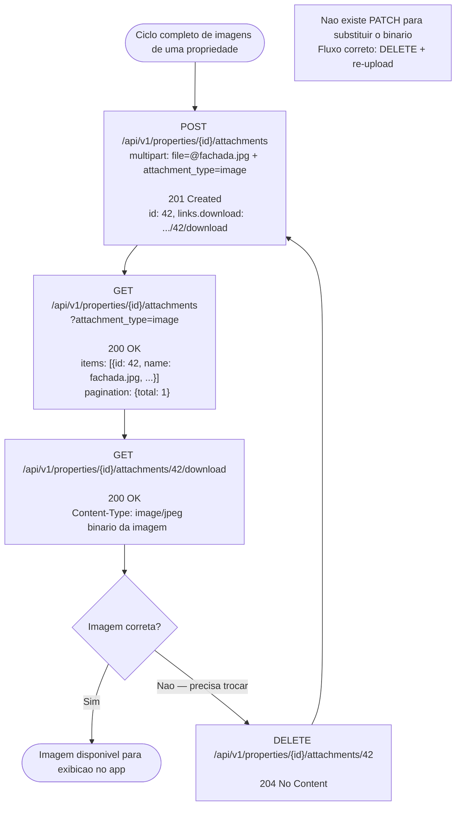

# Fluxogramas de Property Attachments — Spec 017

Este documento descreve como usar os endpoints de **Anexos de Propriedades** nas jornadas cobertas pela spec 017 — upload, listagem, download seguro e exclusão de imagens e documentos vinculados a propriedades imobiliárias.

O objetivo principal é deixar claro:

- quais endpoints chamar e em qual ordem por jornada;
- quais campos são obrigatórios em cada request (form-data vs. query params);
- como interpretar as validações de MIME, tamanho e limites por propriedade;
- quais endpoints adicionais ainda não construídos são necessários para completar o ciclo de forma idiomática.

> **Escopo:** Esta spec cobre somente o domínio de anexos de propriedades. Não altera dados da propriedade em si (veja Spec 018) nem leads, atendimentos ou propostas.

---

## Endpoints Implementados

| Método | Endpoint | Uso na jornada |
|--------|----------|----------------|
| `POST` | `/api/v1/properties/{id}/attachments` | Upload de imagem ou documento (multipart/form-data) |
| `GET` | `/api/v1/properties/{id}/attachments` | Listar metadados dos anexos com paginação e filtro por tipo |
| `GET` | `/api/v1/properties/{id}/attachments/{attachment_id}/download` | Download do binário autenticado (obrigatório via API Gateway) |
| `DELETE` | `/api/v1/properties/{id}/attachments/{attachment_id}` | Exclusão permanente (hard delete) de um anexo |

## Endpoints Adicionais Identificados (não implementados)

| Método | Endpoint | Motivo |
|--------|----------|--------|
| `GET` | `/api/v1/properties/{id}/attachments/{attachment_id}` | Consultar metadados de um único anexo sem precisar baixar o binário — necessário para apps que precisam checar existência ou atributos antes de exibir |
| `PATCH` | `/api/v1/properties/{id}/attachments/{attachment_id}` | Renomear um anexo (campo `name`) sem re-upload — caso de uso: corrigir nome de arquivo mal enviado |

---

## Contrato dos Campos de Request

### Upload — POST /api/v1/properties/{id}/attachments

| Campo | Localização | Tipo | Obrigatório | Valores válidos |
|-------|-------------|------|-------------|-----------------|
| `file` | form-data | binário | ✅ sim | JPEG, PNG, WebP (image) ou PDF, DOC, DOCX, XLS, XLSX (document) |
| `attachment_type` | form-data | string | ✅ sim | `image` ou `document` |
| `Authorization` | header | string | ✅ sim | `Bearer {access_token}` |
| `X-Openerp-Session-Id` | header | string | ✅ sim | `{session_id}` |

> `attachment_type` determina qual conjunto de MIMEs é aceito e qual limite de quantidade é verificado. Não enviar retorna `400 missing_attachment_type`.

### Listagem — GET /api/v1/properties/{id}/attachments

| Parâmetro | Localização | Tipo | Obrigatório | Default |
|-----------|-------------|------|-------------|---------|
| `attachment_type` | query | string | não | todos |
| `limit` | query | integer | não | `50` (máx. `100`) |
| `offset` | query | integer | não | `0` |
| `Authorization` | header | string | ✅ sim | `Bearer {access_token}` |
| `X-Openerp-Session-Id` | header | string | ✅ sim | `{session_id}` |

### Schema de Resposta — Anexo Serializado

```json
{
  "id": 42,
  "name": "fachada.jpg",
  "mimetype": "image/jpeg",
  "size": 204800,
  "attachment_type": "image",
  "uploaded_at": "2026-05-10T21:40:00Z",
  "links": {
    "download": "/api/v1/properties/17/attachments/42/download",
    "self": "/api/v1/properties/17/attachments/42"
  }
}
```

> `links.self` é retornado somente no upload (`POST`). Na listagem (`GET`), apenas `links.download` está presente.
> `links.download` SEMPRE usa a rota `/api/v1/...`. Nunca `/web/content/{id}` — essa rota bypassa o API Gateway e portanto bypassa autenticação JWT.

### Limites Configuráveis (ir.config_parameter)

| Parâmetro | Chave Odoo | Default |
|-----------|-----------|---------|
| Tamanho máximo de arquivo | `web.max_file_upload_size` | 128 MB |
| Máximo de imagens por propriedade | `quicksol_estate.max_images_per_property` | 50 |
| Máximo de documentos por propriedade | `quicksol_estate.max_documents_per_property` | 20 |

---

## Máquina de Estados do Anexo



---

## Ciclo Geral da Jornada



---

## J1 — Upload de imagem

**Endpoint:** `POST /api/v1/properties/{id}/attachments`
**RBAC:** Owner, Manager ou Admin. Agent recebe 403.

```mermaid
flowchart TD
    Start([Owner ou Manager precisa anexar imagem a uma propriedade]) --> U1

    U1["POST /api/v1/properties/{id}/attachments\n\nHeaders:\n  Authorization: Bearer {access_token}\n  X-Openerp-Session-Id: {session_id}\n\nBody multipart/form-data:\n  file = @fachada.jpg\n  attachment_type = image"] --> U1R{Validacoes}

    U1R -->|attachment_type ausente\n400 missing_attachment_type| ERR0([Incluir campo attachment_type\nno form-data])
    U1R -->|attachment_type invalido\n400 invalid_attachment_type| ERR0b([Usar somente image ou document])
    U1R -->|campo file ausente\n400 missing_file| ERR1([Incluir campo file no form-data])
    U1R -->|arquivo vazio 0 bytes\n400 empty_file| ERR1b([Arquivo nao pode ser vazio])
    U1R -->|MIME invalido globalmente\n415 unsupported_mime| ERR2([Apenas JPEG, PNG, WebP para image\nPDF, DOC, DOCX, XLS, XLSX para document])
    U1R -->|MIME nao compativel com attachment_type\n415 mime_mismatch| ERR2b([Ex: PDF enviado com attachment_type=image\nMIME detectado via magic bytes])
    U1R -->|arquivo excede limite\n413 file_too_large| ERR3([Reducir tamanho ou alterar\nweb.max_file_upload_size no painel Odoo])
    U1R -->|limite de 50 imagens atingido\n422 attachment_limit_exceeded| ERR4([Excluir imagens existentes antes\nDELETE /api/v1/properties/{id}/attachments/{att_id}])
    U1R -->|property nao encontrada ou de outra empresa\n404 not_found| ERR5([Verificar property_id e acesso\nanti-enumeracao: nao revela se existe])
    U1R -->|usuario sem permissao\n403 forbidden| ERR6([Apenas Owner ou Manager podem fazer upload])

    U1R -->|Todas as validacoes passam| U2

    U2["201 Created\n\njson:\n  status: success\n  data:\n    id, name, mimetype, size\n    attachment_type: image\n    uploaded_at\n    links:\n      self: /api/v1/properties/{id}/attachments/42\n      download: /api/v1/properties/{id}/attachments/42/download"] --> U3

    U3[Salvar links.download para uso futuro] --> Done([Imagem armazenada no filestore da empresa])

    note1["links.download SEMPRE usa /api/v1/...\nnunca /web/content/{id} — essa rota\nbypassa o API Gateway e a autenticacao JWT"]
```

---

## J2 — Upload de documento

**Endpoint:** `POST /api/v1/properties/{id}/attachments`
**RBAC:** Owner, Manager ou Admin. Agent recebe 403.

```mermaid
flowchart TD
    Start([Owner ou Manager precisa anexar documento legal a uma propriedade]) --> U1

    U1["POST /api/v1/properties/{id}/attachments\n\nHeaders:\n  Authorization: Bearer {access_token}\n  X-Openerp-Session-Id: {session_id}\n\nBody multipart/form-data:\n  file = @escritura.pdf\n  attachment_type = document"] --> U1R{Validacoes}

    U1R -->|MIME valido PDF DOC DOCX XLS XLSX\n+ limite de 20 documentos nao atingido| U2
    U1R -->|MIME invalido para document\n415 mime_mismatch| ERR1([Apenas PDF, DOC, DOCX, XLS, XLSX\nMIME validado via magic bytes])
    U1R -->|limite de 20 documentos atingido\n422 attachment_limit_exceeded| ERR2([Excluir documentos antes de re-enviar\nDELETE /api/v1/properties/{id}/attachments/{att_id}])
    U1R -->|arquivo muito grande\n413 file_too_large| ERR3([Verificar web.max_file_upload_size\nno painel Odoo — default 128 MB])

    U2["201 Created\n\njson:\n  status: success\n  data:\n    id, name, mimetype, size\n    attachment_type: document\n    uploaded_at\n    links:\n      self: ...\n      download: ..."] --> Done([Documento armazenado e pronto para download])
```

---

## J3 — Listagem de anexos com filtro e paginacao

**Endpoint:** `GET /api/v1/properties/{id}/attachments`
**RBAC:** Owner, Manager, Agent e Admin.



---

## J4 — Download seguro do conteudo binario

**Endpoint:** `GET /api/v1/properties/{id}/attachments/{attachment_id}/download`
**RBAC:** Owner, Manager e Agent. O JWT é injetado pelo API Gateway antes de chegar ao Odoo.



---

## J5 — Exclusao de anexo

**Endpoint:** `DELETE /api/v1/properties/{id}/attachments/{attachment_id}`
**RBAC:** Owner, Manager ou Admin. Agent recebe 403.



---

## J6 — Consultar metadados de um unico anexo (endpoint adicional)

**Endpoint:** `GET /api/v1/properties/{id}/attachments/{attachment_id}` _(nao implementado)_
**Motivo:** Apps que precisam checar existência, MIME ou nome de um anexo específico antes de exibir ou re-enviar, sem precisar baixar o binário.



---

## J7 — Renomear anexo sem re-upload (endpoint adicional)

**Endpoint:** `PATCH /api/v1/properties/{id}/attachments/{attachment_id}` _(nao implementado)_
**Motivo:** Corrigir nome de arquivo mal enviado sem precisar deletar e re-fazer upload do binário.



---

## J8 — Ciclo completo gerenciamento de imagens

**Endpoints:** `POST` → `GET` (list) → `GET` (download) → `DELETE`



---

## Resumo de Erros por Endpoint

| Endpoint | Codigo | Erro | Causa |
|----------|--------|------|-------|
| `POST .../attachments` | 400 | `missing_file` | Campo `file` ausente no form-data |
| `POST .../attachments` | 400 | `missing_attachment_type` | Campo `attachment_type` ausente no form-data |
| `POST .../attachments` | 400 | `invalid_attachment_type` | `attachment_type` diferente de `image` ou `document` |
| `POST .../attachments` | 400 | `empty_file` | Arquivo enviado com 0 bytes |
| `POST .../attachments` | 401 | — | Token JWT inválido ou ausente |
| `POST .../attachments` | 403 | `forbidden` | Perfil sem permissão (Agent não pode fazer upload) |
| `POST .../attachments` | 404 | `not_found` | Property não encontrada (anti-enumeração) |
| `POST .../attachments` | 413 | `file_too_large` | Arquivo excede `web.max_file_upload_size` |
| `POST .../attachments` | 415 | `unsupported_mime` | MIME não está na lista global de permitidos |
| `POST .../attachments` | 415 | `mime_mismatch` | MIME incompatível com `attachment_type` declarado |
| `POST .../attachments` | 422 | `attachment_limit_exceeded` | Limite de imagens (50) ou documentos (20) atingido |
| `GET .../attachments` | 400 | `invalid_attachment_type` | Filtro `attachment_type` com valor inválido |
| `GET .../attachments` | 400 | `invalid_pagination` | `limit` ou `offset` não são inteiros válidos |
| `GET .../attachments` | 401 | — | Token JWT inválido |
| `GET .../attachments` | 404 | `not_found` | Property não encontrada (anti-enumeração) |
| `GET .../attachments/{id}/download` | 401 | — | Token JWT inválido |
| `GET .../attachments/{id}/download` | 404 | `not_found` | Attachment não pertence à property informada |
| `DELETE .../attachments/{id}` | 401 | — | Token JWT inválido |
| `DELETE .../attachments/{id}` | 403 | `forbidden` | Agent tentou excluir (apenas Owner/Manager/Admin) |
| `DELETE .../attachments/{id}` | 404 | `not_found` | Attachment não pertence à property informada |

## MIME Types Aceitos

| Categoria | MIME Types |
|---|---|
| **Imagens** | `image/jpeg`, `image/png`, `image/webp` |
| **Documentos** | `application/pdf`, `application/msword`, `application/vnd.openxmlformats-officedocument.wordprocessingml.document`, `application/vnd.ms-excel`, `application/vnd.openxmlformats-officedocument.spreadsheetml.sheet` |

> **Validação:** MIME type é detectado via **magic bytes** (conteúdo binário), não pela extensão do arquivo. Um arquivo `.jpg` com conteúdo executável será rejeitado com 415.

---

## Dados de Seed para Testes

> **Arquivo:** `integration_tests/seeds/019_goals_seed.py`
> Seed idempotente — pode ser executado múltiplas vezes sem duplicar dados.

### Empresas criadas

| Nome | Campo |
|------|-------|
| `Imobiliária Seed A (019)` | Empresa A — usuários owner, manager e agent |
| `Imobiliária Seed B (019)` | Empresa B — owner_b (multitenancy) |

### Usuários criados

| Login | Senha | Perfil | Empresa |
|-------|-------|--------|---------|
| `owner_019@example.com` | `OwnerPass019!` | Owner | Seed A |
| `manager_019@example.com` | `ManagerPass019!` | Manager | Seed A |
| `agent_019@example.com` | `AgentPass019!` | Agent | Seed A |
| `owner_b_019@example.com` | `OwnerBPass019!` | Owner | Seed B |

### Metas criadas

Todas as metas pertencem ao `agent_019@example.com`, referência **maio/2026**, empresa Seed A.

| `metric_type` | `operation_type` | `target_count` | `target_vgv` |
|---------------|------------------|----------------|--------------|
| `captacao` | `sale` | 3 | R$ 1.500.000 |
| `novos_clientes` | `all` | 5 | — |
| `visitas` | `all` | 10 | — |
| `propostas` | `sale` | 4 | R$ 2.000.000 |
| `fechamento` | `all` | 2 | R$ 1.000.000 |
| `captacao` | `rent` | 2 | R$ 84.000 |

### Outros registros criados

| Tipo | Registros |
|------|-----------|
| Propriedades | `Seed Prop 019-A-1` (venda R$500k), `Seed Prop 019-A-2` (venda R$750k), `Seed Prop 019-A-3` (aluguel R$3.500/mês) — todas vinculadas ao agent_019 |
| Atendimentos | `Seed Service 019-A-1`, `Seed Service 019-A-2`, `Seed Service 019-A-3` (operation_type `sale`, agent_019) |

### Consultas rápidas via API

```bash
# 1. Autenticar como owner (pode listar metas de todos na empresa)
curl -s -X POST http://localhost:8069/api/v1/auth/token \
  -d "login=owner_019@example.com&password=OwnerPass019!"

# 2. Listar todas as metas de maio/2026
curl -s "http://localhost:8069/api/v1/goals?year=2026&month=5" \
  -H "Authorization: Bearer {access_token}" \
  -H "X-Openerp-Session-Id: {session_id}"

# 3. Filtrar só metas de captação
curl -s "http://localhost:8069/api/v1/goals?year=2026&month=5&metric_type=captacao" \
  -H "Authorization: Bearer {access_token}" \
  -H "X-Openerp-Session-Id: {session_id}"

# 4. Relatório consolidado de maio/2026
curl -s "http://localhost:8069/api/v1/goals/report?year=2026&month=5" \
  -H "Authorization: Bearer {access_token}" \
  -H "X-Openerp-Session-Id: {session_id}"

# 5. Testar multitenancy: owner_b não deve ver metas da empresa A
curl -s -X POST http://localhost:8069/api/v1/auth/token \
  -d "login=owner_b_019@example.com&password=OwnerBPass019!"
# → listar /api/v1/goals deve retornar lista vazia
```
