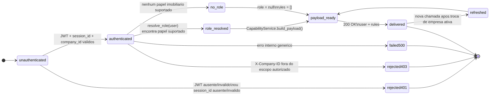
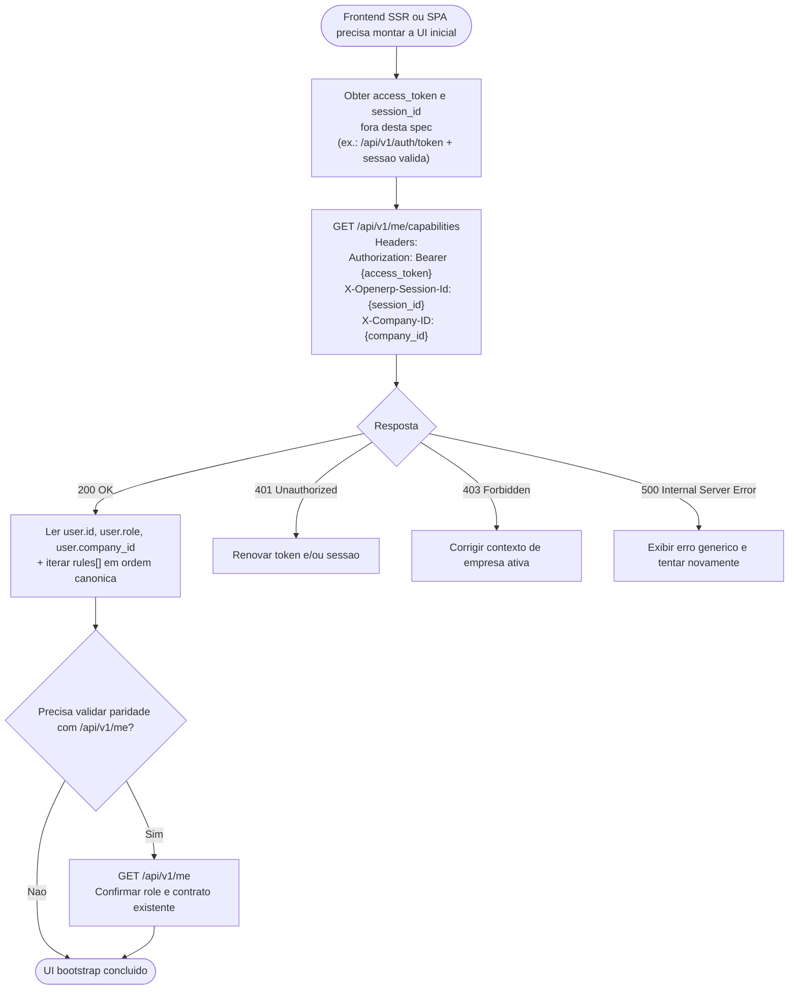
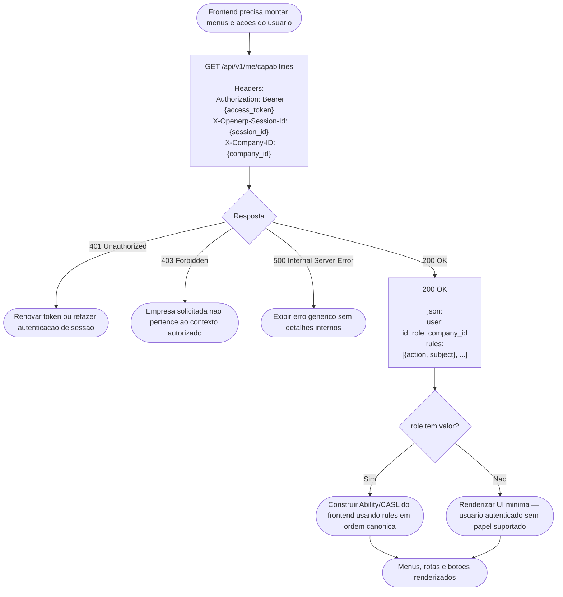
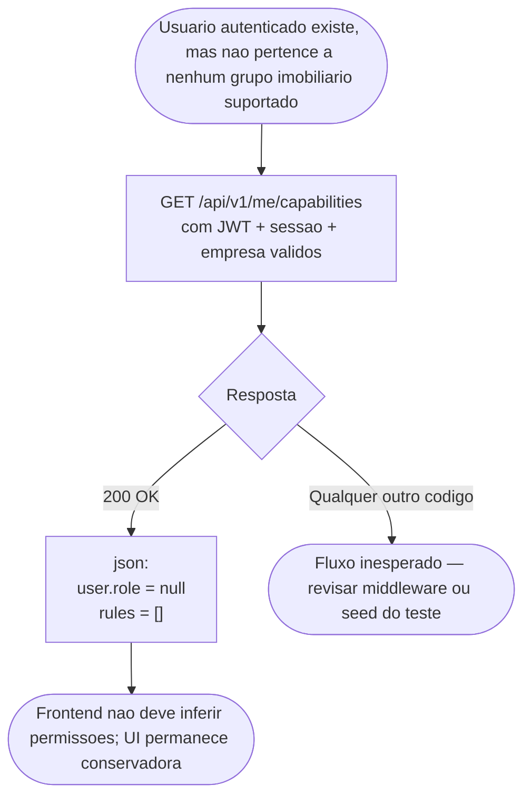
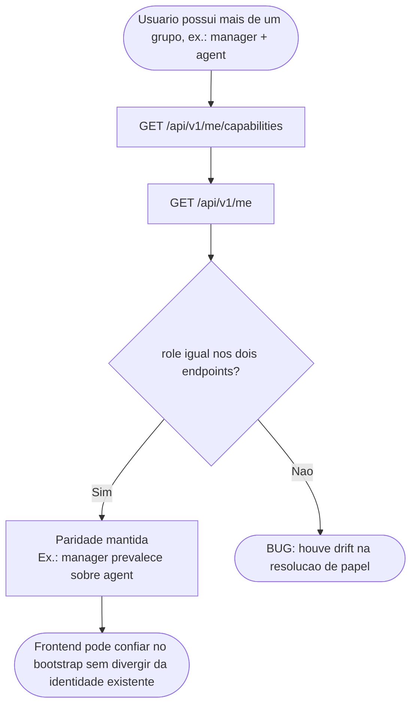
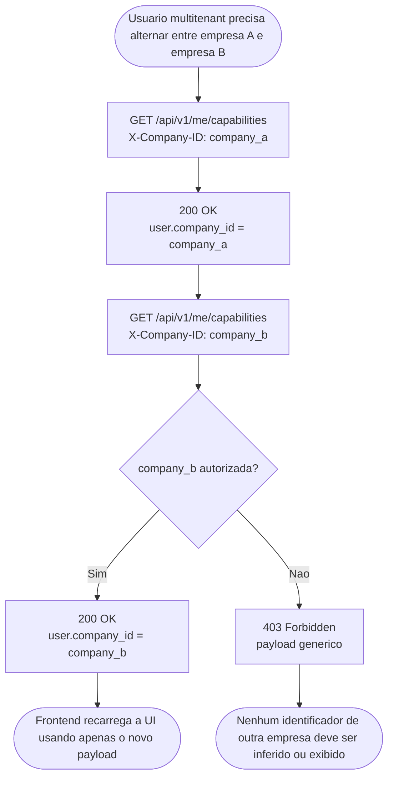
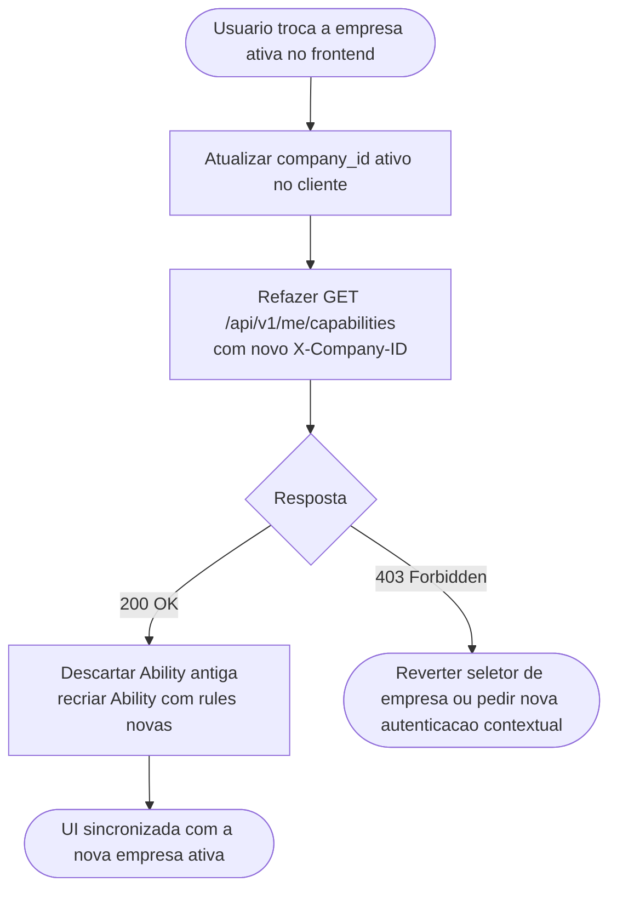
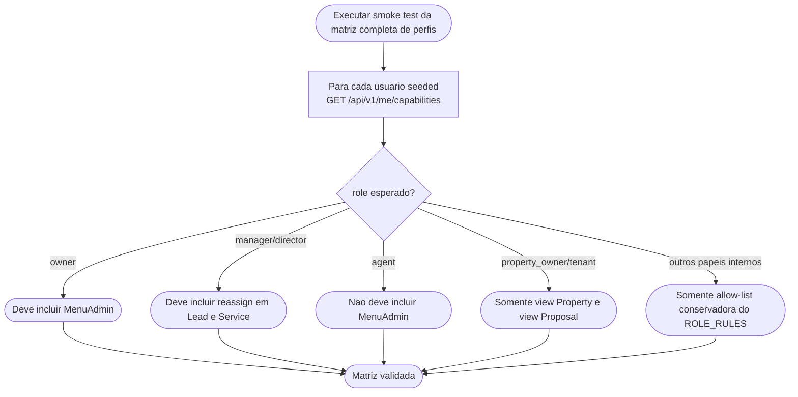
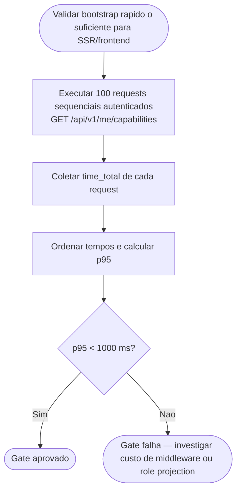

# Fluxogramas de RBAC Capabilities API — Spec 020

Este documento descreve como usar o endpoint de **bootstrap de capacidades RBAC** da spec 020
— autenticação prévia, resolução do contexto ativo, leitura do payload `user + rules`,
tratamento de usuários sem papel suportado, validação de paridade com `/api/v1/me` e
isolamento por empresa.

O objetivo principal é deixar claro:

- quais headers são obrigatórios para chamar `GET /api/v1/me/capabilities`;
- como o backend resolve `role` e `company_id` no contexto autenticado;
- como interpretar respostas `200`, `401`, `403` e `500`;
- em quais jornadas o frontend deve refazer a chamada para atualizar a UI;
- quais dados de seed e cenários de teste cobrem a matriz de 10 perfis.

> **Escopo:** Esta spec cobre somente o endpoint `GET /api/v1/me/capabilities` e suas jornadas
> de consumo pelo frontend headless. Não altera o contrato de `/api/v1/me`, não cria novos
> modelos Odoo e não expõe internals de RBAC.

---

## Endpoints Implementados

| Método | Endpoint | Uso na jornada |
|--------|----------|----------------|
| `GET` | `/api/v1/me/capabilities` | Bootstrap de capacidades CASL-safe para o usuário autenticado e empresa ativa |

## Endpoints de Suporte Reutilizados

| Método | Endpoint | Papel na jornada |
|--------|----------|------------------|
| `POST` | `/api/v1/auth/token` | Obter `access_token` válido antes de chamar capabilities |
| `GET` | `/api/v1/me` | Validar paridade do `role` efetivo e garantir regressão zero no contrato existente |

## Endpoints Adicionais Identificados (não implementados)

| Método | Endpoint | Motivo |
|--------|----------|--------|
| `POST` | `/api/v1/me/capabilities/refresh` | Não é necessário no MVP; o contrato já é stateless e basta repetir `GET /api/v1/me/capabilities` após troca de empresa ativa |
| `GET` | `/api/v1/me/capabilities/debug` | Explicitamente fora de escopo; a spec proíbe vazar XML IDs, grupos, domains, models ou razões de autorização |

---

## Contrato dos Campos de Request

### Bootstrap — GET /api/v1/me/capabilities

| Campo | Localização | Tipo | Obrigatório | Observação |
|-------|-------------|------|-------------|------------|
| `Authorization` | header | string | ✅ sim | `Bearer {access_token}` |
| `X-Openerp-Session-Id` | header | string | ✅ sim | `{session_id}` válido da aplicação |
| `X-Company-ID` | header | integer/string | ✅ sim | Empresa ativa dentro do escopo autorizado |
| `User-Agent` | header | string | não | Usado pelo fingerprint de sessão |
| `Accept-Language` | header | string | não | Usado pelo fingerprint de sessão |

> Este endpoint não recebe body JSON nem query params funcionais. O contrato é inteiramente
> dirigido pelos headers de autenticação/contexto.

### Schema de Resposta — CapabilityResponse

```json
{
  "user": {
    "id": 1431,
    "role": "manager",
    "company_id": 87
  },
  "rules": [
    {"action": "view", "subject": "MenuCRM"},
    {"action": "view", "subject": "Dashboard"},
    {"action": "view", "subject": "Property"},
    {"action": "create", "subject": "Property"}
  ]
}
```

**Invariantes do contrato:**

- exatamente **duas** chaves de topo: `user` e `rules`;
- `user` contém somente `id`, `role` e `company_id`;
- `rules` nunca é `null`; para usuário sem papel suportado retorna `[]`;
- o payload nunca inclui nomes de grupos, XML IDs, domains, models ou stack traces.

### Ações e Subjects Permitidos

| Categoria | Valores |
|-----------|---------|
| **Ações** | `view`, `create`, `update`, `delete`, `reassign`, `approve`, `cancel`, `export` |
| **Subjects** | `MenuCRM`, `MenuAdmin`, `MenuCMS`, `Dashboard`, `Property`, `Lead`, `Service`, `Proposal`, `Agent`, `Company`, `Settings`, `Appointment`, `Report`, `Goal`, `CMSPage`, `CMSMedia` |

> A ordem da resposta é declarativa e estável: subjects em ordem de negócio/navegação e ações
> em progressão semântica (`view → create → update → delete → reassign → approve → cancel → export`).

---

## Máquina de Estados da Jornada de Capabilities



---

## Ciclo Geral da Jornada



---

## J1 — Bootstrap de capabilities para usuário com papel suportado

**Endpoint:** `GET /api/v1/me/capabilities`  
**RBAC:** Qualquer usuário autenticado com um dos 10 papéis suportados e contexto de empresa válido.



---

## J2 — Usuário sem papel imobiliário suportado

**Endpoint:** `GET /api/v1/me/capabilities`  
**Comportamento esperado:** `200 OK` com `user.role = null` e `rules = []`.



---

## J3 — Usuário multi-role com paridade obrigatória com /api/v1/me

**Endpoints:** `GET /api/v1/me/capabilities` + `GET /api/v1/me`



---

## J4 — Isolamento por empresa ativa

**Endpoint:** `GET /api/v1/me/capabilities`  
**RBAC:** Mesmo usuário pode ter acesso a múltiplas empresas, mas cada resposta reflete somente a ativa.



---

## J5 — Troca de empresa ativa com refresh de UI

**Endpoint:** `GET /api/v1/me/capabilities`  
**Motivo:** Não existe endpoint de refresh separado; o contrato é stateless.



---

## J6 — Matriz de 10 papéis suportados

**Endpoint:** `GET /api/v1/me/capabilities`  
**Cobertura:** owner, director, manager, agent, prospector, receptionist, financial, legal, property_owner, tenant.



---

## J7 — Gate de performance SC-005

**Script:** `18.0/integration_tests/test_us020_s4_performance.sh`



---

## Endpoints Utilizados por Jornada (em ordem)

Referência rápida dos endpoints chamados em cada jornada, na sequência exata de execução.

| Legenda | Endpoint |
|---------|----------|
| **[A]** | `POST /api/v1/auth/token` |
| **[C]** | `GET /api/v1/me/capabilities` |
| **[M]** | `GET /api/v1/me` |

---

### Ciclo Geral — Bootstrap completo com validação de paridade

| Ordem | Endpoint | Condição / Finalidade |
|-------|----------|-----------------------|
| 1 | `POST /api/v1/auth/token` | Obter `access_token` (pré-requisito, fora do escopo desta spec) |
| 2 | `GET /api/v1/me/capabilities` | Bootstrap: obter `user.role` + `rules[]` |
| 3 | `GET /api/v1/me` _(opcional)_ | Validar paridade de `role` com o contrato existente |

---

### J1 — Bootstrap com papel suportado

| Ordem | Endpoint | Finalidade |
|-------|----------|-----------|
| 1 | `GET /api/v1/me/capabilities` | Retorna `user.role` preenchido e `rules[]` com as capacidades do perfil |

> Pré-condição: JWT válido + `session_id` + `X-Company-ID` dentro do escopo autorizado.

---

### J2 — Usuário sem papel imobiliário suportado

| Ordem | Endpoint | Finalidade |
|-------|----------|-----------|
| 1 | `GET /api/v1/me/capabilities` | Retorna `200 OK` com `user.role = null` e `rules = []` |

> Nenhum outro endpoint é chamado; o frontend não deve inferir permissões.

---

### J3 — Paridade obrigatória com /api/v1/me (usuário multi-role)

| Ordem | Endpoint | Finalidade |
|-------|----------|-----------|
| 1 | `GET /api/v1/me/capabilities` | Obter `user.role` resolvido pela lógica de prioridade de papéis |
| 2 | `GET /api/v1/me` | Confirmar que o mesmo `role` é devolvido pelo contrato existente |

> Se `role` divergir entre os dois endpoints, é bug de drift na resolução de papel.

---

### J4 — Isolamento por empresa ativa (multitenancy)

| Ordem | Endpoint | `X-Company-ID` | Resultado esperado |
|-------|----------|----------------|--------------------|
| 1 | `GET /api/v1/me/capabilities` | `company_a` | `200 OK` — `user.company_id = company_a` |
| 2 | `GET /api/v1/me/capabilities` | `company_b` (autorizada) | `200 OK` — `user.company_id = company_b` |
| 2b | `GET /api/v1/me/capabilities` | `company_b` (não autorizada) | `403 Forbidden` |

> Cada chamada retorna somente dados da empresa solicitada; dados de outras empresas nunca vazam.

---

### J5 — Troca de empresa ativa com refresh de UI

| Ordem | Endpoint | Finalidade |
|-------|----------|-----------|
| 1 | `GET /api/v1/me/capabilities` | Refazer com novo `X-Company-ID` após troca no cliente |

> Não existe endpoint de refresh separado — o contrato é stateless. Basta repetir a chamada com o novo `X-Company-ID`.

---

### J6 — Smoke test da matriz de 10 papéis

| Ordem | Endpoint | Repetições | Finalidade |
|-------|----------|-----------|-----------|
| 1 | `POST /api/v1/auth/token` | 10× (um por usuário seed) | Autenticar cada perfil da matriz |
| 2 | `GET /api/v1/me/capabilities` | 10× (um por usuário seed) | Verificar `role` e `rules[]` esperados para cada perfil |

> Usuários seed: `cap.owner.a`, `cap.director.a`, `cap.manager.a`, `cap.agent.a`, `cap.prospector.a`, `cap.receptionist.a`, `cap.financial.a`, `cap.legal.a`, `cap.property-owner.a`, `cap.tenant.a`.

---

### J7 — Gate de performance (SC-005)

| Ordem | Endpoint | Repetições | Finalidade |
|-------|----------|-----------|-----------|
| 1 | `GET /api/v1/me/capabilities` | 100× sequencial | Coletar `time_total` e calcular p95 < 1000 ms |

> Pré-condição: usuário autenticado (`cap.owner.a@example.com`). Sem re-autenticação entre as iterações.

---

## Resumo de Erros por Endpoint

| Endpoint | Código | Erro | Causa |
|----------|--------|------|-------|
| `GET /api/v1/me/capabilities` | 401 | `unauthorized` | JWT ausente/inválido ou sessão ausente/inválida |
| `GET /api/v1/me/capabilities` | 403 | `forbidden` | `X-Company-ID` inválido ou empresa fora do escopo autorizado |
| `GET /api/v1/me/capabilities` | 500 | `internal_server_error` | Falha interna genérica, sem vazamento de detalhes |

> A omissão de permissões **não** é erro: papéis sem determinada ação simplesmente não recebem
> aquele par `action + subject` em `rules`.

---

## Matriz Resumida de Capacidades por Perfil

| Papel | Destaques esperados |
|-------|---------------------|
| `owner` | `MenuAdmin`, CRUD amplo, `approve` em Proposal, `export` em Report |
| `director` | mesmo bloco operacional de manager, incluindo `reassign` |
| `manager` | `reassign` em Lead/Service, `approve` em Proposal |
| `agent` | operação diária sem `MenuAdmin`, com `cancel` em Service/Proposal |
| `prospector` | escopo reduzido a CRM/Dashboard/Property |
| `receptionist` | `view` de Property/Proposal e `create` em Service |
| `financial` | leitura operacional + `export` em Report |
| `legal` | leitura conservadora de Property/Service/Proposal/Company |
| `property_owner` | `view Property`, `view Proposal` |
| `tenant` | `view Property`, `view Proposal` |

---

## Dados de Seed para Testes

> **Arquivo:** `18.0/extra-addons/quicksol_estate/data/seed_capabilities_data.xml`
>  
> Seeds determinísticas para matriz de papéis, paridade multi-role e multitenancy.

### Empresas criadas

| Nome | XML ID |
|------|--------|
| `Capabilities Company A` | `quicksol_estate.company_capabilities_a` |
| `Capabilities Company B` | `quicksol_estate.company_capabilities_b` |

### Usuários criados

| Login | Senha | Papel | Empresa |
|-------|-------|-------|---------|
| `cap.owner.a@example.com` | `seed123` | Owner | Company A |
| `cap.director.a@example.com` | `seed123` | Director | Company A |
| `cap.manager.a@example.com` | `seed123` | Manager | Company A |
| `cap.agent.a@example.com` | `seed123` | Agent | Company A |
| `cap.prospector.a@example.com` | `seed123` | Prospector | Company A |
| `cap.receptionist.a@example.com` | `seed123` | Receptionist | Company A |
| `cap.financial.a@example.com` | `seed123` | Financial | Company A |
| `cap.legal.a@example.com` | `seed123` | Legal | Company A |
| `cap.property-owner.a@example.com` | `seed123` | Property Owner | Company A |
| `cap.tenant.a@example.com` | `seed123` | Tenant | Company A |
| `cap.multi-role.a@example.com` | `seed123` | Manager + Agent | Company A |
| `cap.owner.multi@example.com` | `seed123` | Owner multicompanies | Company A + B |
| `cap.owner.b@example.com` | `seed123` | Owner | Company B |
| `cap.manager.b@example.com` | `seed123` | Manager | Company B |
| `cap.agent.b@example.com` | `seed123` | Agent | Company B |
| `cap.no-role.a@example.com` | `seed123` | Sem papel suportado | Company A |

### Consultas rápidas via API

```bash
# 1. Obter token OAuth da aplicação de testes (ajuste conforme seu ambiente)
curl -s -X POST http://localhost:8069/api/v1/auth/token \
  -d "login=cap.owner.a@example.com&password=seed123"

# 2. Bootstrap básico de capabilities
curl -s http://localhost:8069/api/v1/me/capabilities \
  -H "Authorization: Bearer {access_token}" \
  -H "X-Openerp-Session-Id: {session_id}" \
  -H "X-Company-ID: {company_id}"

# 3. Validar paridade de role com /api/v1/me
curl -s http://localhost:8069/api/v1/me \
  -H "Authorization: Bearer {access_token}" \
  -H "X-Openerp-Session-Id: {session_id}"

# 4. Testar isolamento multitenancy: mesmo usuario, empresa B
curl -s http://localhost:8069/api/v1/me/capabilities \
  -H "Authorization: Bearer {access_token}" \
  -H "X-Openerp-Session-Id: {session_id}" \
  -H "X-Company-ID: {company_b_id}"

# 5. Rodar gate de performance
cd /opt/homebrew/var/www/realestate/odoo-docker/18.0
bash integration_tests/test_us020_s4_performance.sh
```
