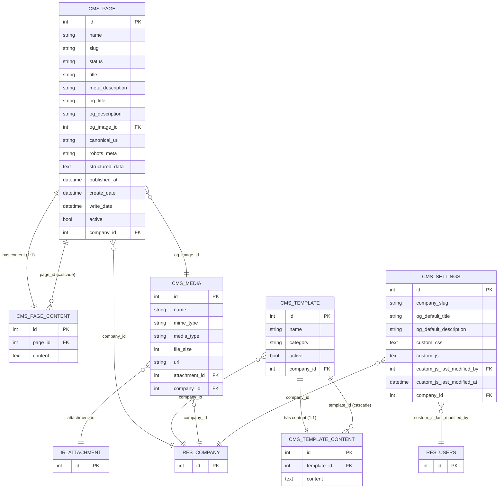
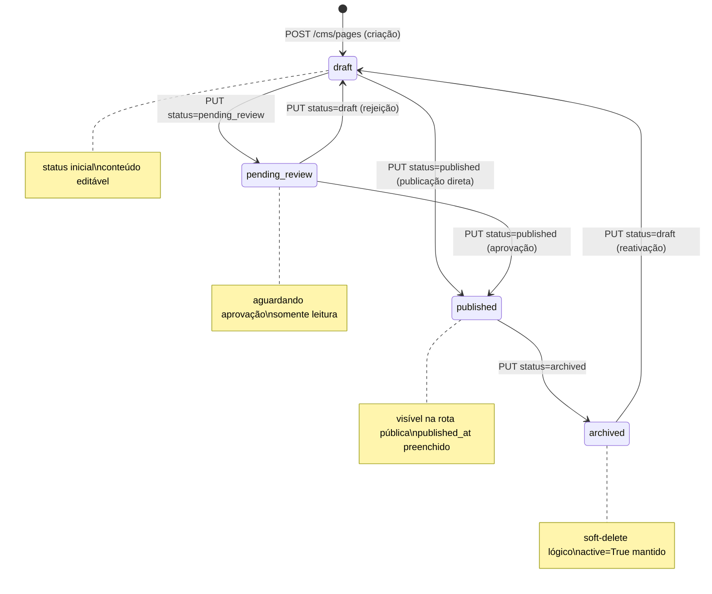

# Data Model: CMS Domain (021)

**Date**: 2026-05-24 | **Branch**: `021-cms-domain`
**Source**: spec.md + research.md

---

## Entity Relationship Diagram



---

## State Machine: CMS Page Status



**Transições válidas por estado**:

| Estado atual | → Pode ir para |
|---|---|
| `draft` | `pending_review`, `published` |
| `pending_review` | `published`, `draft` |
| `published` | `archived` |
| `archived` | `draft` |

**Transições inválidas** (422 com `invalid_status_transition`):
- `draft → archived`
- `pending_review → archived`
- `published → draft`
- `published → pending_review`
- `archived → published`
- `archived → pending_review`

---

## Model Definitions

### thedevkitchen.cms.page

```
Table: thedevkitchen_cms_page
Mixins: mail.thread, mail.activity.mixin
```

| Campo | Tipo Odoo | Banco | Obrigatório | Notas |
|-------|-----------|-------|-------------|-------|
| `id` | auto | serial PK | — | Odoo auto |
| `name` | Char | varchar(255) | ✅ | Nome da página |
| `slug` | Char | varchar(255) | ✅ | URL-safe: `^[a-z0-9]+(?:-[a-z0-9]+)*$` |
| `status` | Selection | varchar(32) | ✅ | draft/pending_review/published/archived; default=draft |
| `title` | Char | varchar(255) | — | SEO `<title>` |
| `meta_description` | Text | text | — | SEO meta description |
| `og_title` | Char | varchar(255) | — | Open Graph title |
| `og_description` | Text | text | — | Open Graph description |
| `og_image_id` | Many2one | int4 FK | — | → thedevkitchen_cms_media; constraint: mesmo company_id |
| `canonical_url` | Char | varchar(512) | — | Canonical URL absoluta |
| `robots_meta` | Selection | varchar(64) | — | index,follow / noindex,follow / noindex,nofollow / noindex |
| `structured_data` | Text | text | — | JSON-LD válido |
| `published_at` | Datetime | timestamp | — | Preenchido na transição → published |
| `active` | Boolean | bool | — | default=True; False = soft-deleted |
| `company_id` | Many2one | int4 FK | ✅ | → res.company |
| `create_date` | Datetime | timestamp | — | Odoo auto (= created_at na API) |
| `write_date` | Datetime | timestamp | — | Odoo auto (= updated_at na API) |

**SQL Constraints**:
```sql
UNIQUE(slug, company_id)  -- _sql_constraints: ('unique_slug_company', ...)
```

**`@api.constrains`**:
- `slug`: regex `^[a-z0-9]+(?:-[a-z0-9]+)*$`
- `structured_data`: `json.loads()` válido quando não-nulo
- `og_image_id`: `og_image_id.company_id == self.company_id`

---

### thedevkitchen.cms.page.content

```
Table: thedevkitchen_cms_page_content
```

| Campo | Tipo Odoo | Banco | Obrigatório | Notas |
|-------|-----------|-------|-------------|-------|
| `id` | auto | serial PK | — | Odoo auto |
| `page_id` | Many2one | int4 FK | ✅ | → thedevkitchen_cms_page; ondelete='cascade' |
| `content` | Text | text | — | JSON Puck; null até primeiro PUT com content |

**SQL Constraints**:
```sql
UNIQUE(page_id)  -- garante 1:1
```

**Validações no service layer** (não no model — para retornar 422 antes do ORM):
- `len(content.encode('utf-8')) <= 524_288` (512KB)
- `json.loads(content)` válido

---

### thedevkitchen.cms.template

```
Table: thedevkitchen_cms_template
```

| Campo | Tipo Odoo | Banco | Obrigatório | Notas |
|-------|-----------|-------|-------------|-------|
| `id` | auto | serial PK | — | Odoo auto |
| `name` | Char | varchar(255) | ✅ | Nome do template |
| `category` | Selection | varchar(32) | ✅ | landing/property/about |
| `active` | Boolean | bool | — | default=True |
| `company_id` | Many2one | int4 FK | ✅ | → res.company |

**SQL Constraints**:
```sql
UNIQUE(name, company_id)
```

---

### thedevkitchen.cms.template.content

```
Table: thedevkitchen_cms_template_content
```

| Campo | Tipo Odoo | Banco | Obrigatório | Notas |
|-------|-----------|-------|-------------|-------|
| `id` | auto | serial PK | — | Odoo auto |
| `template_id` | Many2one | int4 FK | ✅ | → thedevkitchen_cms_template; ondelete='cascade' |
| `content` | Text | text | — | JSON Puck; null até primeiro PUT |

**SQL Constraints**:
```sql
UNIQUE(template_id)  -- garante 1:1
```

---

### thedevkitchen.cms.media

```
Table: thedevkitchen_cms_media
```

| Campo | Tipo Odoo | Banco | Obrigatório | Notas |
|-------|-----------|-------|-------------|-------|
| `id` | auto | serial PK | — | Odoo auto |
| `name` | Char | varchar(255) | ✅ | Nome original do arquivo (sanitizado) |
| `mime_type` | Char | varchar(128) | ✅ | MIME detectado por magic bytes |
| `media_type` | Selection | varchar(16) | ✅ | image/video/document |
| `file_size` | Integer | int4 | ✅ | Bytes |
| `url` | Char | varchar(512) | ✅ | URL de acesso via /api/v1/ |
| `attachment_id` | Many2one | int4 FK | ✅ | → ir.attachment |
| `company_id` | Many2one | int4 FK | ✅ | → res.company |

**Hard Delete**: Override de `unlink()` para remover `ir.attachment` junto. ADR-015 exception documentada.

**Validações no service layer**:
- MIME detectado via `python-magic` contra whitelist por `media_type`
- Tamanho: image ≤ 10MB, video ≤ 100MB, document ≤ 20MB
- Filename: sanitizado (strip path traversal, normalize unicode)

---

### thedevkitchen.cms.settings

```
Table: thedevkitchen_cms_settings
Singleton: UNIQUE(company_id) + get_or_create() class method
```

| Campo | Tipo Odoo | Banco | Obrigatório | Notas |
|-------|-----------|-------|-------------|-------|
| `id` | auto | serial PK | — | Odoo auto |
| `company_slug` | Char | varchar(255) | — | URL-safe: `^[a-z0-9]+(?:-[a-z0-9]+)*$`; plataforma-único |
| `og_default_title` | Char | varchar(255) | — | SEO padrão quando página não tem title |
| `og_default_description` | Text | text | — | SEO padrão |
| `custom_css` | Text | text | — | CSS customizado; ≤ 64KB; validado contra injection |
| `custom_js` | Text | text | — | JS customizado; restrito ao role owner |
| `custom_js_last_modified_by` | Many2one | int4 FK | — | → res.users; auditoria |
| `custom_js_last_modified_at` | Datetime | timestamp | — | Auditoria |
| `company_id` | Many2one | int4 FK | ✅ | → res.company |

**SQL Constraints**:
```sql
UNIQUE(company_id)   -- singleton por imobiliária
UNIQUE(company_slug) -- slug único na plataforma (quando não-nulo)
```

**`@api.constrains`**:
- `company_slug`: regex `^[a-z0-9]+(?:-[a-z0-9]+)*$` quando não-nulo
- `custom_css`: regex patterns de CSS injection (ver RES-004)

**`get_or_create()` class method**:
```python
@classmethod
def get_or_create(cls, env, company_id):
    settings = env['thedevkitchen.cms.settings'].search(
        [('company_id', '=', company_id)], limit=1
    )
    if not settings:
        settings = env['thedevkitchen.cms.settings'].create({
            'company_id': company_id
        })
    return settings
```

---

## Database Indexes

Índices adicionais além das PKs e FKs automáticas:

```sql
-- Lookup de página por slug+company (endpoint público + interno)
CREATE INDEX idx_cms_page_slug_company ON thedevkitchen_cms_page (slug, company_id);

-- Listagem de páginas por status (filtro mais comum)
CREATE INDEX idx_cms_page_status_company ON thedevkitchen_cms_page (status, company_id);

-- Lookup de settings por company_slug (endpoint público)
CREATE INDEX idx_cms_settings_company_slug ON thedevkitchen_cms_settings (company_slug)
  WHERE company_slug IS NOT NULL;

-- Listagem de mídia por company
CREATE INDEX idx_cms_media_company ON thedevkitchen_cms_media (company_id);
```

---

## Security Model (Record Rules)

```xml
<!-- Isolamento de páginas por company -->
<record id="cms_page_company_rule" model="ir.rule">
    <field name="name">CMS Page: company isolation</field>
    <field name="model_id" ref="model_thedevkitchen_cms_page"/>
    <field name="domain_force">[('company_id', 'in', company_ids)]</field>
</record>

<!-- Isolamento de mídia por company -->
<record id="cms_media_company_rule" model="ir.rule">
    <field name="name">CMS Media: company isolation</field>
    <field name="model_id" ref="model_thedevkitchen_cms_media"/>
    <field name="domain_force">[('company_id', 'in', company_ids)]</field>
</record>

<!-- Settings: somente a própria company -->
<record id="cms_settings_company_rule" model="ir.rule">
    <field name="name">CMS Settings: company isolation</field>
    <field name="model_id" ref="model_thedevkitchen_cms_settings"/>
    <field name="domain_force">[('company_id', 'in', company_ids)]</field>
</record>
```

> **Nota**: `cms.page.content` e `cms.template.content` herdam isolamento via `ondelete='cascade'` + record rule do parent.
