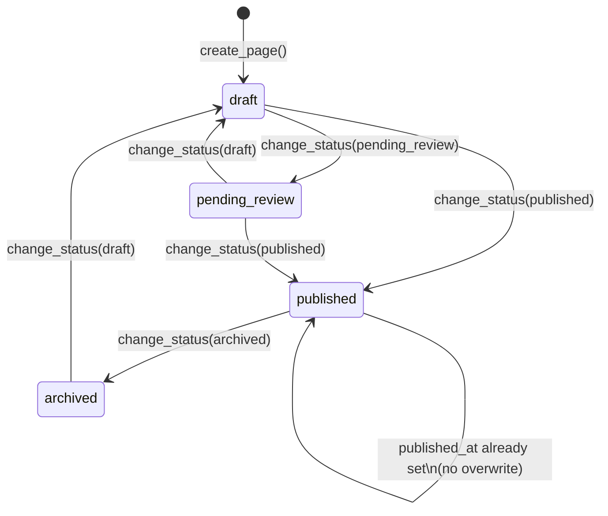
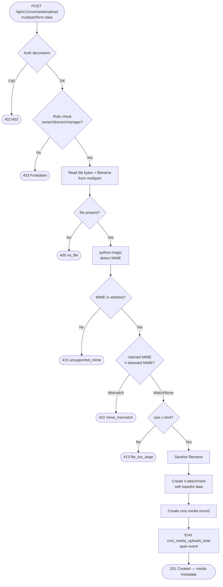
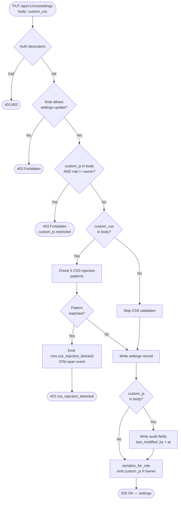
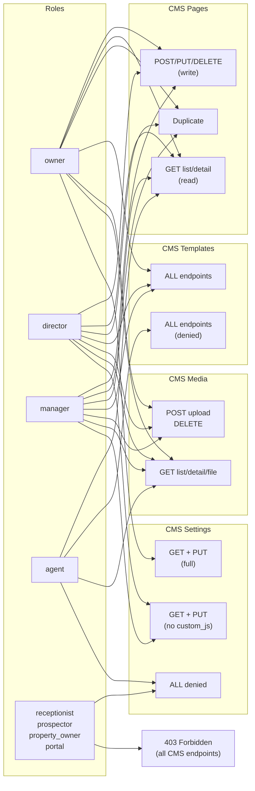

# CMS Domain — Flowcharts

> Feature 021 — `thedevkitchen_cms` Odoo 18.0 module.
> All flows reflect the implemented service and controller logic.

---

## 1. State Machine: Page Status Transitions



---

## 2. Create Page Flow

```mermaid
flowchart TD
    A([POST /api/v1/cms/pages]) --> B{@require_jwt\n@require_session\n@require_company}
    B -- 401/403 --> ERR1([Error Response])
    B -- OK --> C{Role in\nowner/director/manager?}
    C -- No --> ERR2([403 Forbidden])
    C -- Yes --> D[Parse JSON body]
    D --> E{template_id\nprovided?}
    E -- Yes --> F{Template exists\nfor company?}
    F -- No --> ERR3([422 template_not_found])
    F -- Yes --> G[Copy template content]
    E -- No --> H[Use provided content]
    G --> I[Create cms.page record]
    H --> I
    I --> J[Create cms.page.content record]
    J --> K([201 Created — page + content])
```

---

## 3. Media Upload Flow



---

## 4. CSS Injection Guard Flow



---

## 5. Public Route Resolution Flow

```mermaid
flowchart TD
    A([GET /api/v1/public/cms\n/:company_slug/pages/:page_slug]) --> B{@require_jwt\nJWT only — no session}
    B -- 401 --> ERR1([401 Unauthorized])
    B -- OK --> C[Lookup cms.settings\nby company_slug]
    C --> D{Settings found?}
    D -- No --> ERR2([404 company_slug_not_found])
    D -- Yes --> E[Extract company_id\nfrom settings]
    E --> F[Search cms.page\nslug=page_slug\ncompany_id=company_id\nstatus=published\nactive=True]
    F --> G{Page found?}
    G -- No --> ERR3([404 page_not_found])
    G -- Yes --> H[Build response\nexclude: status, active, company_id\ncustom_js, custom_css]
    H --> I[Include og_default_*\nfrom settings]
    I --> J([200 OK — public page])
```

---

## 6. Page Duplicate Flow

```mermaid
flowchart TD
    A([POST /api/v1/cms/pages/:id/duplicate]) --> B{Auth + role\nowner/director/manager}
    B -- Fail --> ERR1([401/403])
    B -- OK --> C[Find source page\nby id + company_id]
    C --> D{Found?}
    D -- No --> ERR2([404 page_not_found])
    D -- Yes --> E[Base slug = slug + '-copy']
    E --> F{slug available?}
    F -- No --> G[Append '-2', '-3' ...\nuntil unique]
    G --> F
    F -- Yes --> H[Copy page fields\nstatus = draft]
    H --> I[Copy content from\ncontent_ids[0]]
    I --> J[create_page() atomic]
    J --> K([201 Created — new page])
```

---

## 7. RBAC Permission Matrix



---

## 8. Module Upgrade / Swagger Sync Flow


