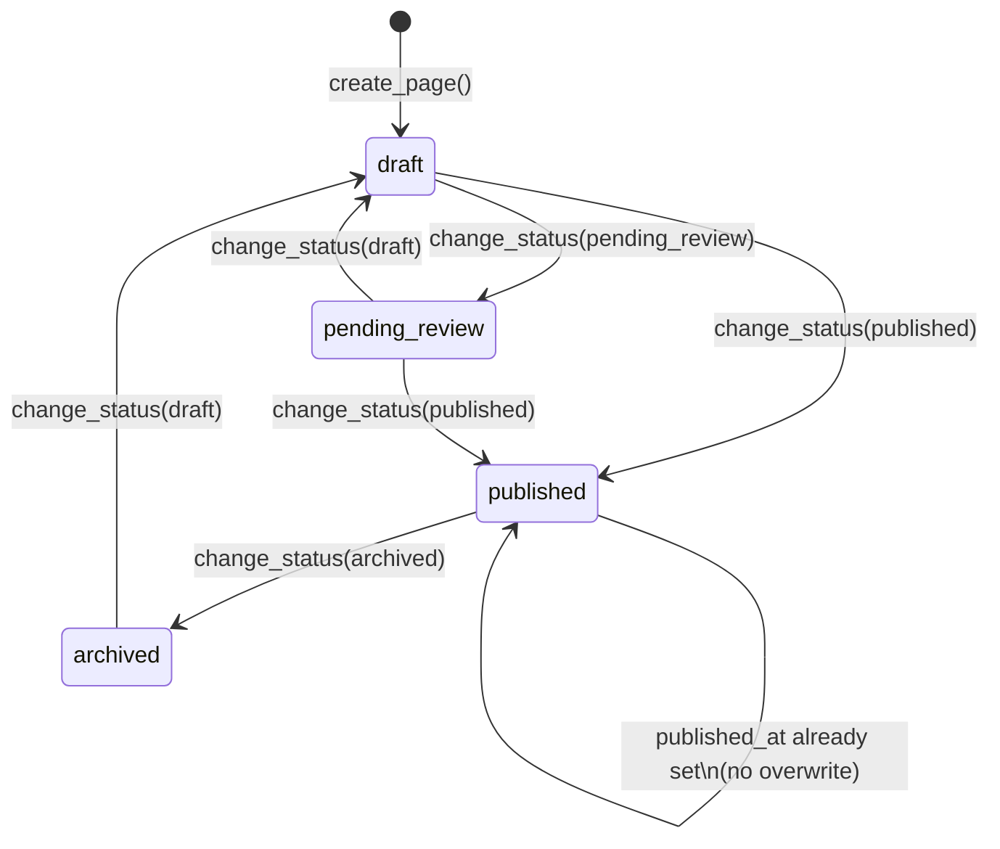
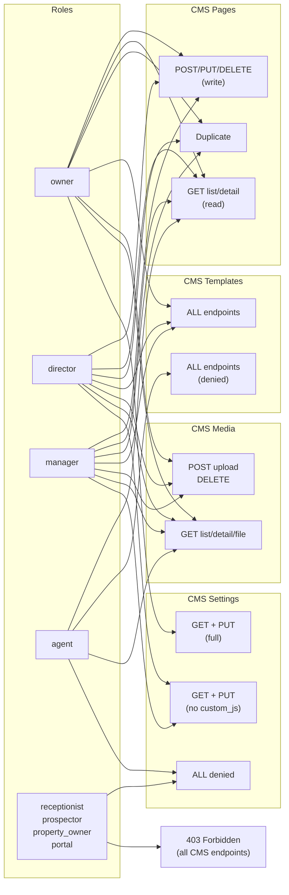
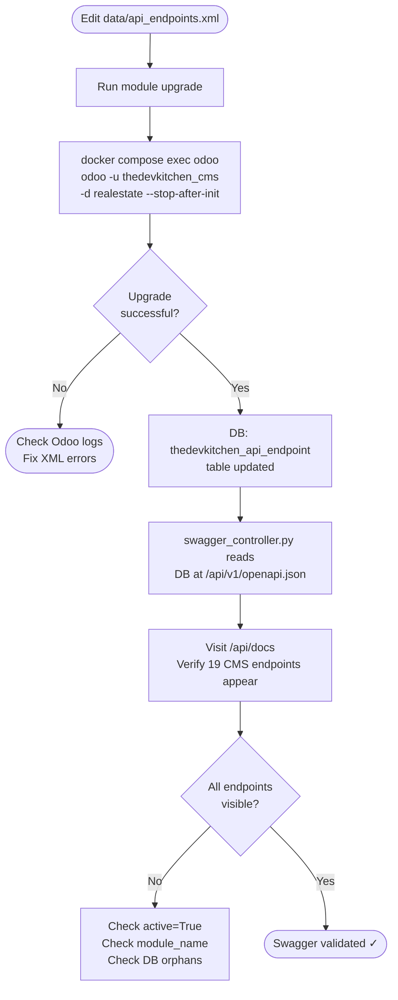
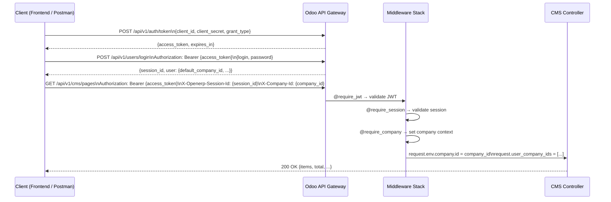
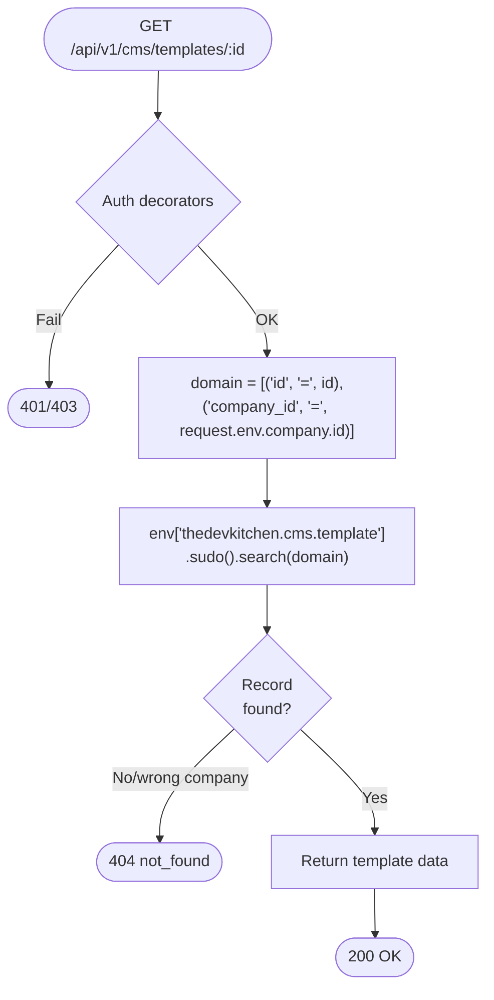

# CMS Domain — Flowcharts

> Feature 021 — `thedevkitchen_cms` Odoo 18.0 module.
> All flows reflect the implemented service and controller logic.

---

## 1. State Machine: Page Status Transitions



---

## 2. Create Page Flow

```mermaid
flowchart TD
    A([POST /api/v1/cms/pages]) --> B{@require_jwt\n@require_session\n@require_company}
    B -- 401/403 --> ERR1([Error Response])
    B -- OK --> C{Role in\nowner/director/manager?}
    C -- No --> ERR2([403 Forbidden])
    C -- Yes --> D[Parse JSON body]
    D --> E{template_id\nprovided?}
    E -- Yes --> F{Template exists\nfor company?}
    F -- No --> ERR3([422 template_not_found])
    F -- Yes --> G[Copy template content]
    E -- No --> H[Use provided content]
    G --> I[Create cms.page record]
    H --> I
    I --> J[Create cms.page.content record]
    J --> K([201 Created — page + content])
```

---

## 3. Media Upload Flow


---

## 4. CSS Injection Guard Flow


---

## 5. Public Route Resolution Flow

```mermaid
flowchart TD
    A([GET /api/v1/public/cms\n/:company_slug/pages/:page_slug]) --> B{@require_jwt\nJWT only — no session}
    B -- 401 --> ERR1([401 Unauthorized])
    B -- OK --> C[Lookup cms.settings\nby company_slug]
    C --> D{Settings found?}
    D -- No --> ERR2([404 company_slug_not_found])
    D -- Yes --> E[Extract company_id\nfrom settings]
    E --> F[Search cms.page\nslug=page_slug\ncompany_id=company_id\nstatus=published\nactive=True]
    F --> G{Page found?}
    G -- No --> ERR3([404 page_not_found])
    G -- Yes --> H[Build response\nexclude: status, active, company_id\ncustom_js, custom_css]
    H --> I[Include og_default_*\nfrom settings]
    I --> J([200 OK — public page])
```

---

## 6. Page Duplicate Flow

```mermaid
flowchart TD
    A([POST /api/v1/cms/pages/:id/duplicate]) --> B{Auth + role\nowner/director/manager}
    B -- Fail --> ERR1([401/403])
    B -- OK --> C[Find source page\nby id + company_id]
    C --> D{Found?}
    D -- No --> ERR2([404 page_not_found])
    D -- Yes --> E[Base slug = slug + '-copy']
    E --> F{slug available?}
    F -- No --> G[Append '-2', '-3' ...\nuntil unique]
    G --> F
    F -- Yes --> H[Copy page fields\nstatus = draft]
    H --> I[Copy content from\ncontent_ids[0]]
    I --> J[create_page() atomic]
    J --> K([201 Created — new page])
```

---

## 7. RBAC Permission Matrix



---

## 8. Module Upgrade / Swagger Sync Flow



---

## 9. 3-Header Authentication Flow (all private endpoints)



---

## 10. Company Slug Conflict Resolution

```mermaid
flowchart TD
    A([PUT /api/v1/cms/settings\nbody: company_slug]) --> B{Auth + role\nowner/director/manager}
    B -- Fail --> ERR1([401/403])
    B -- OK --> C[CmsSettingsService.update_settings]
    C --> D{company_slug\nin request body?}
    D -- No --> SKIP[Skip uniqueness check]
    D -- Yes --> E["SELECT FROM cms.settings\nWHERE company_slug = :slug\nAND company_id != :current_company"]
    E --> F{Conflict\nfound?}
    F -- Yes --> ERR2([409 Conflict\nslug_conflict])
    F -- No --> SKIP
    SKIP --> G[settings.write(vals)]
    G --> H([200 OK — updated settings])
```

---

## 11. Template Isolation (Multitenancy)



---

## 12. Complete Endpoint Reference

| # | Method | Path | Auth | Roles | HTTP Codes |
|---|--------|------|------|-------|------------|
| 1 | `POST` | `/api/v1/cms/pages` | 3-header | owner, director, manager | 201, 400, 401, 403, 409, 422 |
| 2 | `GET` | `/api/v1/cms/pages` | 3-header | owner, director, manager, agent | 200, 401, 403 |
| 3 | `GET` | `/api/v1/cms/pages/{id}` | 3-header | owner, director, manager, agent | 200, 401, 403, 404 |
| 4 | `PUT` | `/api/v1/cms/pages/{id}` | 3-header | owner, director, manager | 200, 400, 401, 403, 404, 422 |
| 5 | `DELETE` | `/api/v1/cms/pages/{id}` | 3-header | owner, director, manager | 200, 401, 403, 404 |
| 6 | `POST` | `/api/v1/cms/pages/{id}/duplicate` | 3-header | owner, director, manager | 201, 401, 403, 404 |
| 7 | `POST` | `/api/v1/cms/media/upload` | 3-header | owner, director, manager | 201, 400, 401, 403, 413, 415, 422 |
| 8 | `GET` | `/api/v1/cms/media` | 3-header | owner, director, manager, agent | 200, 401, 403 |
| 9 | `GET` | `/api/v1/cms/media/{id}` | 3-header | owner, director, manager, agent | 200, 401, 403, 404 |
| 10 | `GET` | `/api/v1/cms/media/{id}/file` | 3-header | owner, director, manager, agent | 200, 401, 403, 404 |
| 11 | `DELETE` | `/api/v1/cms/media/{id}` | 3-header | owner, director, manager | 200, 401, 403, 404 |
| 12 | `POST` | `/api/v1/cms/templates` | 3-header | owner, director, manager | 201, 400, 401, 403, 409, 422 |
| 13 | `GET` | `/api/v1/cms/templates` | 3-header | owner, director, manager | 200, 401, 403 |
| 14 | `GET` | `/api/v1/cms/templates/{id}` | 3-header | owner, director, manager | 200, 401, 403, 404 |
| 15 | `PUT` | `/api/v1/cms/templates/{id}` | 3-header | owner, director, manager | 200, 400, 401, 403, 404, 422 |
| 16 | `DELETE` | `/api/v1/cms/templates/{id}` | 3-header | owner, director, manager | 200, 401, 403, 404 |
| 17 | `GET` | `/api/v1/cms/settings` | 3-header | owner (full), director, manager, agent | 200, 401, 403 |
| 18 | `PUT` | `/api/v1/cms/settings` | 3-header | owner, director, manager | 200, 400, 401, 403, 409, 422 |
| 19 | `GET` | `/api/v1/public/cms/{company_slug}/pages/{page_slug}` | JWT only | public | 200, 401, 404 |

### Notes

- **3-header** = `Authorization: Bearer {token}` + `X-Openerp-Session-Id: {sid}` + `X-Company-Id: {cid}`
- **JWT only** = `Authorization: Bearer {token}` only (no session, no company)
- **Soft delete**: Pages and Templates set `active=False` — they remain in DB
- **Hard delete**: Media permanently removes `cms.media` + `ir.attachment` (ADR-015 exception)
- **`custom_js`**: Only returned for `owner` role in GET settings; returns 403 for non-owner in PUT
- **Multitenancy**: All private endpoints use `request.env.company.id` for domain filtering — data from other companies returns 404

---

## 13. Integration Test Coverage

| Suite | Scenarios | Coverage |
|-------|-----------|---------|
| `test_us021_cms_page_crud.sh` | 16 | CRUD, state machine, duplicate, RBAC |
| `test_us021_cms_media.sh` | 9 | Upload, MIME validation, magic bytes, delete |
| `test_us021_cms_public.sh` | 7 | Public route, 404 for draft/archived/invalid slug |
| `test_us021_cms_templates.sh` | 6 | CRUD, agent 403 |
| `test_us021_cms_settings.sh` | 10 | Singleton, CSS injection, custom_js RBAC, audit fields |
| `test_us021_rbac_matrix.sh` | 27 | Full permission matrix across all endpoints |
| `test_us021_multitenancy.sh` | 6 | Page/template isolation, same slug, slug conflict 409 |
| **Total** | **81** | **7/7 PASS** |

---

## 14. Endpoint Sequences per Journey

Cada jornada lista os endpoints chamados **em ordem**, com o número de referência da seção 12.

---

### J1 — Autenticação (pré-requisito de todos os fluxos privados)

| # | Endpoint | Finalidade |
|---|----------|-----------|
| 1 | `POST /api/v1/auth/token` | Obter JWT (`access_token`) |
| 2 | `POST /api/v1/users/login` | Criar sessão (`session_id`) |

> Após a autenticação, todos os requests privados enviam:
> `Authorization: Bearer {token}` + `X-Openerp-Session-Id: {session_id}` + `X-Company-Id: {company_id}`

---

### J2 — Criar e publicar uma página (editor)

| Ordem | # | Method | Endpoint | Ação |
|-------|---|--------|----------|------|
| 1 | 7 | `POST` | `/api/v1/cms/media/upload` | Upload de imagens / assets necessários |
| 2 | 1 | `POST` | `/api/v1/cms/pages` | Criar página (status `draft`) |
| 3 | 4 | `PUT` | `/api/v1/cms/pages/{id}` | Editar conteúdo Puck JSON |
| 4 | 4 | `PUT` | `/api/v1/cms/pages/{id}` | Submeter para revisão (`status: pending_review`) |
| 5 | 3 | `GET` | `/api/v1/cms/pages/{id}` | Verificar estado da página |
| 6 | 4 | `PUT` | `/api/v1/cms/pages/{id}` | Aprovar e publicar (`status: published`) |

---

### J3 — Criar página a partir de template

| Ordem | # | Method | Endpoint | Ação |
|-------|---|--------|----------|------|
| 1 | 13 | `GET` | `/api/v1/cms/templates` | Listar templates disponíveis |
| 2 | 14 | `GET` | `/api/v1/cms/templates/{id}` | Visualizar conteúdo do template |
| 3 | 1 | `POST` | `/api/v1/cms/pages` | Criar página com `template_id` (copia conteúdo) |
| 4 | 4 | `PUT` | `/api/v1/cms/pages/{id}` | Personalizar conteúdo e metadados |
| 5 | 3 | `GET` | `/api/v1/cms/pages/{id}` | Verificar resultado final |

---

### J4 — Fluxo de aprovação (manager → owner)

| Ordem | # | Method | Endpoint | Ação |
|-------|---|--------|----------|------|
| 1 | 1 | `POST` | `/api/v1/cms/pages` | Manager cria rascunho |
| 2 | 4 | `PUT` | `/api/v1/cms/pages/{id}` | Manager submete: `status: pending_review` |
| 3 | 2 | `GET` | `/api/v1/cms/pages` | Owner lista páginas em revisão (`?status=pending_review`) |
| 4 | 3 | `GET` | `/api/v1/cms/pages/{id}` | Owner lê conteúdo completo |
| 5 | 4 | `PUT` | `/api/v1/cms/pages/{id}` | Owner publica: `status: published` |

---

### J5 — Duplicar e adaptar página existente

| Ordem | # | Method | Endpoint | Ação |
|-------|---|--------|----------|------|
| 1 | 2 | `GET` | `/api/v1/cms/pages` | Listar páginas publicadas |
| 2 | 3 | `GET` | `/api/v1/cms/pages/{id}` | Visualizar página original |
| 3 | 6 | `POST` | `/api/v1/cms/pages/{id}/duplicate` | Duplicar (gera slug único, status `draft`) |
| 4 | 4 | `PUT` | `/api/v1/cms/pages/{id}` | Editar cópia (novo conteúdo / slug) |
| 5 | 4 | `PUT` | `/api/v1/cms/pages/{id}` | Publicar cópia |

---

### J6 — Gerenciar biblioteca de mídia

| Ordem | # | Method | Endpoint | Ação |
|-------|---|--------|----------|------|
| 1 | 7 | `POST` | `/api/v1/cms/media/upload` | Upload do arquivo (valida MIME + tamanho) |
| 2 | 8 | `GET` | `/api/v1/cms/media` | Listar biblioteca para seleção no editor |
| 3 | 9 | `GET` | `/api/v1/cms/media/{id}` | Obter metadados (URL, mime_type, file_size) |
| 4 | 10 | `GET` | `/api/v1/cms/media/{id}/file` | Download / preview do arquivo |
| 5 | 11 | `DELETE` | `/api/v1/cms/media/{id}` | Remover arquivo desnecessário |

---

### J7 — Gerenciar templates

| Ordem | # | Method | Endpoint | Ação |
|-------|---|--------|----------|------|
| 1 | 12 | `POST` | `/api/v1/cms/templates` | Criar template com conteúdo base |
| 2 | 13 | `GET` | `/api/v1/cms/templates` | Listar templates disponíveis |
| 3 | 14 | `GET` | `/api/v1/cms/templates/{id}` | Inspecionar template específico |
| 4 | 15 | `PUT` | `/api/v1/cms/templates/{id}` | Atualizar conteúdo do template |
| 5 | 16 | `DELETE` | `/api/v1/cms/templates/{id}` | Remover template obsoleto |

---

### J8 — Configurar site (owner)

| Ordem | # | Method | Endpoint | Ação |
|-------|---|--------|----------|------|
| 1 | 17 | `GET` | `/api/v1/cms/settings` | Ler configurações atuais (inclui `custom_js` para owner) |
| 2 | 18 | `PUT` | `/api/v1/cms/settings` | Atualizar `company_slug`, OG defaults, `custom_css`, `custom_js` |
| 3 | 17 | `GET` | `/api/v1/cms/settings` | Confirmar alterações salvas |

---

### J9 — Leitura pública de página (frontend / SEO)

| Ordem | # | Method | Endpoint | Ação |
|-------|---|--------|----------|------|
| 1 | 19 | `GET` | `/api/v1/public/cms/{company_slug}/pages/{page_slug}` | Obter página publicada com OG metadata |
| 2 | 10 | `GET` | `/api/v1/cms/media/{id}/file` | Carregar assets de mídia referenciados no conteúdo |

> **Auth:** apenas JWT (`Authorization: Bearer {token}`) — sem sessão, sem company header.
> Retorna 404 para páginas `draft`, `pending_review` ou `archived`.

---

### J10 — Arquivar / desativar página

| Ordem | # | Method | Endpoint | Ação |
|-------|---|--------|----------|------|
| 1 | 2 | `GET` | `/api/v1/cms/pages` | Localizar página a ser arquivada |
| 2 | 4 | `PUT` | `/api/v1/cms/pages/{id}` | Mudar status para `archived` |
| 3 | 5 | `DELETE` | `/api/v1/cms/pages/{id}` | Soft-delete se não for mais necessária (`active=False`) |
