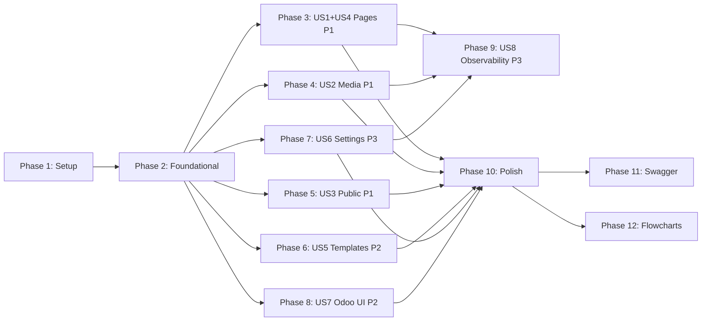

# Tasks: CMS Domain

**Feature Branch**: `021-cms-domain`
**Input**: [spec.md](spec.md), [plan.md](plan.md), [data-model.md](data-model.md), [contracts/api-contracts.md](contracts/api-contracts.md)
**Module path**: `18.0/extra-addons/thedevkitchen_cms/`

---

## Format: `[ID] [P?] [Story?] Description with file path`

- **[P]**: Task can run in parallel (different files, no shared dependencies)
- **[Story]**: Maps to user story in spec.md — Setup and Foundational phases do not carry story label

---

## Phase 1: Setup — Estrutura do Módulo

**Purpose**: Criar a estrutura base do módulo Odoo. Deve ser concluída antes de qualquer outra fase.

- [ ] T001 Criar estrutura de diretórios do módulo em `18.0/extra-addons/thedevkitchen_cms/` com `__init__.py`, `__manifest__.py`, subdiretórios `models/`, `controllers/`, `services/`, `views/`, `data/`, `security/`, `tests/unit/` cada um com `__init__.py`
- [ ] T002 [P] Preencher `18.0/extra-addons/thedevkitchen_cms/__manifest__.py` com `name`, `version`, `depends` (`quicksol_estate`, `thedevkitchen_apigateway`, `thedevkitchen_observability`), `data` (lista de arquivos security/views/data), `installable=True`
- [ ] T003 [P] Criar `18.0/extra-addons/thedevkitchen_cms/services/cms_error_helpers.py` com helper `_cms_error(http_status, error_code, detail=None, **extra)` que retorna envelope FR6.9: `{"error": error_code, "detail": detail, ...extra}`

**Checkpoint**: Módulo instalável no Odoo sem erros de manifesto (`odoo -d realestate -u thedevkitchen_cms --stop-after-init`)

---

## Phase 2: Foundational — Modelos e Banco de Dados

**Purpose**: Modelos ORM que bloqueiam toda implementação posterior. Nenhuma fase de user story pode iniciar antes deste checkpoint.

**⚠️ CRÍTICO**: Todas as tarefas T004–T013 devem ser concluídas antes de qualquer fase US.

- [ ] T004 Criar modelo `thedevkitchen.cms.page` em `18.0/extra-addons/thedevkitchen_cms/models/cms_page.py` com: `name` (Char, required), `slug` (Char, required), `status` (Selection: draft/pending_review/published/archived, default=draft), `title`, `meta_description`, `og_title`, `og_description`, `og_image_id` (Many2one cms.media), `canonical_url`, `robots_meta` (Selection), `structured_data` (Text), `published_at` (Datetime), `active` (Boolean, default=True), `company_id` (Many2one res.company, required); herdar `mail.thread`; `_sql_constraints`: `UNIQUE(slug, company_id)`
- [ ] T005 [P] Criar modelo `thedevkitchen.cms.page.content` em `18.0/extra-addons/thedevkitchen_cms/models/cms_page_content.py` com: `page_id` (Many2one cms.page, required, ondelete='cascade'), `content` (Text); `_sql_constraints`: `UNIQUE(page_id)` (garante relação 1:1 — padrão One2one no Odoo)
- [ ] T006 [P] Criar modelo `thedevkitchen.cms.template` em `18.0/extra-addons/thedevkitchen_cms/models/cms_template.py` com: `name` (Char, required), `category` (Selection: landing/property/about, required), `active` (Boolean, default=True), `company_id` (Many2one res.company, required); `_sql_constraints`: `UNIQUE(name, company_id)`
- [ ] T007 [P] Criar modelo `thedevkitchen.cms.template.content` em `18.0/extra-addons/thedevkitchen_cms/models/cms_template_content.py` com: `template_id` (Many2one cms.template, required, ondelete='cascade'), `content` (Text); `_sql_constraints`: `UNIQUE(template_id)`
- [ ] T008 [P] Criar modelo `thedevkitchen.cms.media` em `18.0/extra-addons/thedevkitchen_cms/models/cms_media.py` com: `name` (Char, required), `mime_type` (Char, required), `media_type` (Selection: image/video/document, required), `file_size` (Integer, required), `url` (Char, required), `attachment_id` (Many2one ir.attachment, required), `company_id` (Many2one res.company, required); override de `unlink()` para hard delete (remove `ir.attachment` junto) — ADR-015 exception documentada no comentário do método
- [ ] T009 [P] Criar modelo `thedevkitchen.cms.settings` em `18.0/extra-addons/thedevkitchen_cms/models/cms_settings.py` com: `company_slug` (Char), `og_default_title` (Char), `og_default_description` (Text), `custom_css` (Text), `custom_js` (Text), `custom_js_last_modified_by` (Many2one res.users), `custom_js_last_modified_at` (Datetime), `company_id` (Many2one res.company, required); `_sql_constraints`: `UNIQUE(company_id)` (singleton) e `UNIQUE(company_slug)`; classmethod `get_or_create(cls, env, company_id)`
- [ ] T010 Adicionar `@api.constrains` em `18.0/extra-addons/thedevkitchen_cms/models/cms_page.py`: (1) `slug` regex `^[a-z0-9]+(?:-[a-z0-9]+)*$`; (2) `structured_data` `json.loads()` válido quando não-nulo; (3) `og_image_id.company_id == self.company_id` quando não-nulo
- [ ] T011 [P] Adicionar `@api.constrains` em `18.0/extra-addons/thedevkitchen_cms/models/cms_settings.py`: (1) `company_slug` regex `^[a-z0-9]+(?:-[a-z0-9]+)*$` quando não-nulo; (2) `custom_css` contra 5 padrões CSS injection: `expression(`, `behavior:`, `url(javascript:`, `@import`, `-moz-binding`
- [ ] T012 Criar `18.0/extra-addons/thedevkitchen_cms/security/ir.model.access.csv` com ACLs para os 5 modelos CMS e `18.0/extra-addons/thedevkitchen_cms/security/cms_record_rules.xml` com 3 record rules de isolamento por `company_id` para `cms.page`, `cms.media` e `cms.settings`
- [ ] T013 [P] Atualizar `18.0/extra-addons/quicksol_estate/services/capability_service.py` adicionando subjects CMS (`CMSPage`, `CMSTemplate`, `CMSMedia`, `CMSSettings`) a `ALLOWED_SUBJECTS` e regras RBAC: owner/director/manager = full access; agent = read-only `CMSPage` e `CMSMedia`; demais roles = sem acesso

**Checkpoint**: `odoo -d realestate -u thedevkitchen_cms --stop-after-init` instala sem erros; `\dt thedevkitchen_cms*` lista 6 tabelas no banco

---

## Phase 3: US1 + US4 — CRUD de Páginas e Ciclo de Vida (Priority: P1) 🎯 MVP

**Goal**: Criar, editar, listar e publicar páginas CMS. Toda mudança de status via `PUT /api/v1/cms/pages/:id`. State machine 4-estados com transições explícitas.

**Independent Test**: `POST /api/v1/cms/pages` → `PUT /:id {"status":"published"}` → `GET /:id` retorna `status=published` com `published_at` preenchido.

### Testes para US1 + US4

- [ ] T014 [P] [US1] Criar testes unitários em `18.0/extra-addons/thedevkitchen_cms/tests/unit/test_cms_page_validations.py`: slug inválido (`MY_PAGE`) → ValidationError; slug válido (`my-page`) → aceito; content > 512KB → ValidationError; content JSON inválido → ValidationError; JSON-LD inválido em `structured_data` → ValidationError; `og_image_id` de outra company → ValidationError
- [ ] T015 [P] [US4] Criar testes unitários em `18.0/extra-addons/thedevkitchen_cms/tests/unit/test_cms_status_machine.py`: todas as transições válidas (draft→pending_review, draft→published, pending_review→published, pending_review→draft, published→archived, archived→draft) e todas inválidas (draft→archived, pending_review→archived, published→draft, published→pending_review, archived→published, archived→pending_review) com `unittest.mock`; `published_at` preenchido somente na transição → published
- [ ] T016 [P] [US1] Criar testes de integração em `integration_tests/test_us021_cms_page_crud.sh`: POST criar página (201), PUT atualizar metadados (200), PUT fluxo completo de status (draft→pending_review→published→archived→draft), GET listagem sem campo `content`, GET por id com `content`, DELETE soft delete, acesso cross-company retorna 404, role agent em POST retorna 403

### Implementação de US1 + US4

- [ ] T017 [US1] Criar `18.0/extra-addons/thedevkitchen_cms/services/cms_page_service.py` com métodos: `create_page(env, vals, company_id)` — cria `cms.page` + `cms.page.content` (content=null) atomicamente; `update_page(env, page_id, vals)` — valida content ≤ 512KB e JSON válido antes de persistir; `duplicate_page(env, page_id)` — copia page + content com `name + " (Cópia)"` e slug incremental (`-copy`, `-copy-2`, etc.)
- [ ] T018 [US4] Implementar state machine em `18.0/extra-addons/thedevkitchen_cms/services/cms_page_service.py`, método `change_status(env, page_id, new_status)`: mapa `VALID_TRANSITIONS = {draft: [pending_review, published], pending_review: [published, draft], published: [archived], archived: [draft]}`; lançar `_cms_error(422, "invalid_status_transition", from=..., to=..., allowed=[...])` para inválidas; lançar `_cms_error(422, "invalid_status_value", allowed=[...])` para status desconhecido; atualizar `published_at` quando `→ published`
- [ ] T019 [US1] Criar `18.0/extra-addons/thedevkitchen_cms/controllers/cms_page_controller.py` com 6 endpoints (todos com `@require_jwt`, `@require_session`, `@require_company`): `POST /api/v1/cms/pages` (201 + HATEOAS links), `GET /api/v1/cms/pages` (listagem paginada, sem campo `content`), `GET /api/v1/cms/pages/<int:page_id>` (com content via join), `PUT /api/v1/cms/pages/<int:page_id>` (metadados e/ou status), `DELETE /api/v1/cms/pages/<int:page_id>` (soft delete, `active=False`), `POST /api/v1/cms/pages/<int:page_id>/duplicate` (201)

**Checkpoint**: US1 e US4 funcionais. `POST /pages → PUT published → GET` verificado. Testes T014–T016 passando.

---

## Phase 4: US2 — Biblioteca de Mídia (Priority: P1)

**Goal**: Upload seguro de arquivos com validação por magic bytes (conteúdo real, não extensão). Hard delete completo (binário + metadados).

**Independent Test**: Upload de `.jpg` com conteúdo PDF retorna 415 `mime_mismatch`; upload `.jpg` válido retorna 201 com URL acessível.

### Testes para US2

- [ ] T020 [P] [US2] Criar testes unitários em `18.0/extra-addons/thedevkitchen_cms/tests/unit/test_cms_media_validations.py`: MIME `text/html` → `unsupported_mime`; extensão `.jpg` + magic bytes PDF → `mime_mismatch`; imagem > 10MB → `file_too_large` com `max_size_bytes=10485760`; vídeo > 100MB → `file_too_large`; documento > 20MB → `file_too_large`; filename `../../etc/passwd.jpg` → sanitizado para `passwd.jpg`
- [ ] T021 [P] [US2] Criar testes de integração em `integration_tests/test_us021_cms_media.sh`: upload válido jpg (201 + URL), upload com MIME inválido (415), upload com magic bytes divergentes (415), upload acima do limite (413), DELETE verifica remoção do `ir.attachment`, acesso cross-company retorna 404

### Implementação de US2

- [ ] T022 [US2] Criar `18.0/extra-addons/thedevkitchen_cms/services/cms_media_service.py` com: `validate_upload(file_bytes, filename, claimed_mime)` — detecta MIME via `python-magic`, verifica contra whitelist (image: jpg/png/gif/webp; video: mp4/webm; document: pdf/txt), limites por tipo (image: 10MB, video: 100MB, document: 20MB), sanitiza filename
- [ ] T023 [US2] Criar `18.0/extra-addons/thedevkitchen_cms/controllers/cms_media_controller.py` com 5 endpoints (todos com `@require_jwt`, `@require_session`, `@require_company`): `POST /api/v1/cms/media/upload` (multipart/form-data, 201), `GET /api/v1/cms/media` (listagem paginada), `GET /api/v1/cms/media/<int:media_id>` (metadados), `GET /api/v1/cms/media/<int:media_id>/file` (retorna binário com Content-Type correto), `DELETE /api/v1/cms/media/<int:media_id>` (hard delete via `cms_media.unlink()`)

**Checkpoint**: US2 funcional. Uploads maliciosos rejeitados antes do storage. Testes T020–T021 passando.

---

## Phase 5: US3 — Rotas Interna e Pública (Priority: P1)

**Goal**: Rota pública para Next.js SSR com `@require_jwt` apenas (sem session/company). Company resolvida via `company_slug` na URL. Campos operacionais nunca expostos.

**Independent Test**: `GET /api/v1/public/cms/minha-agencia/pages/home` sem token → 401; com token válido e página publicada → 200 sem campos `status`, `created_at`, `updated_at`, `custom_js`, `custom_css`.

### Testes para US3

- [ ] T024 [P] [US3] Criar testes unitários em `18.0/extra-addons/thedevkitchen_cms/tests/unit/test_cms_public_route.py`: acesso sem JWT → 401; JWT inválido → 401; `company_slug` inexistente → 404; página em `status=draft` → 404; página em `status=archived` → 404; página com `active=False` → 404; página publicada → 200 com campos SEO; `status`, `created_at`, `updated_at`, `custom_js`, `custom_css` ausentes no payload; mesmo slug em duas imobiliárias → retorna somente da company resolvida pelo slug
- [ ] T025 [P] [US3] Criar testes de integração em `integration_tests/test_us021_cms_public.sh`: GET rota pública com JWT válido + página publicada, GET sem token (401), GET com página em draft (404), GET com company_slug inexistente (404), validar campos ausentes no payload, isolamento entre imobiliárias com mesmo page_slug

### Implementação de US3

- [ ] T026 [US3] Criar `18.0/extra-addons/thedevkitchen_cms/controllers/cms_public_controller.py` com endpoint `GET /api/v1/public/cms/<string:company_slug>/pages/<string:page_slug>`: marcado `# public endpoint`, `auth='none'`, decorator `@require_jwt` manual (sem `@require_session` nem `@require_company`); resolver `company_slug → company_id` via `cms.settings`; buscar página com `status=published` AND `active=True`; retornar Puck JSON + campos SEO; **nunca incluir** `status`, `created_at`, `updated_at`, `custom_js`, `custom_css`, `id`, `company_id`

**Checkpoint**: US3 funcional. Rota interna (JWT+session+company) e pública (JWT only) independentes. Testes T024–T025 passando.

---

## Phase 6: US5 — Templates (Priority: P2)

**Goal**: Templates reutilizáveis por imobiliária. Criação de páginas a partir de template copia o conteúdo Puck JSON automaticamente.

**Independent Test**: `POST /api/v1/cms/templates` → `POST /api/v1/cms/pages` com `template_id` → `GET /pages/:id` com `content` igual ao do template.

### Testes para US5

- [ ] T027 [P] [US5] Criar testes de integração em `integration_tests/test_us021_cms_templates.sh`: criar template (201), listar templates (sem `content`), GET template/:id (com `content`), criar página com `template_id` válido (content copiado), criar página com `template_id` de outra imobiliária (422 `template_not_found`), role agent em `GET /templates` → 403, DELETE template (200)

### Implementação de US5

- [ ] T028 [US5] Criar `18.0/extra-addons/thedevkitchen_cms/controllers/cms_template_controller.py` com 5 endpoints (todos com `@require_jwt`, `@require_session`, `@require_company`): `POST /api/v1/cms/templates` (201), `GET /api/v1/cms/templates` (listagem sem `content`, paginada), `GET /api/v1/cms/templates/<int:template_id>` (com `content`), `PUT /api/v1/cms/templates/<int:template_id>` (200), `DELETE /api/v1/cms/templates/<int:template_id>` (soft delete)
- [ ] T029 [US5] Atualizar `cms_page_service.create_page()` em `18.0/extra-addons/thedevkitchen_cms/services/cms_page_service.py` para aceitar `template_id` opcional: validar `template.company_id == company_id` (lançar `_cms_error(422, "template_not_found")`); copiar `template.content_ids[0].content` para novo `cms.page.content`

**Checkpoint**: US5 funcional. Templates isolados por imobiliária. Páginas instanciadas a partir de templates. Testes T027 passando.

---

## Phase 7: US6 — Configurações CMS (Priority: P3)

**Goal**: Configurar `company_slug` (pré-requisito para rota pública), `custom_css` com validação anti-injection, `custom_js` com acesso restrito ao owner + auditoria.

**Independent Test**: `PUT /api/v1/cms/settings` com `company_slug="minha-agencia"` → `GET /api/v1/public/cms/minha-agencia/pages/home` resolve corretamente a imobiliária.

### Testes para US6

- [ ] T030 [P] [US6] Criar testes unitários em `18.0/extra-addons/thedevkitchen_cms/tests/unit/test_cms_settings_validations.py`: `company_slug` com uppercase → ValidationError; `company_slug` com espaços → ValidationError; `custom_css` com `expression(` → `css_injection_detected`; `custom_css` com `behavior:` → `css_injection_detected`; `custom_css` > 64KB → `css_too_large`; `custom_js` enviado por director → `forbidden`; `custom_js` enviado por owner → aceito + `custom_js_last_modified_by` e `custom_js_last_modified_at` preenchidos
- [ ] T031 [P] [US6] Criar testes de integração em `integration_tests/test_us021_cms_settings.sh`: GET settings (auto-criação singleton), PUT `company_slug` válido (200), PUT `company_slug` duplicado (409), PUT CSS injection (422), PUT `custom_js` por manager (403), PUT `custom_js` por owner (200 + campos auditoria), GET por manager sem `custom_js` na resposta

### Implementação de US6

- [ ] T032 [US6] Criar `18.0/extra-addons/thedevkitchen_cms/services/cms_settings_service.py` com: `get_or_create(env, company_id)` — retorna singleton ou cria novo; `update_settings(env, vals, company_id, user_role)` — valida `custom_js` restrito ao owner (lança `_cms_error(403, "forbidden")`), preenche campos de auditoria; `serialize_for_role(settings, user_role)` — omite `custom_js` se role != owner
- [ ] T033 [US6] Criar `18.0/extra-addons/thedevkitchen_cms/controllers/cms_settings_controller.py` com 2 endpoints (ambos com `@require_jwt`, `@require_session`, `@require_company`): `GET /api/v1/cms/settings` (auto-cria singleton, omite `custom_js` para roles não-owner), `PUT /api/v1/cms/settings` (valida CSS injection e custom_js RBAC via service)

**Checkpoint**: US6 funcional. `company_slug` resolve na rota pública. `custom_js` auditado. Testes T030–T031 passando.

---

## Phase 8: US7 — Interface Administrativa Odoo (Priority: P2)

**Goal**: Menus e views Odoo para administração direta pelo usuário `admin`. Zero erros JavaScript. Statusbar com 4 estados e aba SEO dedicada.

**Independent Test**: Navegar para menu "CMS" no Odoo como admin → todas as views carregam sem diálogo "Oops!" e sem erros JavaScript no console.

### Testes para US7

- [ ] T034 [P] [US7] Criar testes Cypress em `cypress/e2e/views/cms.cy.js` com 6 cenários: menu "CMS" carrega sem erro; list view de páginas exibe badge de status (4 cores) e colunas `created_at`/`updated_at`; form view de página exibe statusbar com 4 status e aba "SEO"; form view de template carrega sem erro; form view de settings exibe `company_slug` e seção "Código Customizado (Avançado)"; zero erros JavaScript no console durante toda a navegação

### Implementação de US7

- [ ] T035 [P] [US7] Criar `18.0/extra-addons/thedevkitchen_cms/views/cms_page_views.xml`: list view com `status` badge colorido (decoration-info=draft, decoration-warning=pending_review, decoration-success=published, decoration-muted=archived), colunas `create_date`/`write_date` com `optional="show"`, search filters por status; form view com statusbar `field="status"`, aba "SEO" com campos `title`, `meta_description`, `og_*`, `canonical_url`, `robots_meta`, `structured_data`, aba "Conteúdo" com campo `content`
- [ ] T036 [P] [US7] Criar `18.0/extra-addons/thedevkitchen_cms/views/cms_template_views.xml`: list view e form view com campos `name`, `category`, `content`
- [ ] T037 [P] [US7] Criar `18.0/extra-addons/thedevkitchen_cms/views/cms_media_views.xml`: list view com `name`, `mime_type`, `media_type`, `file_size`, `url`
- [ ] T038 [P] [US7] Criar `18.0/extra-addons/thedevkitchen_cms/views/cms_settings_views.xml`: form view com `company_slug`, seções "SEO Padrão" (`og_default_*`), "CSS Customizado" (`custom_css`), "Código Customizado (Avançado)" (`custom_js` + campos de auditoria)
- [ ] T039 [US7] Criar `18.0/extra-addons/thedevkitchen_cms/views/cms_menus.xml`: menu raiz "CMS" com submenus "Páginas", "Templates", "Mídia", "Configurações" apontando para as actions dos respectivos list views

**Checkpoint**: Navegação Odoo admin sem erros. Testes Cypress T034 (6 cenários) passando.

---

## Phase 9: US8 — Observabilidade (Priority: P3)

**Goal**: Eventos estruturados no Loki e métricas Prometheus para operações críticas CMS: mudanças de status, publicações, uploads de mídia, CSS injection bloqueada.

**Independent Test**: Publicar uma página → evento `cms.page.published` aparece no Loki com campos `company_id`, `page_id`, `slug`, `published_at`.

### Testes para US8

- [ ] T040 [P] [US8] Criar testes unitários em `18.0/extra-addons/thedevkitchen_cms/tests/unit/test_cms_observability.py`: com `unittest.mock` — `change_status()` emite `cms.page.status_changed` com todos os campos; transição → published emite adicionalmente `cms.page.published` com `published_at`; `validate_upload()` incrementa `cms_media_uploads_total` com labels corretos; CSS injection detectada emite `cms.css_injection_blocked` com `company_id` e `field`

### Implementação de US8

- [ ] T041 [US8] Adicionar emissão de eventos em `18.0/extra-addons/thedevkitchen_cms/services/cms_page_service.py`, método `change_status()`: emitir `cms.page.status_changed` com `{company_id, page_id, slug, from_status, to_status, author_id}`; emitir adicionalmente `cms.page.published` com `{published_at}` quando `to_status == published`
- [ ] T042 [P] [US8] Adicionar incremento de counter `cms_media_uploads_total` em `18.0/extra-addons/thedevkitchen_cms/services/cms_media_service.py` com labels `company_id`, `mime_type`, `type` após upload bem-sucedido
- [ ] T043 [P] [US8] Adicionar emissão de evento `cms.css_injection_blocked` em `18.0/extra-addons/thedevkitchen_cms/services/cms_settings_service.py` com campos `company_id` e `field` quando injection detectada
- [ ] T044 [P] [US8] Registrar gauge `cms_pages_by_status` em `18.0/extra-addons/thedevkitchen_cms/services/cms_page_service.py`: atualizar 4 valores (draft/pending_review/published/archived) após cada `change_status()` via query agregada

**Checkpoint**: Eventos visíveis no Loki após operações. Métricas `cms_pages_by_status` e `cms_media_uploads_total` disponíveis em `/metrics`.

---

## Phase 10: Polish — Validação Final Cross-Cutting

**Purpose**: Verificação de segurança, isolamento multi-tenant e RBAC cobrindo 100% da matriz de permissões.

- [ ] T045 Criar `integration_tests/test_us021_rbac_matrix.sh`: testar todas as combinações role × endpoint da RBAC matrix em `contracts/api-contracts.md` com pelo menos 2 imobiliárias distintas; verificar 200 para permissões concedidas e 403 para negadas; verificar 404 para cross-company (não 403)
- [ ] T046 [P] Criar `integration_tests/test_us021_multitenancy.sh`: para cada entidade (page, template, media, settings) verificar que acesso cross-company retorna 404; verificar que `company_slug` duplicado retorna 409; verificar que `og_image_id` de outra imobiliária é rejeitado com 422; verificar que mesmo `page_slug` em duas imobiliárias são independentes

**Checkpoint**: Matriz RBAC 100% correta. Isolamento multi-tenant verificado para todas as entidades.

---

## Phase 11: Swagger (após validação completa)

**Purpose**: Documentar todos os 19 endpoints do módulo CMS no Swagger UI via tabela `thedevkitchen_api_endpoint`.

- [ ] T047 Criar `18.0/extra-addons/thedevkitchen_cms/data/api_endpoints.xml` usando a skill `swagger-updater` com todos os endpoints (pages ×6, public ×1, templates ×5, media ×5, settings ×2): cada record com `name`, `path`, `method`, `summary`, `description`, `tags`, `protected`, `request_schema`, `response_schema`; endpoints autenticados com `protected=True` tag `CMS`; endpoint público com `protected=False` tag `CMS Public`
- [ ] T048 Fazer upgrade do módulo e validar no Swagger UI: `docker compose exec odoo bash -c "odoo -d realestate -u thedevkitchen_cms"`; verificar todos os 19 endpoints visíveis em `/api/docs` e `/api/v1/openapi.json`

**Checkpoint**: 19 endpoints CMS documentados e visíveis no Swagger UI.

---

## Phase 12: Flowcharts (após validação completa)

**Purpose**: Documentar visualmente as jornadas de usuário com endpoints envolvidos.

- [ ] T049 Criar `specs/021-cms-domain/flowcharts.md` com 8 diagramas Mermaid: (1) Criar e publicar página (POST→PUT published→GET public); (2) Upload de mídia (POST upload→GET file); (3) Rota interna vs pública (autenticação e campos comparados); (4) State machine de páginas (4 estados + todas transições válidas/inválidas); (5) Fluxo editorial com revisão (draft→pending_review→published/draft); (6) Criar página a partir de template (POST template→POST page com template_id); (7) Configurar company_slug (PUT settings→GET public); (8) Tabela RBAC role × endpoint

**Checkpoint**: `flowcharts.md` com 8 diagramas renderizáveis no preview markdown do VS Code.

---

## Dependency Graph



**User Story Completion Order**:
- **MVP** (minimum deliverable): Phase 1 → Phase 2 → Phase 3 (US1+US4) — pages creation and publishing
- **P1 Complete**: + Phase 4 (US2) + Phase 5 (US3) — media + public route
- **P2 Complete**: + Phase 6 (US5) + Phase 8 (US7) — templates + admin UI
- **P3 Complete**: + Phase 7 (US6) + Phase 9 (US8) — settings + observability

**Stories independentes pós-Foundational** (podem iniciar em paralelo após Phase 2):
- US1+US4, US2, US3, US5, US6, US7 — todas dependem apenas de Phase 2

---

## Parallel Execution por User Story

### MVP Sprint (Phase 3: US1+US4)
```
Paralelo:  T014 (unit tests page validations)
           T015 (unit tests state machine)
           T016 (integration tests page CRUD)
Sequencial: T017 (cms_page_service) → T018 (state machine) → T019 (controller)
```

### Media Sprint (Phase 4: US2)
```
Paralelo:  T020 (unit tests media) + T021 (integration tests media)
Sequencial: T022 (cms_media_service) → T023 (controller)
```

### Public Route Sprint (Phase 5: US3)
```
Paralelo:  T024 (unit tests public route) + T025 (integration tests public)
Sequencial: T026 (cms_public_controller)
```

### P2 Sprint — Templates + UI (Phases 6+8, paralelo entre si)
```
Templates: T027 (integration tests) → T028 (controller) + T029 (update service)
Odoo UI:   T034 (Cypress) paralelo com T035+T036+T037+T038 (views) → T039 (menus)
```

---

## Resumo

| Fase | User Story | Tarefas | Paralelas |
|------|-----------|---------|-----------|
| Phase 1 | Setup | T001–T003 | T002, T003 |
| Phase 2 | Foundational | T004–T013 | T005–T009, T011, T013 |
| Phase 3 | US1 + US4 (P1) 🎯 | T014–T019 | T014, T015, T016 |
| Phase 4 | US2 (P1) | T020–T023 | T020, T021 |
| Phase 5 | US3 (P1) | T024–T026 | T024, T025 |
| Phase 6 | US5 (P2) | T027–T029 | T027 |
| Phase 7 | US6 (P3) | T030–T033 | T030, T031 |
| Phase 8 | US7 (P2) | T034–T039 | T034, T035, T036, T037, T038 |
| Phase 9 | US8 (P3) | T040–T044 | T040, T042, T043, T044 |
| Phase 10 | Polish | T045–T046 | T046 |
| Phase 11 | Swagger | T047–T048 | — |
| Phase 12 | Flowcharts | T049 | — |
| **Total** | **8 user stories** | **49 tarefas** | **28 paralelas** |

**MVP Scope**: Phase 1 + Phase 2 + Phase 3 (T001–T019, 19 tarefas) — entrega US1+US4 funcionais e testados de forma independente.

